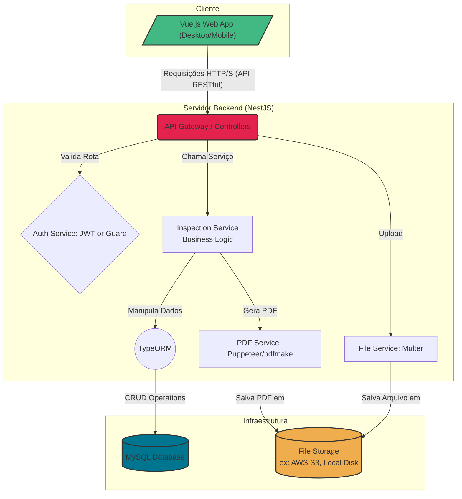
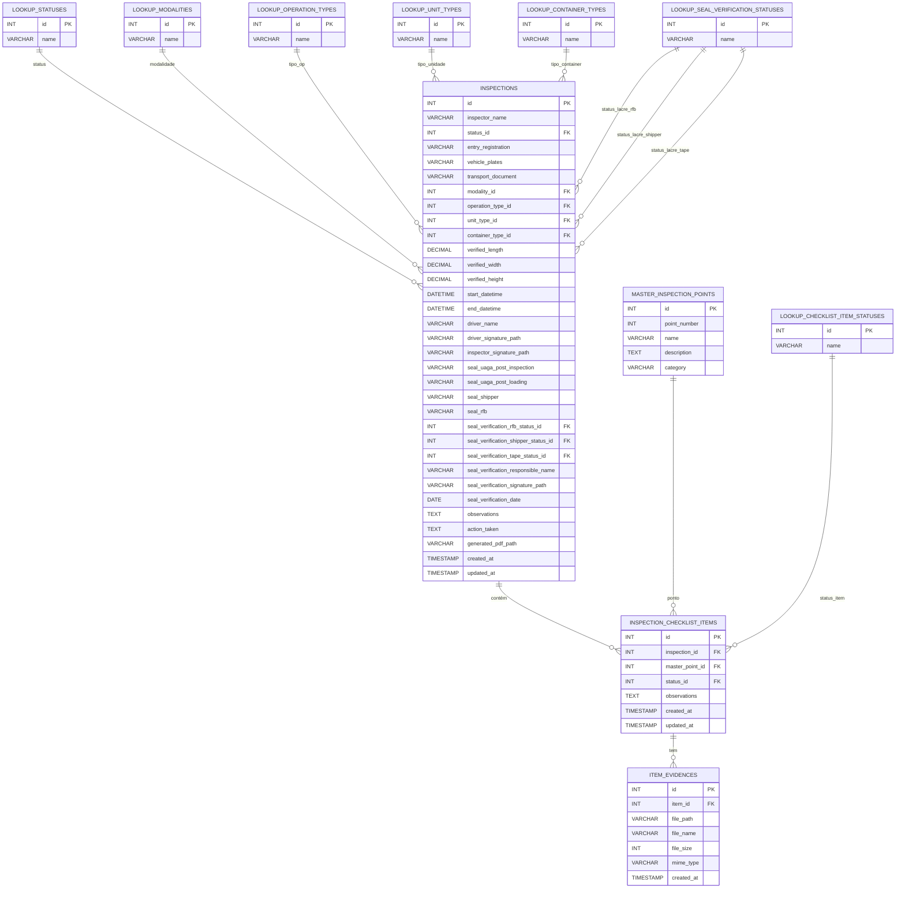
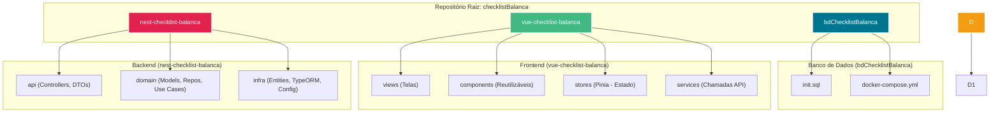
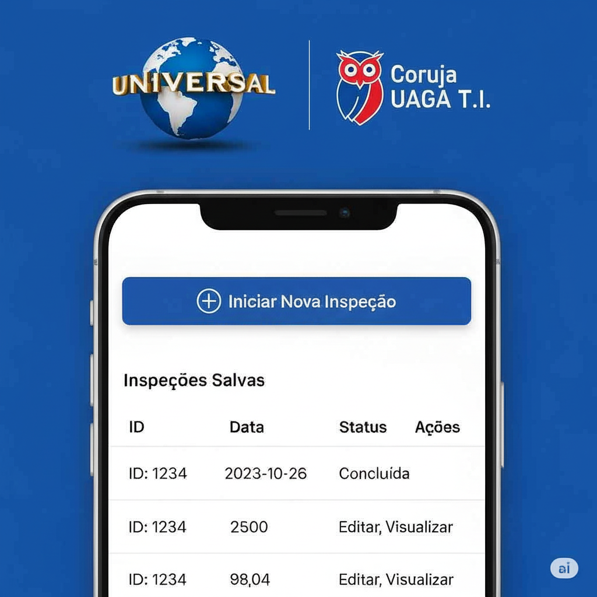
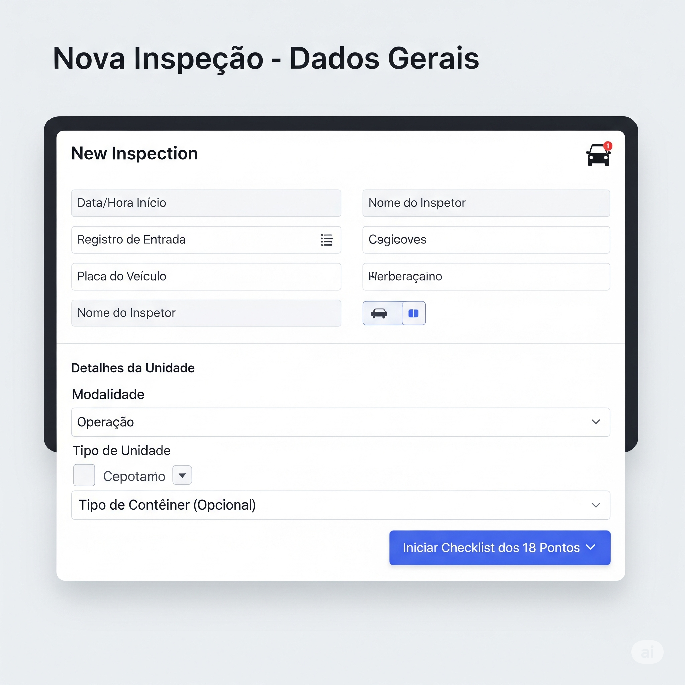
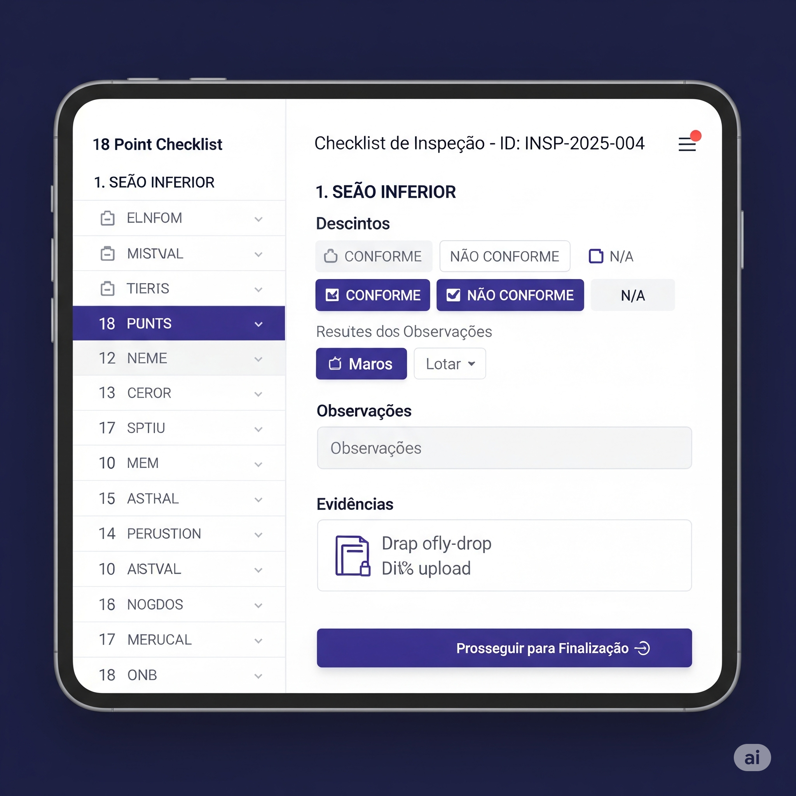
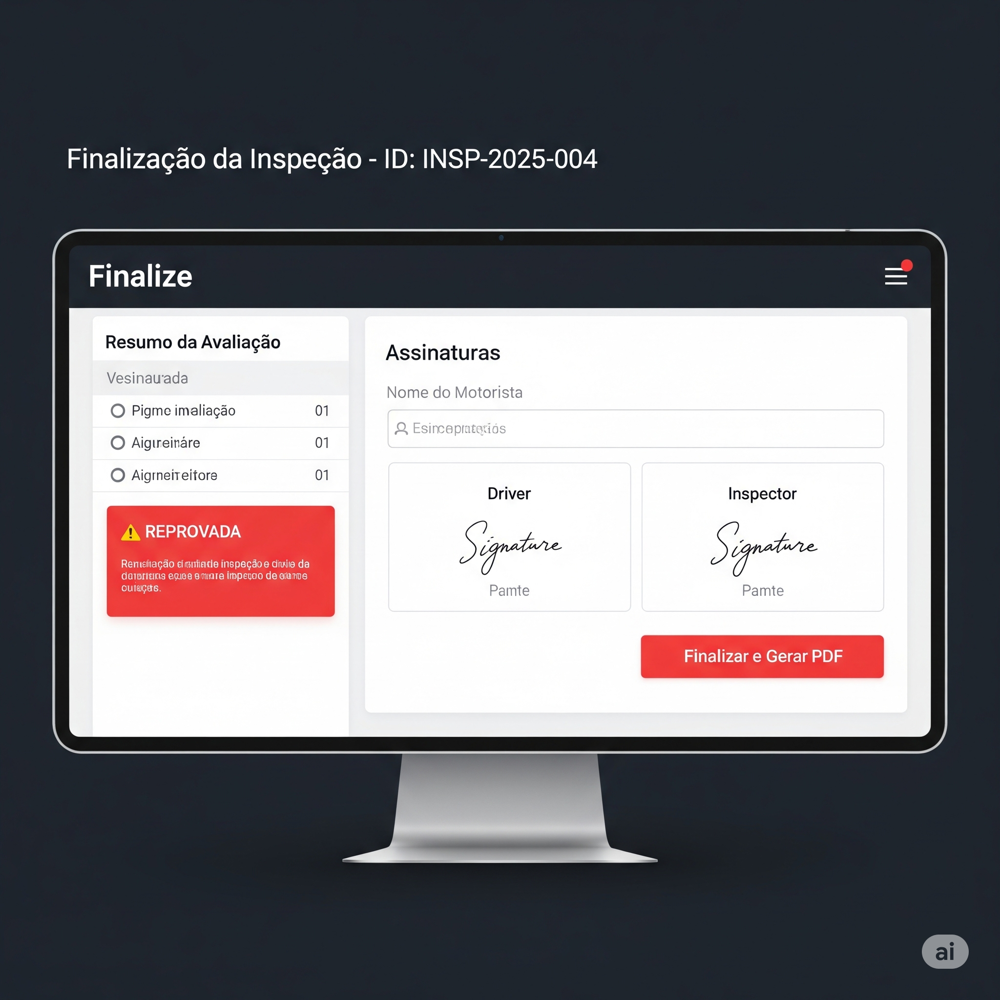

<h1 id="app-de-inspe-o-digital-api-checklist-nestjs">App de Inspeção Digital - API (checklist-nestjs)</h1>

  

Backend desenvolvido com <a href="http://nodejs.org" target="_blank">Node.js</a> e NestJS para o sistema de inspeção de unidades de carga.

<h2 id="sum-rio">Sumário</h2>
<ul>
    <li><a href="#app-de-inspe-o-digital-api-checklist-nestjs">App de Inspeção Digital - API (checklist-nestjs)</a>
        <ul>
            <li><a href="#sum-rio">Sumário</a></li>
            <li><a href="#-vis-o-geral-do-projeto">📝 Visão Geral do Projeto</a></li>
            <li><a href="#️-arquitetura-do-sistema">🏛️ Arquitetura do Sistema</a></li>
            <li><a href="#modelo-de-dados-mer">Modelo de Dados (MER)</a></li>
            <li><a href="#-pr--requisitos">✅ Pré-requisitos</a></li>
            <li><a href="#-instala-o-e-configura-o">🚀 Instalação e Configuração</a></li>
            <li><a href="#️-executando-a-aplica-o">▶️ Executando a Aplicação</a></li>
            <li><a href="#-executando-os-testes">🧪 Executando os Testes</a></li>
            <li><a href="#-endpoints-da-api">📡 Endpoints da API</a></li>
            <li><a href="#️-jornadas-do-usu-rio-user-flows">🗺️ Jornadas do Usuário (User Flows)</a></li>
            <li><a href="#-nosso-acordo-de-trabalho-fluxo-de-desenvolvimento-e-contribui-o">🔄 Nosso Acordo de Trabalho</a></li>
            <li><a href="#-definition-of-ready-dor-definition-of-done-dod">✅ Definition of Ready (DoR) &amp; Definition of Done (DoD)</a></li>
            <li><a href="#-licen-a">📄 Licença</a></li>
        </ul>
    </li>
</ul>

<h2 id="-vis-o-geral-do-projeto">📝 Visão Geral do Projeto</h2>

Este projeto é a implementação do backend para o <strong>App de Inspeção Digital 8/18</strong>. O objetivo é substituir o processo de inspeção manual, baseado no formulário físico <strong>"Form. 24 - Inspeção de Unidade de Carga"</strong>, por uma solução digital inteligente e rastreável.

O sistema permite que inspetores realizem inspeções ponto a ponto, coletem evidências (texto e imagens), capturem assinaturas digitais, e gera um relatório PDF idêntico ao formulário físico para fins de auditoria e conformidade.

<h2 id="️-arquitetura-do-sistema">🏛️ Arquitetura do Sistema</h2>

A aplicação segue uma arquitetura desacoplada, separando as responsabilidades entre o cliente (Frontend), o servidor (Backend) e a infraestrutura de dados e arquivos.

<h2 id="modelo-de-dados-mer">Modelo de Dados (MER)</h2>

O modelo de entidade-relacionamento a seguir ilustra a estrutura do banco de dados MySQL, utilizando tabelas de lookup para garantir a integridade e flexibilidade dos dados.

Clique para expandir o Dicionário de Dados Completo

<h3>Tabelas de Lookup (Mestras)</h3>

Estas tabelas contêm valores estáticos para garantir a consistência dos dados.

<table border="1" style="border-collapse: collapse; width:100%;">
    <thead>
        <tr>
            <th align="left">Tabela</th>
            <th align="left">Descrição</th>
        </tr>
    </thead>
    <tbody>
        <tr><td><code>lookup_statuses</code></td><td>Status possíveis para uma inspeção geral.</td></tr>
        <tr><td><code>lookup_modalities</code></td><td>Modalidades de transporte disponíveis.</td></tr>
        <tr><td><code>lookup_operation_types</code></td><td>Tipos de operação aduaneira (nível de risco).</td></tr>
        <tr><td><code>lookup_unit_types</code></td><td>Tipos de unidade de carga.</td></tr>
        <tr><td><code>lookup_container_types</code></td><td>Tipos específicos de contêineres.</td></tr>
        <tr><td><code>lookup_checklist_item_statuses</code></td><td>Status possíveis para cada item individual da inspeção.</td></tr>
        <tr><td><code>lookup_seal_verification_statuses</code></td><td>Status para a verificação de lacres de saída.</td></tr>
    </tbody>
</table>

<h3>Tabelas Principais</h3>

<h4><strong><code>master_inspection_points</code></strong></h4>

Tabela mestre com a definição dos 18 pontos de inspeção padrão.

<table border="1" style="border-collapse: collapse; width:100%;">
    <thead>
        <tr>
            <th align="left">Nome da Coluna</th>
            <th align="left">Tipo de Dado</th>
            <th align="left">Chave</th>
            <th align="left">Nulo?</th>
            <th align="left">Descrição / Regra de Negócio</th>
            <th align="left">Exemplo</th>
        </tr>
    </thead>
    <tbody>
        <tr><td><code>id</code></td><td>INT</td><td>PK</td><td>Não</td><td>Identificador único do ponto de inspeção.</td><td><code>5</code></td></tr>
        <tr><td><code>point_number</code></td><td>INT</td><td>UNIQUE</td><td>Não</td><td>Número do ponto (1 a 18).</td><td><code>5</code></td></tr>
        <tr><td><code>name</code></td><td>VARCHAR(255)</td><td></td><td>Não</td><td>Nome resumido do ponto.</td><td><code>"PISO DO CAMINHÃO"</code></td></tr>
        <tr><td><code>description</code></td><td>TEXT</td><td></td><td>Sim</td><td>Descrição detalhada do procedimento.</td><td><code>"Levantar o carpete para verificar compartimentos ocultos."</code></td></tr>
        <tr><td><code>category</code></td><td>VARCHAR(50)</td><td></td><td>Não</td><td>Categoria: VEICULO ou CONTEINER.</td><td><code>"VEICULO"</code></td></tr>
    </tbody>
</table>

<h4><strong><code>inspections</code></strong></h4>

Tabela que armazena cada checklist de inspeção.

<table border="1" style="border-collapse: collapse; width:100%;">
    <thead>
        <tr><th align="left">Nome da Coluna</th><th align="left">Tipo de Dado</th><th align="left">Chave</th><th align="left">Nulo?</th><th align="left">Descrição</th><th align="left">Exemplo</th></tr>
    </thead>
    <tbody>
        <tr><td><code>id</code></td><td>INT</td><td>PK</td><td>Não</td><td>Identificador único da inspeção (auto-incremento).</td><td><code>2024001</code></td></tr>
        <tr><td><code>inspector_name</code></td><td>VARCHAR(255)</td><td></td><td>Não</td><td>Nome do responsável pela inspeção.</td><td><code>"Carlos Souza"</code></td></tr>
        <tr><td><code>status_id</code></td><td>INT</td><td>FK</td><td>Não</td><td>Status geral (<code>lookup_statuses</code>).</td><td><code>2</code></td></tr>
        <tr><td><code>entry_registration</code></td><td>VARCHAR(100)</td><td></td><td>Sim</td><td>Número de registro de entrada.</td><td><code>"RE-2024-099"</code></td></tr>
        <tr><td><code>vehicle_plates</code></td><td>VARCHAR(20)</td><td></td><td>Sim</td><td>Placa do veículo.</td><td><code>"BRA2E19"</code></td></tr>
        <tr><td><code>transport_document</code></td><td>VARCHAR(100)</td><td></td><td>Sim</td><td>Número do documento de transporte (CTe, AWB).</td><td><code>"CTE123456"</code></td></tr>
        <tr><td><code>modality_id</code></td><td>INT</td><td>FK</td><td>Não</td><td>Modalidade (<code>lookup_modalities</code>).</td><td><code>1</code></td></tr>
        <tr><td><code>operation_type_id</code></td><td>INT</td><td>FK</td><td>Não</td><td>Tipo de operação (<code>lookup_operation_types</code>).</td><td><code>1</code></td></tr>
        <tr><td><code>unit_type_id</code></td><td>INT</td><td>FK</td><td>Não</td><td>Tipo de unidade de carga (<code>lookup_unit_types</code>).</td><td><code>1</code></td></tr>
        <tr><td><code>container_type_id</code></td><td>INT</td><td>FK</td><td>Sim</td><td>Tipo de contêiner (<code>lookup_container_types</code>).</td><td><code>2</code></td></tr>
        <tr><td><code>verified_length</code></td><td>DECIMAL(10,2)</td><td></td><td>Sim</td><td>Comprimento verificado (metros).</td><td><code>12.02</code></td></tr>
        <tr><td><code>verified_width</code></td><td>DECIMAL(10,2)</td><td></td><td>Sim</td><td>Largura verificada (metros).</td><td><code>2.35</code></td></tr>
        <tr><td><code>verified_height</code></td><td>DECIMAL(10,2)</td><td></td><td>Sim</td><td>Altura verificada (metros).</td><td><code>2.69</code></td></tr>
        <tr><td><code>start_datetime</code></td><td>DATETIME</td><td></td><td>Não</td><td>Início da inspeção.</td><td><code>"2025-07-15 08:00"</code></td></tr>
        <tr><td><code>end_datetime</code></td><td>DATETIME</td><td></td><td>Sim</td><td>Fim da inspeção.</td><td><code>"2025-07-15 08:45"</code></td></tr>
        <tr><td><code>driver_name</code></td><td>VARCHAR(255)</td><td></td><td>Não</td><td>Nome do motorista.</td><td><code>"José da Silva"</code></td></tr>
        <tr><td><code>driver_signature_path</code></td><td>VARCHAR(512)</td><td></td><td>Sim</td><td>Assinatura do motorista.</td><td><code>"/sig/driver.png"</code></td></tr>
        <tr><td><code>inspector_signature_path</code></td><td>VARCHAR(512)</td><td></td><td>Sim</td><td>Assinatura do inspetor.</td><td><code>"/sig/inspector.png"</code></td></tr>
        <tr><td><code>seal_uaga_post_inspection</code></td><td>VARCHAR(100)</td><td></td><td>Sim</td><td>Nº do lacre UAGA pós-inspeção.</td><td><code>"LACRE1234"</code></td></tr>
        <tr><td><code>seal_uaga_post_loading</code></td><td>VARCHAR(100)</td><td></td><td>Sim</td><td>Nº do lacre UAGA pós-carregamento.</td><td><code>"LACRE5678"</code></td></tr>
        <tr><td><code>seal_shipper</code></td><td>VARCHAR(100)</td><td></td><td>Sim</td><td>Lacre do armador (shipper).</td><td><code>"SHIPPER321"</code></td></tr>
        <tr><td><code>seal_rfb</code></td><td>VARCHAR(100)</td><td></td><td>Sim</td><td>Lacre Receita Federal (RFB).</td><td><code>"RFB987"</code></td></tr>
        <tr><td><code>seal_verification_rfb_status_id</code></td><td>INT</td><td>FK</td><td>Sim</td><td>Status do lacre RFB (<code>lookup_seal_verification_statuses</code>).</td><td><code>1</code></td></tr>
        <tr><td><code>seal_verification_shipper_status_id</code></td><td>INT</td><td>FK</td><td>Sim</td><td>Status do lacre Shipper (<code>lookup_seal_verification_statuses</code>).</td><td><code>1</code></td></tr>
        <tr><td><code>seal_verification_tape_status_id</code></td><td>INT</td><td>FK</td><td>Sim</td><td>Status da fita lacre UAGA (<code>lookup_seal_verification_statuses</code>).</td><td><code>1</code></td></tr>
        <tr><td><code>seal_verification_responsible_name</code></td><td>VARCHAR(255)</td><td></td><td>Sim</td><td>Responsável pela verificação de lacres.</td><td><code>"Ana Souza"</code></td></tr>
        <tr><td><code>seal_verification_signature_path</code></td><td>VARCHAR(512)</td><td></td><td>Sim</td><td>Assinatura do responsável pela verificação.</td><td><code>"/sig/verifier.png"</code></td></tr>
        <tr><td><code>seal_verification_date</code></td><td>DATE</td><td></td><td>Sim</td><td>Data da verificação de lacres.</td><td><code>"2025-07-15"</code></td></tr>
        <tr><td><code>observations</code></td><td>TEXT</td><td></td><td>Sim</td><td>Observações gerais.</td><td><code>"Sem inconformidades."</code></td></tr>
        <tr><td><code>action_taken</code></td><td>TEXT</td><td></td><td>Sim</td><td>Providências tomadas.</td><td><code>"Lacre substituído."</code></td></tr>
        <tr><td><code>generated_pdf_path</code></td><td>VARCHAR(512)</td><td></td><td>Sim</td><td>PDF gerado da inspeção.</td><td><code>"/reports/insp_2024001.pdf"</code></td></tr>
        <tr><td><code>created_at</code></td><td>TIMESTAMP</td><td></td><td>Não</td><td>Data/hora de criação.</td><td><code>"2025-07-15 08:00"</code></td></tr>
        <tr><td><code>updated_at</code></td><td>TIMESTAMP</td><td></td><td>Não</td><td>Data/hora de atualização.</td><td><code>"2025-07-15 08:45"</code></td></tr>
    </tbody>
</table>

<h4><strong><code>inspection_checklist_items</code></strong></h4>

Relação dos pontos verificados em cada inspeção.

<table border="1" style="border-collapse: collapse; width:100%;">
    <thead>
        <tr><th align="left">Nome da Coluna</th><th align="left">Tipo de Dado</th><th align="left">Chave</th><th align="left">Nulo?</th><th align="left">Descrição</th><th align="left">Exemplo</th></tr>
    </thead>
    <tbody>
        <tr><td><code>id</code></td><td>INT</td><td>PK</td><td>Não</td><td>Identificador único.</td><td><code>5001</code></td></tr>
        <tr><td><code>inspection_id</code></td><td>INT</td><td>FK</td><td>Não</td><td>Inspeção relacionada.</td><td><code>2024001</code></td></tr>
        <tr><td><code>master_point_id</code></td><td>INT</td><td>FK</td><td>Não</td><td>Ponto de inspeção (<code>master_inspection_points</code>).</td><td><code>11</code></td></tr>
        <tr><td><code>status_id</code></td><td>INT</td><td>FK</td><td>Não</td><td>Status (<code>lookup_checklist_item_statuses</code>).</td><td><code>2</code></td></tr>
        <tr><td><code>observations</code></td><td>TEXT</td><td></td><td>Sim</td><td>Observações para este ponto.</td><td><code>"Tudo conforme."</code></td></tr>
        <tr><td><code>created_at</code></td><td>TIMESTAMP</td><td></td><td>Não</td><td>Data/hora de criação.</td><td><code>"2025-07-15 08:05"</code></td></tr>
        <tr><td><code>updated_at</code></td><td>TIMESTAMP</td><td></td><td>Não</td><td>Data/hora de atualização.</td><td><code>"2025-07-15 08:05"</code></td></tr>
    </tbody>
</table>

<h4><strong><code>item_evidences</code></strong></h4>

Evidências (imagens) de cada item do checklist.

<table border="1" style="border-collapse: collapse; width:100%;">
    <thead>
        <tr><th align="left">Nome da Coluna</th><th align="left">Tipo de Dado</th><th align="left">Chave</th><th align="left">Nulo?</th><th align="left">Descrição</th><th align="left">Exemplo</th></tr>
    </thead>
    <tbody>
        <tr><td><code>id</code></td><td>INT</td><td>PK</td><td>Não</td><td>ID único da evidência.</td><td><code>9001</code></td></tr>
        <tr><td><code>item_id</code></td><td>INT</td><td>FK</td><td>Não</td><td>ID do item de checklist.</td><td><code>5001</code></td></tr>
        <tr><td><code>file_path</code></td><td>VARCHAR(512)</td><td></td><td>Não</td><td>Local do arquivo.</td><td><code>"/evidences/5001_img1.jpg"</code></td></tr>
        <tr><td><code>file_name</code></td><td>VARCHAR(255)</td><td></td><td>Não</td><td>Nome do arquivo.</td><td><code>"pneu_frontal.jpg"</code></td></tr>
        <tr><td><code>file_size</code></td><td>INT</td><td></td><td>Não</td><td>Tamanho em bytes.</td><td><code>245678</code></td></tr>
        <tr><td><code>mime_type</code></td><td>VARCHAR(100)</td><td></td><td>Não</td><td>Tipo MIME.</td><td><code>"image/jpeg"</code></td></tr>
        <tr><td><code>created_at</code></td><td>TIMESTAMP</td><td></td><td>Não</td><td>Data/hora de envio.</td><td><code>"2025-07-15 08:10"</code></td></tr>
    </tbody>
</table>

<h3>🏗️ Estrutura de Projeto Unificada</h3>

O projeto é organizado em uma estrutura multi-repo, onde cada serviço principal (backend, frontend, banco de dados) reside em seu próprio subdiretório dentro da pasta raiz <code>checklistBalanca/</code>. Esta abordagem promove a separação clara das responsabilidades.

A filosofia de desenvolvimento para cada serviço segue os princípios de Arquitetura Limpa e Domain-Driven Design (DDD), garantindo um código manutenível e escalável.

<h4>Diagrama de Arquitetura de Repositórios</h4>

Este diagrama representa a estrutura completa do nosso ecossistema de projetos.

<h4>Detalhes da Estrutura Interna</h4>
<ul>
    <li><strong>Backend (nest-checklist-balanca)</strong>
        <ul>
            <li><code>src/api</code>: A camada de apresentação, responsável por receber requisições HTTP e retornar respostas. Contém os controllers e os DTOs (Data Transfer Objects).</li>
            <li><code>src/domain</code>: O coração da aplicação. Contém a lógica de negócio pura (use-cases), as representações dos dados (entities) e os contratos de persistência (repositories).</li>
            <li><code>src/infra</code>: A camada de detalhes técnicos, com as implementações concretas, como a configuração do TypeORM e os repositórios que interagem com o banco.</li>
        </ul>
    </li>
    <li><strong>Frontend (vue-checklist-balanca)</strong>
        <ul>
            <li><code>src/views (ou pages)</code>: As telas principais da aplicação, que orquestram os componentes.</li>
            <li><code>src/components</code>: Componentes de UI reutilizáveis e "burros" (sem lógica de negócio).</li>
            <li><code>src/stores (Pinia)</code>: Gerencia o estado global da aplicação e a lógica de negócio do frontend.</li>
            <li><code>src/services</code>: Isola toda a comunicação com a nossa API NestJS.</li>
        </ul>
    </li>
    <li><strong>tests/</strong>: Pasta na raiz do projeto para testes unitários e e2e.</li>
</ul>

<h2 id="-pr--requisitos">✅ Pré-requisitos</h2>

Para rodar este projeto, você precisará ter as seguintes ferramentas instaladas em seu ambiente:

<ul>
    <li><strong><a href="https://nodejs.org/">Node.js</a></strong> (versão 18.x ou superior)</li>
    <li><strong><a href="https://yarnpkg.com/">Yarn</a></strong> (gerenciador de pacotes principal)</li>
    <li><strong><a href="https://www.docker.com/">Docker</a></strong> (recomendado para rodar o banco de dados)</li>
</ul>

<h2 id="-instala-o-e-configura-o">🚀 Instalação e Configuração</h2>

Siga os passos abaixo para configurar e rodar o ambiente de desenvolvimento localmente.

<h3>1. Clone o Repositório</h3>

Primeiro, clone o projeto para a sua máquina local.

<pre><code>git clone &lt;URL_DO_SEU_REPOSITORIO&gt;
cd checklist-nestjs
</code></pre>

<h3>📦 2. Instale as Dependências</h3>

O projeto utiliza <code>Yarn</code> como gerenciador de pacotes. Execute o comando abaixo para instalar todas as dependências necessárias.

<pre><code>yarn install
</code></pre>

<h3>📝 3. Configure as Variáveis de Ambiente</h3>

É necessário criar um arquivo <code>.env</code> para armazenar as configurações sensíveis do projeto.

<ul>
    <li>Primeiro, copie o arquivo de exemplo <code>.env.example</code> para criar seu arquivo de configuração local:
        <pre><code>cp .env.example .env
</code></pre>
    </li>
    <li>Em seguida, edite o arquivo <code>.env</code> com as suas credenciais de banco de dados e outras configurações:
<pre><code>
PORT=8888
DB_HOST=localhost
DB_PORT=3306
DB_USERNAME=uaga_user
DB_PASSWORD=uaga_password
DB_DATABASE=uagabd
DB_SYNCHRONIZE=false
JWT_SECRET=your_super_secret_key
</code></pre>
    </li>
</ul>

<h3>🐳 4. Inicie o Banco de Dados com Contêineres</h3>

A forma mais simples e recomendada de rodar o banco de dados MySQL é utilizando uma ferramenta de contêineres como <strong>Docker</strong> ou <strong>Podman</strong>. Isso garante um ambiente limpo, isolado e consistente.

<ul>
    <li>Primeiro, crie um arquivo <code>docker-compose.yml</code> na raiz do projeto. O formato é compatível com ambas as ferramentas.
<pre><code>
version: '3.8'
services:
  db:
    image: mysql:8.0
    command: --default-authentication-plugin=mysql_native_password
    restart: always
    environment:
      MYSQL_ROOT_PASSWORD: uaga_password
      MYSQL_DATABASE: uagabd
    ports:
      - "3306:3306"
    volumes:
      - ./init.sql:/docker-entrypoint-initdb.d/init.sql
</code></pre>
    </li>
    <li>Agora, execute o comando correspondente à sua ferramenta para iniciar o contêiner em segundo plano:
        <ul>
            <li><strong>Se você usa Docker:</strong>
<pre><code>docker-compose up -d
</code></pre>
            </li>
            <li><strong>Se você usa Podman</strong> (requer <code>podman-compose</code> instalado):
<pre><code>podman-compose up -d
</code></pre>
            </li>
        </ul>
    </li>
</ul>
<blockquote>
    
<strong>Nota:</strong> O arquivo <code>init.sql</code> será executado automaticamente na primeira vez que o contêiner for criado, preparando todo o esquema de tabelas e populando os dados iniciais (lookups).

</blockquote>

<h2 id="️-executando-a-aplica-o">▶️ Executando a Aplicação</h2>

Com o ambiente configurado, você pode iniciar o servidor NestJS nos seguintes modos:

<ul>
    <li><strong>Modo de Desenvolvimento</strong> (com auto-reload):
<pre><code>yarn run start:dev
</code></pre>
    </li>
    <li><strong>Modo de Produção</strong>:
<pre><code>yarn run start:prod
</code></pre>
    </li>
</ul>
<blockquote>
    
Após iniciar, a API estará disponível em <code>http://localhost:3000</code>.

</blockquote>

<h2 id="-executando-os-testes">🧪 Executando os Testes</h2>

Para garantir a qualidade e a integridade do código, execute os comandos de teste abaixo:

<ul>
    <li><strong>Testes Unitários</strong>:
<pre><code>yarn run test
</code></pre>
    </li>
    <li><strong>Testes End-to-End (E2E)</strong>:
<pre><code>yarn run test:e2e
</code></pre>
    </li>
    <li><strong>Relatório de Cobertura de Testes</strong>:
<pre><code>yarn run test:cov
</code></pre>
    </li>
</ul>

<h2 id="-endpoints-da-api">📡 Endpoints da API</h2>

A seguir, a lista dos principais endpoints da API. Uma documentação interativa completa está disponível via <strong>Swagger</strong> em <code>http://localhost:8888/api</code> após a aplicação ser iniciada.

<table border="1" style="border-collapse: collapse; width:100%;">
    <thead>
        <tr>
            <th align="left">Método</th>
            <th align="left">Endpoint</th>
            <th align="left">Descrição</th>
        </tr>
    </thead>
    <tbody>
        <tr><td><code>GET</code></td><td><code>/lookups/:type</code></td><td>Retorna a lista de valores para um tipo de lookup (ex: <code>/modalities</code>).</td></tr>
        <tr><td><code>POST</code></td><td><code>/inspections</code></td><td>Cria um novo registro de inspeção.</td></tr>
        <tr><td><code>GET</code></td><td><code>/inspections</code></td><td>Lista todas as inspeções.</td></tr>
        <tr><td><code>GET</code></td><td><code>/inspections/:id</code></td><td>Retorna os detalhes completos de uma inspeção específica.</td></tr>
        <tr><td><code>PATCH</code></td><td><code>/inspections/:id</code></td><td><strong>(NOVO)</strong> Atualiza os dados de cabeçalho de uma inspeção (ex: nome do motorista).</td></tr>
        <tr><td><code>DELETE</code></td><td><code>/inspections/:id</code></td><td><strong>(NOVO)</strong> Apaga uma inspeção completa (apenas se estiver "EM INSPEÇÃO").</td></tr>
        <tr><td><code>POST</code></td><td><code>/inspections/check-existing</code></td><td>Verifica se uma inspeção similar já existe antes de criar uma nova.</td></tr>
        <tr><td><code>PATCH</code></td><td><code>/inspections/:inspectionId/points/:pointNumber</code></td><td>Atualiza o status e as observações de um item do checklist.</td></tr>
        <tr><td><code>POST</code></td><td><code>/inspections/:inspectionId/points/:pointNumber/evidence</code></td><td>Faz o upload de uma imagem de evidência para um item.</td></tr>
        <tr><td><code>DELETE</code></td><td><code>/inspections/:inspectionId/points/:pointNumber/evidence</code></td><td><strong>(NOVO)</strong> Apaga uma evidência (imagem) específica de um item do checklist.</td></tr>
        <tr><td><code>PATCH</code></td><td><code>/inspections/:id/finalize</code></td><td>Finaliza uma inspeção, mudando seu status para APROVADO ou REPROVADO.</td></tr>
        <tr><td><code>GET</code></td><td><code>/inspections/:id/report/pdf</code></td><td>Gera e baixa o relatório de uma inspeção finalizada em formato PDF.</td></tr>
    </tbody>
</table>

<h2 id="️-jornadas-do-usu-rio-user-flows">🗺️ Jornadas do Usuário (User Flows)</h2>

Esta seção descreve os caminhos que os usuários percorrem para realizar tarefas chave no sistema.

    
Clique para expandir as Jornadas do Usuário

    <h4><strong>Fluxo 1: Autenticação do Inspetor</strong></h4>
    <ul>
        <li><strong>Ator:</strong> Inspetor</li>
        <li><strong>Objetivo:</strong> Acessar o sistema de inspeção de forma segura.</li>
        <li><strong>Passos:</strong>
            <ol>
                <li>Abre a aplicação e vê a tela de login.</li>
                <li>Insere e-mail e senha.</li>
                <li>Clica em "Entrar".</li>
                <li>O sistema valida as credenciais. Se corretas, direciona para a tela inicial.</li>
            </ol>
        </li>
    </ul>
    <h4><strong>Fluxo 2: Realização de uma Nova Inspeção</strong></h4>
    <ul>
        <li><strong>Ator:</strong> Inspetor</li>
        <li><strong>Objetivo:</strong> Preencher um checklist de inspeção de 18 pontos.</li>
        <li><strong>Passos:</strong>
            <ol>
                <li>Seleciona uma inspeção pendente na tela inicial ou cria uma nova.</li>
                <li>Preenche os campos do cabeçalho (Modalidade, Operação, Nome do Motorista, etc.).</li>
                <li>Navega pela lista dos 18 pontos de inspeção.</li>
                <li>Para cada ponto, seleciona um status (<code>CONFORME</code>, <code>NÃO CONFORME</code>, <code>N/A</code>), adiciona observações e anexa imagens como evidência.</li>
                <li><strong>(Ação de Correção)</strong> Se uma imagem for enviada por engano, o inspetor pode apagá-la.</li>
                <li>O progresso é salvo continuamente a cada alteração de status.</li>
            </ol>
        </li>
    </ul>
    <h4><strong>Fluxo 3: Finalização da Inspeção</strong></h4>
    <ul>
        <li><strong>Ator:</strong> Inspetor, Motorista</li>
        <li><strong>Objetivo:</strong> Concluir a inspeção, coletar assinaturas e gerar o relatório.</li>
        <li><strong>Passos:</strong>
            <ol>
                <li>Após avaliar todos os 18 pontos, clica em "Finalizar".</li>
                <li>O sistema aplica a regra de avaliação automática (se houver <code>NÃO CONFORME</code> → <code>REPROVADO</code>, senão <code>APROVADO</code>).</li>
                <li>Inspetor e motorista assinam digitalmente na tela.</li>
                <li>O sistema gera e armazena o relatório em PDF, idêntico ao formulário físico.</li>
            </ol>
        </li>
    </ul>
    <h4><strong>Fluxo 4: Consulta e Análise no Dashboard</strong></h4>
    <ul>
        <li><strong>Ator:</strong> Administrador, Inspetor</li>
        <li><strong>Objetivo:</strong> Visualizar, filtrar e exportar dados de inspeções.</li>
        <li><strong>Passos:</strong>
            <ol>
                <li>Acessa o Dashboard.</li>
                <li>Visualiza a lista de inspeções.</li>
                <li>Usa os filtros de busca (por data, status, motorista, etc.) para encontrar inspeções específicas.</li>
                <li>Clica em uma inspeção para ver os detalhes e baixar o PDF gerado.</li>
            </ol>
        </li>
    </ul>
    
    

    
    <h4><strong>Fluxo 5: Correção e Cancelamento de Inspeções (NOVOS)</strong></h4>
    <ul>
        <li><strong>Ator:</strong> Inspetor, Administrador</li>
        <li><strong>Objetivo:</strong> Corrigir dados ou cancelar uma inspeção que ainda está em andamento.</li>
        <li><strong>Cenários:</strong>
            <ul>
                <li><strong>A) Corrigir Dados do Cabeçalho:</strong>
                    <ol>
                        <li>Na lista de inspeções, seleciona a inspeção com status <code>EM ANDAMENTO</code> que precisa de correção.</li>
                        <li>Clica numa opção "Editar Cabeçalho".</li>
                        <li>Altera os dados necessários (ex: nome do motorista, placa do veículo).</li>
                        <li>Salva as alterações. O sistema confirma a atualização.</li>
                    </ol>
                </li>
                <li><strong>B) Cancelar/Apagar uma Inspeção:</strong>
                    <ol>
                        <li>Na lista de inspeções, encontra uma inspeção <code>EM ANDAMENTO</code> que foi criada por engano.</li>
                        <li>Clica na opção "Apagar Inspeção".</li>
                        <li>O sistema pede uma confirmação final, alertando que a ação é irreversível.</li>
                        <li>Após confirmar, a inspeção, todos os seus dados e ficheiros associados são permanentemente removidos. O sistema retorna à lista de inspeções.</li>
                    </ol>
                </li>
            </ul>
        </li>
    </ul>

<h2>Planejamento Ágil para MVP</h2>

O objetivo do MVP é entregar o fluxo principal de valor: <strong>digitalizar o preenchimento do checklist e gerar um PDF fiel ao formulário original</strong>. Funcionalidades de gestão e automação avançada serão adicionadas em iterações futuras.

<table border="1" cellpadding="10" cellspacing="0" width="100%">
    <thead>
        <tr bgcolor="#f2f2f2">
            <th><b>Épico</b></th>
            <th><b>ID</b></th>
            <th><b>História de Usuário (User Story)</b></th>
            <th><b>Critérios de Aceite</b></th>
            <th><b>Prioridade MVP</b></th>
            <th><b>Observações / Simplificação para MVP</b></th>
        </tr>
    </thead>
    <tbody>
        <tr>
            <td valign="top">Gestão de Inspeções (Core)</td>
            <td valign="top"><strong>US-01</strong></td>
            <td valign="top"><strong>Como um</strong> inspetor, <strong>eu quero</strong> iniciar um novo checklist, <strong>para que</strong> eu possa preencher os dados iniciais da inspeção.</td>
            <td valign="top">
                <ul>
                    <li>O sistema deve abrir um novo formulário de checklist.</li>
                    <li>O campo "Nome do Inspetor" deve estar disponível para preenchimento (texto livre).</li>
                    <li>A data/hora de início é registrada.</li>
                    <li>Os campos do cabeçalho (Modalidade, etc.) devem ser de preenchimento obrigatório.</li>
                </ul>
            </td>
            <td valign="top" bgcolor="#ffebee">🔴 <b>Essencial</b></td>
            <td valign="top">O nome do inspetor será um campo de texto simples, sem vínculo com um usuário logado.</td>
        </tr>
        <tr>
            <td valign="top">Gestão de Inspeções (Core)</td>
            <td valign="top"><strong>US-02</strong></td>
            <td valign="top"><strong>Como um</strong> inspetor, <strong>eu quero</strong> avaliar cada um dos 18 pontos do checklist, adicionando status e observações, <strong>para que</strong> eu possa registrar o resultado da verificação.</td>
            <td valign="top">
                <ul>
                    <li>Para cada item, deve ser possível selecionar CONFORME, NÃO CONFORME ou N/A.</li>
                    <li>Deve ser possível adicionar um texto de observação.</li>
                    <li>Deve ser possível anexar uma ou mais fotos como evidência para qualquer item.</li>
                </ul>
            </td>
            <td valign="top" bgcolor="#ffebee">🔴 <b>Essencial</b></td>
            <td valign="top">A funcionalidade de upload de imagens é o "ponto de corte" técnico. Se for complexa, podemos avaliar deixá-la para a v1.1, mas o ideal é que entre no MVP.</td>
        </tr>
        <tr>
            <td valign="top">Gestão de Inspeções (Core)</td>
            <td valign="top"><strong>US-03</strong></td>
            <td valign="top"><strong>Como um</strong> inspetor, <strong>eu quero</strong> finalizar o checklist, <strong>para que</strong> o sistema determine o resultado final.</td>
            <td valign="top">
                <ul>
                    <li>O botão "Finalizar" deve estar habilitado após a avaliação dos 18 pontos.</li>
                    <li>Ao finalizar, o status geral da inspeção deve ser definido como APROVADO ou REPROVADO baseado nas regras.</li>
                </ul>
            </td>
            <td valign="top" bgcolor="#fffde7">🟡 <b>Importante</b></td>
            <td valign="top">A assinatura digital é adiada. A lógica de APROVADO/REPROVADO é essencial, mas a coleta de assinatura será feita manualmente no PDF gerado.</td>
        </tr>
        <tr>
            <td valign="top">Relatórios e Análise</td>
            <td valign="top"><strong>US-05</strong></td>
            <td valign="top"><strong>Como um</strong> inspetor, <strong>eu quero</strong> que um relatório em PDF seja gerado ao final de cada inspeção, <strong>para que</strong> eu tenha um documento oficial.</td>
            <td valign="top">
                <ul>
                    <li>O PDF gerado deve ter um layout idêntico ao do "Form. 24".</li>
                    <li>O PDF deve conter todos os dados do cabeçalho e dos 18 pontos.</li>
                    <li>Os campos de assinatura no PDF devem ser deixados em branco para assinatura manual.</li>
                </ul>
            </td>
            <td valign="top" bgcolor="#ffebee">🔴 <b>Essencial</b></td>
            <td valign="top">Este é o principal entregável de valor do MVP. O PDF deve ser perfeito e funcional.</td>
        </tr>
        <tr>
            <td valign="top">Relatórios e Análise</td>
            <td valign="top"><strong>US-06</strong></td>
            <td valign="top"><strong>Como um</strong> inspetor, <strong>eu quero</strong> acessar um dashboard com a listagem das inspeções, <strong>para que</strong> eu possa buscar e analisar os resultados.</td>
            <td valign="top">
                <ul>
                    <li>O dashboard deve exibir uma lista simples de inspeções realizadas.</li>
                    <li>Cada item na lista deve permitir baixar o PDF correspondente.</li>
                </ul>
            </td>
            <td valign="top" bgcolor="#fffde7">🟡 <b>Importante</b></td>
            <td valign="top">Filtros avançados são adiados. O MVP precisa apenas de uma lista cronológica simples para que o usuário possa encontrar e baixar o PDF que acabou de gerar.</td>
        </tr>
        <tr>
            <td valign="top">Gestão de Acesso</td>
            <td valign="top"><strong>US-04</strong></td>
            <td valign="top"><strong>Como um</strong> usuário registrado, <strong>eu quero</strong> fazer login, <strong>para que</strong> eu possa acessar o sistema de forma segura.</td>
            <td valign="top">
                <ul>
                    <li>A tela de login deve conter campos para e-mail e senha.</li>
                    <li>Ao submeter credenciais válidas, o sistema deve retornar um token JWT.</li>
                    <li>Rotas protegidas devem ser inacessíveis sem token.</li>
                </ul>
            </td>
            <td valign="top" bgcolor="#e8f5e9">🟢 <b>Desejável</b></td>
            <td valign="top"><strong>Adiado para a v2.</strong> Conforme sua sugestão, esta funcionalidade não é necessária para o MVP, o que simplifica drasticamente o desenvolvimento inicial.</td>
        </tr>
    </tbody>
</table>

<h3>Resumo da Estratégia para o MVP</h3>

Com base na tabela acima, a equipe de desenvolvimento deve focar em criar um fluxo único e linear:

<ol>
    <li>Abrir a aplicação e iniciar um checklist (sem login).</li>
    <li>Preencher todos os dados da inspeção e dos 18 pontos.</li>
    <li>Finalizar a inspeção para obter o status de Aprovado/Reprovado.</li>
    <li>Gerar um PDF fiel ao original, com espaços em branco para as assinaturas.</li>
    <li>Exibir uma lista simples das inspeções concluídas para permitir o download do PDF.</li>
</ol>

Este escopo é enxuto, focado no valor principal e perfeitamente alcançável para uma primeira entrega rápida.

<h2 id="-nosso-acordo-de-trabalho-fluxo-de-desenvolvimento-e-contribui-o">🔄 Nosso Acordo de Trabalho: Fluxo de Desenvolvimento e Contribuição</h2>

Para garantir a qualidade, consistência e a saúde da nossa branch principal de desenvolvimento (<code>develop</code>), todo o trabalho de codificação seguirá o fluxo descrito abaixo. Este processo manual exige disciplina e comunicação de todos.

<h3>1. 🌿 Início do Trabalho: Criando sua Branch</h3>
<ul>
    <li><strong>Sempre comece a partir da <code>develop</code>:</strong> Antes de criar sua branch, certifique-se de que sua cópia local da <code>develop</code> está atualizada.
        <pre><code>git checkout develop
git pull origin develop
</code></pre>
    </li>
    <li><strong>Crie sua <code>feature-branch</code></strong> seguindo as convenções de nomenclatura que definimos (ex: <code>feature/US-01-iniciar-inspecao</code>).
        <pre><code>git checkout -b feature/US-01-iniciar-inspecao
</code></pre>
    </li>
</ul>

<h3>2. 🔄 Sincronização e Teste Local (Passo Crucial)</h3>

Esta é a etapa mais importante para proteger a branch <code>develop</code>.

<ul>
    <li><strong>Antes de considerar sua tarefa concluída</strong>, traga as últimas atualizações da <code>develop</code> para dentro da sua <code>feature-branch</code> para simular a integração.
        <pre><code># Estando na sua feature-branch, execute:
git pull origin develop
</code></pre>
    </li>
    <li><strong>Resolva quaisquer conflitos de merge</strong> que possam surgir na sua máquina local.</li>
    <li><strong>Rode os testes unitários</strong> na sua branch, que agora está sincronizada. Você está testando o seu código já integrado com o trabalho recente da equipe.
        <pre><code>yarn test
</code></pre>
    </li>
</ul>

<h3>3. ✅ Pull Request (PR) e Revisão de Código</h3>
<ul>
    <li><strong>Somente se todos os testes passarem localmente</strong>, faça o <code>push</code> da sua <code>feature-branch</code> e abra uma <strong>Pull Request</strong> para a <code>develop</code>.</li>
    <li>Na descrição do PR, mencione que os testes foram executados com sucesso após a sincronização.</li>
    <li>A PR <strong>deve ser revisada e aprovada</strong> por, no mínimo, um outro membro da equipe. A prática de Code Review é obrigatória.</li>
</ul>

<h3>4. 🤝 Merge e Validação Final</h3>
<ul>
    <li>Após a aprovação, o próprio autor da PR é responsável por realizar o merge para a <code>develop</code>.</li>
    <li><strong>Regra de Ouro:</strong> Embora o risco seja baixo, se por qualquer motivo um merge quebrar a <code>develop</code> (descoberto em um teste manual subsequente), o autor do merge tem a <strong>responsabilidade total e imediata</strong> de:
        <ol>
            <li><strong>Comunicar</strong> a equipe.</li>
            <li><strong>Reverter</strong> a PR (<code>git revert</code>).</li>
            <li>Corrigir o problema em sua <code>feature-branch</code> antes de tentar um novo merge.</li>
        </ol>
    </li>
</ul>

Com este processo, garantimos que a nossa base de código se mantenha estável e que a responsabilidade pela qualidade seja compartilhada por todos.

<h2 id="-definition-of-ready-dor-definition-of-done-dod">✅ Definition of Ready (DoR) &amp; Definition of Done (DoD)</h2>

Este documento formaliza os <strong>pré-requisitos</strong> para que uma User Story seja considerada <strong>Pronta para Desenvolvimento (DoR)</strong> e define os critérios para que seja <strong>Concluída (DoD)</strong>. Ele também inclui os <strong>wireframes</strong> e as <strong>decisões técnicas</strong> que guiam a Sprint 1.

<h3>✅ <strong>Definition of Ready (DoR)</strong></h3>

Uma User Story só pode entrar no backlog de uma Sprint se atender a todos os critérios abaixo:

<ul>
    <li><strong>História Clara e Concisa:</strong> Escrita no formato <code>Como um [ator], eu quero [ação], para que [valor]</code>.</li>
    <li><strong>Critérios de Aceite Definidos:</strong> Itens claros para validar a entrega.</li>
    <li><strong>Wireframes Acordados:</strong> Estrutura visual definida e validada pela equipe.</li>
    <li><strong>Dependências Técnicas Resolvidas:</strong> Nenhuma pendência técnica que bloqueie o desenvolvimento.</li>
</ul>

<h3>🎨 Mockups Oficiais do MVP</h3>

A seguir, os mockups oficiais que servem como a base visual acordada para o desenvolvimento do MVP.

<table width="100%">
    <tr>
        <td align="center" width="50%">
            <b>Tela 1: Inicial</b> 
            Objetivo: Ponto de partida claro para iniciar um novo trabalho ou consultar inspeções.
              
            
        </td>
        <td align="center" width="50%">
            <b>Tela 2: Nova Inspeção</b> 
            Objetivo: Coletar os dados primários que identificam a inspeção.
              
            
        </td>
    </tr>
    <tr>
        <td align="center" colspan="2">
             
            <b>Tela 3: Checklist 18 Pontos</b> 
            Objetivo: Permitir a avaliação detalhada de cada ponto com coleta de evidências.
              
            
        </td>
    </tr>
    <tr>
        <td align="center" width="50%">
             
            <b>Tela 4: Finalizar</b> 
            Objetivo: Apresentar um resumo, coletar assinaturas e concluir o processo.
              
            
        </td>
        <td align="center" width="50%">
             
            <b>Tela 5: Visualizar Relatório</b> 
            Objetivo: Confirmar a conclusão e fornecer acesso fácil ao PDF.
              
            
        </td>
    </tr>
</table>

<h3>🔧 <strong>Definições Técnicas para o MVP</strong></h3>
<h4>Upload de Imagens</h4>
<ul>
    <li><strong>Endpoint:</strong> <code>POST /api/inspections/:id/items/:itemId/evidence</code></li>
    <li><strong>Limite:</strong> 5MB por arquivo</li>
    <li><strong>Tipos:</strong> <code>image/jpeg</code>, <code>image/png</code></li>
    <li><strong>Armazenamento:</strong> Local (<code>/uploads</code>)</li>
    <li><strong>Padrão:</strong> <code>/uploads/{inspection_id}/{point_number}_{timestamp}.jpg</code></li>
</ul>

<h4>Layout do PDF</h4>
<ul>
    <li>Fiel ao <code>Form. 24 - Inspecao de Unidade de Carga - Rev.- J.pdf</code></li>
    <li>Campos de assinatura em branco.</li>
</ul>

<h4>Fluxo de Rascunho</h4>
<ul>
    <li>Inspeção iniciada é salva automaticamente como rascunho.</li>
    <li>Sem expiração ou exclusão na versão inicial.</li>
</ul>

<h4>Autenticação</h4>
<ul>
    <li><strong>Não haverá login no MVP</strong>.</li>
    <li><code>Nome do Inspetor</code> como texto livre.</li>
    <li>Tabela <code>users</code> não será usada.</li>
</ul>

<h4>Deploy</h4>
<ul>
    <li>Manual, ambiente único.</li>
    <li>Sem CI/CD para o MVP.</li>
</ul>

<h3>🎯 Meta da Sprint 1</h3>

Ao final da Sprint 1, um inspetor poderá utilizar a aplicação para registrar uma inspeção completa, desde a inserção dos dados iniciais até a avaliação dos 18 pontos com evidências, e gerar um relatório em PDF fiel ao formulário físico. A API que suporta este fluxo estará 100% funcional e documentada, e o frontend terá telas funcionais, construídas com uma biblioteca de componentes, para cada etapa do processo.

<h3>✅ Definition of Ready (DoR) – Pré-requisitos para Iniciar</h3>

Uma User Story está pronta para desenvolvimento quando atende aos seguintes critérios:

<ul>
    <li>User Story clara no formato padrão.</li>
    <li>Critérios de Aceite testáveis e definidos.</li>
    <li>Wireframes e fluxo de navegação validados.</li>
    <li>Sem bloqueios ou dependências técnicas.</li>
</ul>

<h3>🏁 Definition of Done (DoD) – Nosso Contrato de Qualidade</h3>

Uma tarefa ou User Story é considerada "Concluída" quando atende a todos os critérios abaixo.

<h4>1. Qualidade do Código e Processo</h4>
<ul>
    <li>✅ Implementação: Código implementa todos os Critérios de Aceite.</li>
    <li>✅ Padrões: Código adere aos padrões SOLID e DDD definidos.</li>
    <li>✅ Fluxo de Contribuição: Processo GitFlow seguido rigorosamente.</li>
    <li>✅ Revisão de Código: PR revisada e aprovada por um colega.</li>
    <li>✅ Integração: Merge na branch develop concluído com sucesso.</li>
</ul>

<h4>2. Testes e Validação</h4>
<ul>
    <li>✅ Testes Unitários: Lógica de negócio coberta por testes unitários (TDD).</li>
    <li>✅ Suíte de Testes: Suíte de testes (<code>yarn test</code>) passa sem falhas.</li>
    <li>✅ Validação Manual: Funcionalidade validada manualmente (Postman/Navegador).</li>
</ul>

<h4>3. Documentação (Não-Negociável)</h4>
<ul>
    <li>✅ Código Comentado: Código comentado onde a lógica é complexa.</li>
    <li>✅ Diagramas: Diagramas (Classe, Sequência, MER) atualizados conforme as mudanças.</li>
    <li>✅ Banco de Dados: <code>init.sql</code> atualizado com as mudanças de schema.</li>
    <li>✅ API: Documentação Swagger/OpenAPI atualizada.</li>
    <li>✅ Tutorial: <code>README.md</code> atualizado se o processo de execução mudou.</li>
</ul>

📋 Sprint Backlog Detalhado e Ordenado
A seguir, as tarefas da Sprint 1 na sequência recomendada para execução.

<table border="1" cellpadding="10" cellspacing="0" width="100%" style="border-collapse: collapse; font-family: sans-serif; font-size: 14px;">
<thead style="background-color: #f2f2f2;">
<tr>
<th style="text-align: left; padding: 10px; border: 1px solid #ddd;">Fase</th>
<th style="text-align: left; padding: 10px; border: 1px solid #ddd;">Tarefa Técnica</th>
<th style="text-align: left; padding: 10px; border: 1px solid #ddd;">Área</th>
<th style="text-align: left; padding: 10px; border: 1px solid #ddd;">Pontos</th>
<th style="text-align: left; padding: 10px; border: 1px solid #ddd;">✅ Definition of Ready (DoR)</th>
<th style="text-align: left; padding: 10px; border: 1px solid #ddd;">🏁 Definition of Done (DoD)</th>
</tr>
</thead>
<tbody>
<!-- Fase 1: Fundação -->
<tr style="background-color: #eef4ff;">
<td colspan="7" style="padding: 10px; border: 1px solid #ddd; font-weight: bold;">Fase 1: Fundação (Infraestrutura e Domínio)</td>
</tr>
<tr>
<td rowspan="4" valign="top" style="padding: 10px; border: 1px solid #ddd;"><b>1</b></td>
<td style="padding: 10px; border: 1px solid #ddd;"><b>[INFRA]</b> 1 - Configurar docker-compose.yml e init.sql.</td>
<td style="padding: 10px; border: 1px solid #ddd;">Infra</td>
<td style="padding: 10px; border: 1px solid #ddd;"><b>2</b></td>
<td style="padding: 10px; border: 1px solid #ddd;">- DDL e DML do banco finalizados. - README.md com seção de setup.</td>
<td style="padding: 10px; border: 1px solid #ddd;">podman-compose up -d executa sem erros; container do banco ativo; tabelas criadas e populadas.</td>
</tr>
<tr>
<td style="padding: 10px; border: 1px solid #ddd;"><b>[BE]</b> 2 - Estruturar o projeto NestJS.</td>
<td style="padding: 10px; border: 1px solid #ddd;">BE</td>
<td style="padding: 10px; border: 1px solid #ddd;"><b>1</b></td>
<td style="padding: 10px; border: 1px solid #ddd;">- Arquitetura Limpa definida no README.md.</td>
<td style="padding: 10px; border: 1px solid #ddd;">Estrutura de pastas criada. yarn start:dev sobe o servidor com "Hello World!".</td>
</tr>
<tr>
<td style="padding: 10px; border: 1px solid #ddd;"><b>[FE]</b> 3 - Estruturar o projeto Vue.js e instalar Vuetify.</td>
<td style="padding: 10px; border: 1px solid #ddd;">FE</td>
<td style="padding: 10px; border: 1px solid #ddd;"><b>2</b></td>
<td style="padding: 10px; border: 1px solid #ddd;">- Decisão de usar Vue.js e Vuetify tomada.</td>
<td style="padding: 10px; border: 1px solid #ddd;">Projeto Vue criado; Vuetify instalado; yarn serve exibe um componente Vuetify.</td>
</tr>
<tr>
<td style="padding: 10px; border: 1px solid #ddd;"><b>[BE]</b> 4 - Criar entidades TypeORM e de domínio (DDD).</td>
<td style="padding: 10px; border: 1px solid #ddd;">BE</td>
<td style="padding: 10px; border: 1px solid #ddd;"><b>3</b></td>
<td style="padding: 10px; border: 1px solid #ddd;">- MER e Dicionário de Dados aprovados.</td>
<td style="padding: 10px; border: 1px solid #ddd;">Entidades codificadas como classes de domínio e schemas TypeORM. Código compila sem erros.</td>
</tr>
<!-- Fase 2: Backend - API Completa para o Frontend -->
<tr style="background-color: #eef4ff;">
<td colspan="7" style="padding: 10px; border: 1px solid #ddd; font-weight: bold;">Fase 2: Backend - API Completa para o Frontend</td>
</tr>
<tr>
<td rowspan="7" valign="top" style="padding: 10px; border: 1px solid #ddd;"><b>2</b></td>
<td style="padding: 10px; border: 1px solid #ddd;"><b>[BE]</b> 5 - Criar o endpoint POST /api/inspections.</td>
<td style="padding: 10px; border: 1px solid #ddd;">BE</td>
<td style="padding: 10px; border: 1px solid #ddd;"><b>2</b></td>
<td style="padding: 10px; border: 1px solid #ddd;">- Entidades criadas. - DTO de entrada definido.</td>
<td style="padding: 10px; border: 1px solid #ddd;">Endpoint no Swagger; Postman retorna 201 Created e cria registros no banco. Teste unitário do Use Case criado.</td>
</tr>
<tr>
<td style="padding: 10px; border: 1px solid #ddd;"><b>[BE]</b> 8 - Criar o endpoint PATCH /api/inspections/:id/items/:itemId.</td>
<td style="padding: 10px; border: 1px solid #ddd;">BE</td>
<td style="padding: 10px; border: 1px solid #ddd;"><b>2</b></td>
<td style="padding: 10px; border: 1px solid #ddd;">- Entidades criadas. - DTO de entrada definido.</td>
<td style="padding: 10px; border: 1px solid #ddd;">Endpoint no Swagger; Postman retorna 200 OK e atualiza o item no banco. Teste unitário criado.</td>
</tr>
<tr>
<td style="padding: 10px; border: 1px solid #ddd;"><b>[BE]</b> 9 - Implementar o serviço de upload de arquivos (Multer).</td>
<td style="padding: 10px; border: 1px solid #ddd;">BE</td>
<td style="padding: 10px; border: 1px solid #ddd;"><b>5</b></td>
<td style="padding: 10px; border: 1px solid #ddd;">- Decisões técnicas sobre upload tomadas.</td>
<td style="padding: 10px; border: 1px solid #ddd;">Endpoint de upload no Swagger; Postman salva arquivo e cria registro no banco.</td>
</tr>
<tr>
<td style="padding: 10px; border: 1px solid #ddd;"><b>[BE]</b> 13-  Implementar a lógica de negócio para calcular o status final.</td>
<td style="padding: 10px; border: 1px solid #ddd;">BE</td>
<td style="padding: 10px; border: 1px solid #ddd;"><b>1</b></td>
<td style="padding: 10px; border: 1px solid #ddd;">- Regras de APROVADO/REPROVADO definidas.</td>
<td style="padding: 10px; border: 1px solid #ddd;">Lógica coberta por testes unitários que validam todos os cenários.</td>
</tr>
<tr>
<td style="padding: 10px; border: 1px solid #ddd;"><b>[BE]</b> 14 - Criar o endpoint PATCH /api/inspections/:id/finalize.</td>
<td style="padding: 10px; border: 1px solid #ddd;">BE</td>
<td style="padding: 10px; border: 1px solid #ddd;"><b>2</b></td>
<td style="padding: 10px; border: 1px solid #ddd;">- Lógica de negócio para finalização concluída.</td>
<td style="padding: 10px; border: 1px solid #ddd;">Endpoint no Swagger; Postman executa cálculo e atualiza status no banco.</td>
</tr>
<tr>
<td style="padding: 10px; border: 1px solid #ddd;"><b>[BE]</b> 19 - Criar o endpoint GET /api/inspections e /api/inspections/:id </td>
<td style="padding: 10px; border: 1px solid #ddd;">BE</td>
<td style="padding: 10px; border: 1px solid #ddd;"><b>2</b></td>
<td style="padding: 10px; border: 1px solid #ddd;">- Entidade Inspection definida.</td>
<td style="padding: 10px; border: 1px solid #ddd;">Endpoint no Swagger; Postman retorna 200 OK com uma lista de inspeções do banco.</td>
</tr>
<!-- Fase 3: Backend - Geração de Relatórios -->
<tr style="background-color: #eef4ff;">
<td colspan="7" style="padding: 10px; border: 1px solid #ddd; font-weight: bold;">Fase 3: Backend - Geração de Relatórios</td>
</tr>
<tr>
<td rowspan="3" valign="top" style="padding: 10px; border: 1px solid #ddd;"><b>3</b></td>
<td style="padding: 10px; border: 1px solid #ddd;"><b>[BE]</b> 16 - Configurar o serviço de geração de PDF (Puppeteer).</td>
<td style="padding: 10px; border: 1px solid #ddd;">BE</td>
<td style="padding: 10px; border: 1px solid #ddd;"><b>3</b></td>
<td style="padding: 10px; border: 1px solid #ddd;">- Decisão de usar Puppeteer tomada.</td>
<td style="padding: 10px; border: 1px solid #ddd;">PdfService existe e gera um PDF de teste a partir de uma string HTML.</td>
</tr>
<tr>
<td style="padding: 10px; border: 1px solid #ddd;"><b>[BE]</b> 17 - Criar o template HTML/CSS fiel ao "Form. 24".</td>
<td style="padding: 10px; border: 1px solid #ddd;">BE</td>
<td style="padding: 10px; border: 1px solid #ddd;"><b>8</b></td>
<td style="padding: 10px; border: 1px solid #ddd;">- Mockup oficial do PDF (Form. 24) disponível.</td>
<td style="padding: 10px; border: 1px solid #ddd;">Arquivo HTML existe e replica visualmente a estrutura do Form. 24.</td>
</tr>
<tr>
<td style="padding: 10px; border: 1px solid #ddd;"><b>[BE]</b> 20 - Criar o endpoint GET /api/inspections/:id/pdf.</td>
<td style="padding: 10px; border: 1px solid #ddd;">BE</td>
<td style="padding: 10px; border: 1px solid #ddd;"><b>2</b></td>
<td style="padding: 10px; border: 1px solid #ddd;">- Serviço de geração de PDF concluído.</td>
<td style="padding: 10px; border: 1px solid #ddd;">Endpoint no Swagger; Postman retorna um arquivo com o Content-Type: application/pdf.</td>
</tr>
<!-- Fase 4: Frontend - Construção das Telas -->
<tr style="background-color: #eef4ff;">
  <td colspan="7" style="padding: 10px; border: 1px solid #ddd; font-weight: bold;">
    Fase 4: Frontend - Construção das Telas Funcionais
  </td>
</tr>
<tr>
  <td rowspan="8" valign="top" style="padding: 10px; border: 1px solid #ddd;"><b>4</b></td>
  <td style="padding: 10px; border: 1px solid #ddd;"><b>[FE]</b> 6 - Desenvolver a <b>Tela 1 (Inicial)</b>.</td>
  <td style="padding: 10px; border: 1px solid #ddd;">FE</td>
  <td style="padding: 10px; border: 1px solid #ddd;"><b>3</b></td>
  <td style="padding: 10px; border: 1px solid #ddd;">- Mockup da Tela 1 validado. - Endpoint GET /api/inspections pronto.</td>
  <td style="padding: 10px; border: 1px solid #ddd;">Tela renderiza conforme mockup; botão "Iniciar" navega para a rota da Tela 2; tabela é populada com dados da API.</td>
</tr>
<tr>
  <td style="padding: 10px; border: 1px solid #ddd;"><b>[FE]</b> 7 - Desenvolver a <b>Tela 2 (Nova Inspeção)</b>.</td>
  <td style="padding: 10px; border: 1px solid #ddd;">FE</td>
  <td style="padding: 10px; border: 1px solid #ddd;"><b>5</b></td>
  <td style="padding: 10px; border: 1px solid #ddd;">- Mockup da Tela 2 validado. - Endpoint POST /api/inspections pronto.</td>
  <td style="padding: 10px; border: 1px solid #ddd;">Tela renderiza conforme mockup; botão envia dados para a API e redireciona para a Tela 3.</td>
</tr>
<tr>
  <td style="padding: 10px; border: 1px solid #ddd;"><b>[FE]</b> 10 - Desenvolver a <b>Tela 3 (Checklist)</b>.</td>
  <td style="padding: 10px; border: 1px solid #ddd;">FE</td>
  <td style="padding: 10px; border: 1px solid #ddd;"><b>8</b></td>
  <td style="padding: 10px; border: 1px solid #ddd;">- Mockup da Tela 3 validado. - Endpoints de busca e atualização de item prontos.</td>
  <td style="padding: 10px; border: 1px solid #ddd;">Tela renderiza conforme mockup, exibindo os 18 pontos da API. Accordion funciona.</td>
</tr>
<tr>
  <td style="padding: 10px; border: 1px solid #ddd;"><b>[FE]</b> 11 - Implementar a lógica de atualização de status e observações.</td>
  <td style="padding: 10px; border: 1px solid #ddd;">FE</td>
  <td style="padding: 10px; border: 1px solid #ddd;"><b>3</b></td>
  <td style="padding: 10px; border: 1px solid #ddd;">- Tela 3 desenvolvida. - Endpoint PATCH pronto.</td>
  <td style="padding: 10px; border: 1px solid #ddd;">Alterar status/observação na Tela 3 dispara chamada à API PATCH e a UI reflete a mudança.</td>
</tr>
<tr>
  <td style="padding: 10px; border: 1px solid #ddd;"><b>[FE]</b> 12 - Implementar o componente de upload de imagens.</td>
  <td style="padding: 10px; border: 1px solid #ddd;">FE</td>
  <td style="padding: 10px; border: 1px solid #ddd;"><b>5</b></td>
  <td style="padding: 10px; border: 1px solid #ddd;">- Tela 3 desenvolvida. - Endpoint de upload pronto.</td>
  <td style="padding: 10px; border: 1px solid #ddd;">Componente de upload na Tela 3 permite selecionar arquivo, envia para a API e exibe confirmação.</td>
</tr>
<tr>
  <td style="padding: 10px; border: 1px solid #ddd;"><b>[FE]</b> 15 - Desenvolver a <b>Tela 4 (Finalizar)</b>.</td>
  <td style="padding: 10px; border: 1px solid #ddd;">FE</td>
  <td style="padding: 10px; border: 1px solid #ddd;"><b>3</b></td>
  <td style="padding: 10px; border: 1px solid #ddd;">- Mockup da Tela 4 validado. - Endpoint /finalize pronto.</td>
  <td style="padding: 10px; border: 1px solid #ddd;">Tela renderiza conforme mockup, exibe resumo e o botão "Finalizar" chama a API.</td>
</tr>
<tr>
  <td style="padding: 10px; border: 1px solid #ddd;"><b>[FE]</b> 21 - Implementar a tabela de "Inspeções Salvas" na Tela 1.</td>
  <td style="padding: 10px; border: 1px solid #ddd;">FE</td>
  <td style="padding: 10px; border: 1px solid #ddd;"><b>3</b></td>
  <td style="padding: 10px; border: 1px solid #ddd;">- Tela 1 desenvolvida. - Endpoint GET /api/inspections pronto.</td>
  <td style="padding: 10px; border: 1px solid #ddd;">Tabela na Tela 1 é populada com os dados retornados pela API ao carregar a página.</td>
</tr>
<tr>
  <td style="padding: 10px; border: 1px solid #ddd;"><b>[FE]</b> 22 - Desenvolver a Tela 5 (Visualizar Relatório).</td>
  <td style="padding: 10px; border: 1px solid #ddd;">FE</td>
  <td style="padding: 10px; border: 1px solid #ddd;"><b>5</b></td>
  <td style="padding: 10px; border: 1px solid #ddd;">- Mockup da Tela 5 validado. - Endpoint GET .../pdf pronto.</td>
  <td style="padding: 10px; border: 1px solid #ddd;">Tela renderiza conforme mockup; o botão "Baixar PDF" inicia o download do arquivo correto.</td>
</tr>
</tbody>
</table>

<h2 id="-licen-a">📄 <strong>Licença</strong></h2>

Este projeto é licenciado sob a <strong>Licença MIT</strong>. Veja o arquivo <code>LICENSE</code> para mais detalhes.

