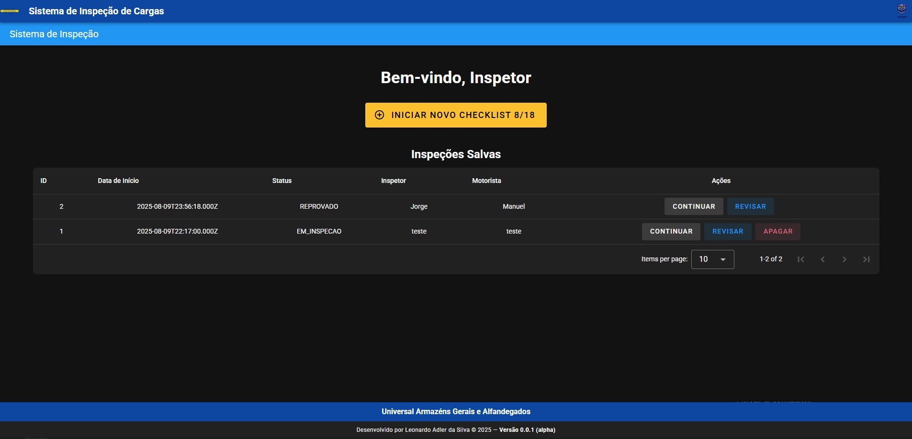
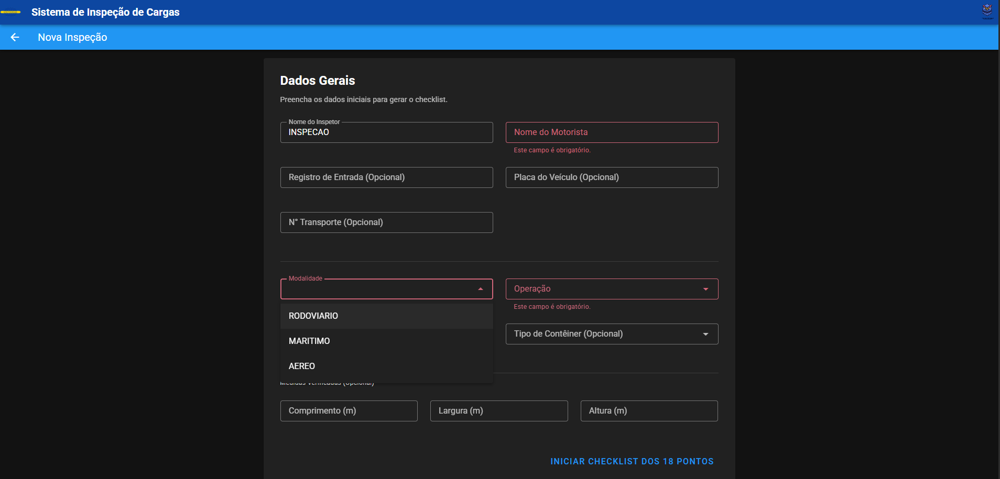
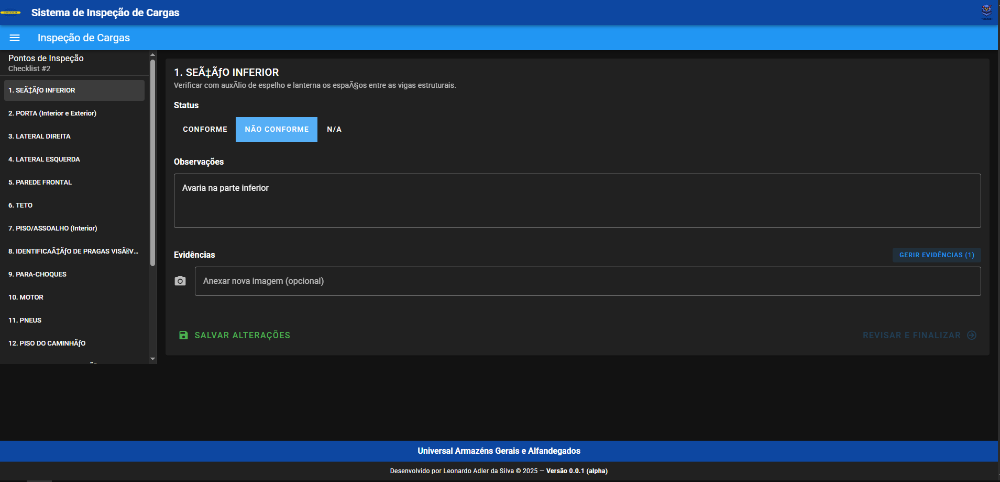
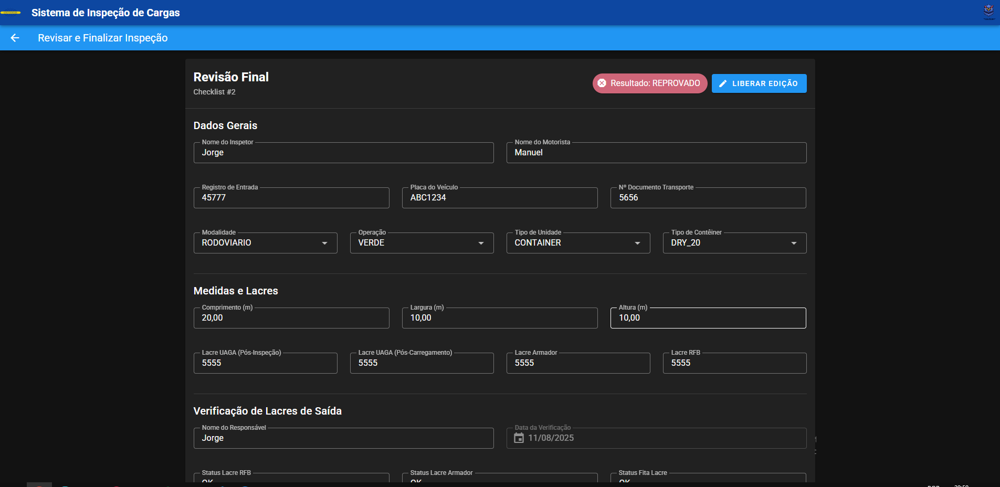
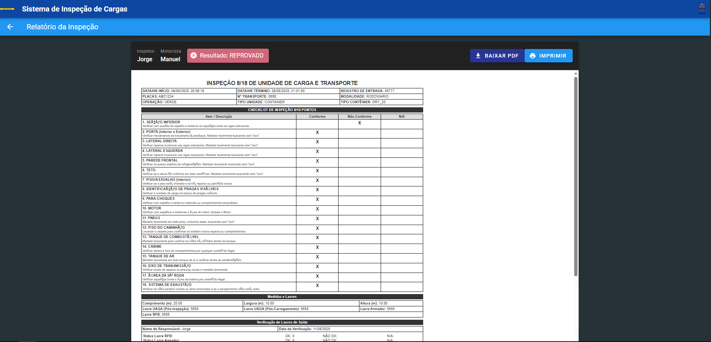
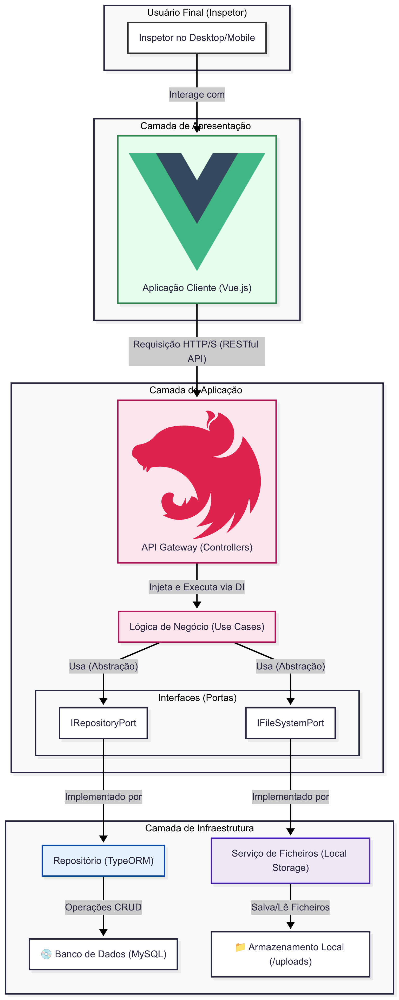
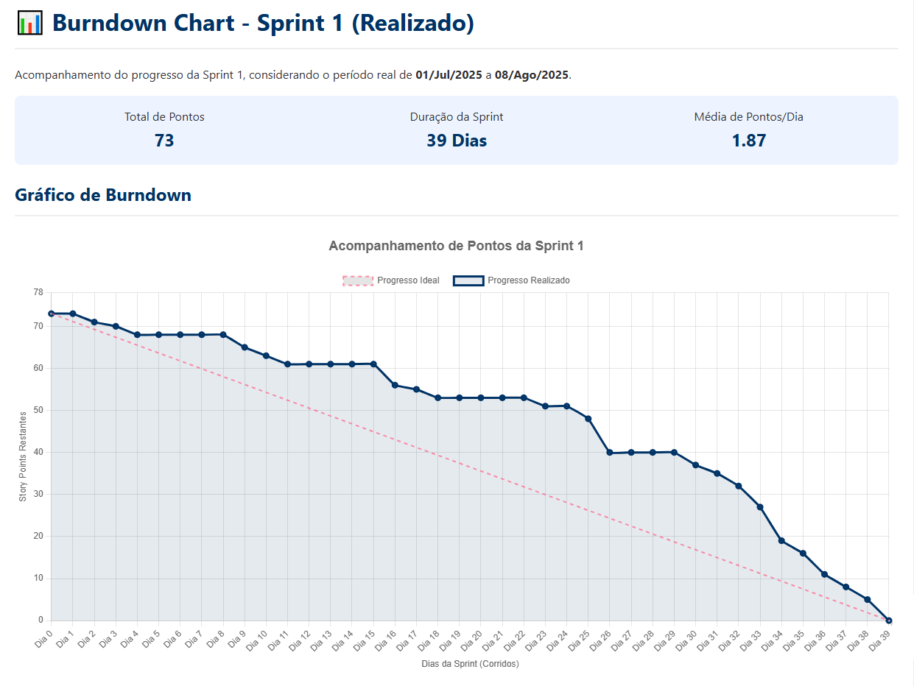

    
    
    <h1 align="center">Aplicação para Inspeção Digital 8/18</h1>
    

        <strong>Versão 0.1.0-beta (Homologação)</strong> 
        <em>MVP da Sprint 1 Concluído em: 08 de Agosto de 2025</em>
    

    

        
        
        
    

    Este projeto foi idealizado, gerido e desenvolvido por <strong>Leonardo Adler da Silva</strong>, Analista de
    Sistemas I na Universal Armazéns Gerais e Alfandegados.
    Atuando em um papel híbrido, foi responsável pelo ciclo de vida completo do MVP: desde o levantamento de requisitos
    (Product Owner), passando pelo planeamento ágil e rituais (Scrum Master), até o desenvolvimento completo da solução
    (Fullstack Developer).

<h2 id="sumario">📜 Sumário</h2>
<ul>
    <li><a href="#visao-geral">Visão Geral: O Problema e a Solução</a></li>
    <li><a href="#entregue-no-mvp">O Que Foi Entregue no MVP</a></li>
    <li><a href="#tecnologias">Tecnologias e Ferramentas</a></li>
    <li><a href="#jornada-do-inspetor">A Jornada do Inspetor (Como Funciona)</a></li>
    <li><a href="#arquitetura">Arquitetura da Solução e Excelência Técnica</a></li>
    <li><a href="#executar-aplicacao">Como Executar a Aplicação</a></li>
    <li><a href="#referencia-api">Referência Rápida da API</a></li>
    <li><a href="#requisitos-sprint1">Requisitos da sprint 1</a></li>
    <li><a href="#requisitos-sprint2">Requisitos da sprint 2</a></li>
    <li><a href="#product-backlog">Product Backlog e Histórias de Usuário</a></li>
    <li><a href="#guia-de-contribuicao">Guia de Contribuição</a></li>
    <li><a href="#gestao-sprint-1">Gestão do Projeto: Sprint 1</a></li>
    <li><a href="#proximos-passos">Próximos Passos: Sprint 2</a></li>
    <li><a href="#autor">Autor</a></li>
    <li><a href="#licenca">Licença</a></li>
</ul>

<h2 id="visao-geral">📝 Visão Geral: Da Necessidade à Plataforma</h2>

    O ponto de partida para este projeto foi a necessidade crítica de digitalizar o processo de <strong>inspeção
        alfandegária 8/18</strong>. Historicamente realizado em formulários físicos, este método manual apresentava
    desafios significativos: risco de perda de documentos, dificuldade na rastreabilidade e, crucialmente, a
    <strong>impossibilidade de anexar evidências fotográficas</strong> de forma ágil.

    No entanto, durante o desenvolvimento inicial, ficou claro que estes desafios eram um sintoma de uma necessidade
    maior na companhia por processos de inspeção mais modernos e centralizados. Assim, a visão do projeto evoluiu: de
    uma solução única para uma <strong>Plataforma de Inspeções Digitais</strong>, capaz de suportar múltiplos tipos de
    checklists, com ou sem a necessidade de evidências fotográficas.

    Esta ambiciosa expansão de escopo é possível sem a necessidade de alterar a arquitetura central da aplicação, um
    testemunho da escolha estratégica de se utilizar <strong>Domain-Driven Design (DDD)</strong> e uma
    <strong>arquitetura desacoplada</strong>. Com o domínio do negócio bem isolado, adicionar novos tipos de inspeção
    torna-se uma expansão lógica, e não uma refatoração complexa. O módulo de <strong>Inspeção 8/18</strong> é,
    portanto, o primeiro e fundamental passo desta jornada, servindo como o MVP que valida o conceito da plataforma e já
    entrega valor imediato para a operação.

<h2 id="entregue-no-mvp">🏆 O Que Foi Entregue na Versão Beta (MVP)</h2>

A primeira versão do projeto foca em entregar o fluxo de valor mais crítico para a operação. O sistema atual permite:

<ul>
    <li>✅ <strong>Criação e Gestão de Inspeções:</strong> Iniciar, editar e apagar inspeções em andamento.</li>
    <li>✅ <strong>Checklist Digital Completo:</strong> Avaliar todos os 18 pontos padrão, adicionando status,
        observações e evidências.</li>
    <li>✅ <strong>Gestão de Evidências Fotográficas:</strong> Anexar, visualizar, baixar e excluir múltiplas fotos para
        cada item.</li>
    <li>✅ <strong>Finalização Inteligente:</strong> O sistema calcula automaticamente o resultado final
        (Aprovado/Reprovado).</li>
    <li>✅ <strong>Geração de Relatórios PDF:</strong> Ao finalizar, um relatório PDF fiel ao formulário oficial é gerado
        e armazenado.</li>
    <li>✅ <strong>Qualidade Garantida:</strong> Todo o fluxo é coberto por uma suíte completa de testes unitários e
        testes End-to-End.</li>
</ul>

<h2 id="tecnologias">🛠️ Tecnologias e Ferramentas</h2>

A aplicação foi construída com uma stack moderna e robusta, focada em performance, escalabilidade e qualidade de
    código.

<table border="1" style="border-collapse: collapse; width:100%;">
    <thead>
        <tr bgcolor="#f2f2f2">
            <th align="left">Área</th>
            <th align="left">Tecnologia Principal</th>
            <th align="left">Testes</th>
            <th align="left">Detalhes</th>
        </tr>
    </thead>
    <tbody>
        <tr>
            <td><strong>Backend</strong></td>
            <td><code>NestJS</code></td>
            <td><code>Jest</code> (Unitário & E2E)</td>
            <td>Node.js, TypeScript, TypeORM, Arquitetura Limpa, DDD, SOLID.</td>
        </tr>
        <tr>
            <td><strong>Frontend</strong></td>
            <td><code>Vue.js</code></td>
            <td><code>Vitest</code> (Unitário) + <code>Cypress</code> (E2E)</td>
            <td>Node.js, TypeScript, Vuetify, Pinia para gestão de estado.</td>
        </tr>
        <tr>
            <td><strong>Banco de Dados</strong></td>
            <td><code>MySQL</code></td>
            <td>N/A</td>
            <td>Banco de dados relacional para persistência dos dados da inspeção.</td>
        </tr>
        <tr>
            <td><strong>DevOps & CI/CD</strong></td>
            <td><code>Podman / Docker Compose</code></td>
            <td>Scripts de Entrypoint</td>
            <td>Ambiente de desenvolvimento e testes 100% containerizado e pipeline de CI "Test-Before-Run".</td>
        </tr>
    </tbody>
</table>

<h2 id="jornada-do-inspetor">🗺️ A Jornada do Inspetor: Como a Aplicação Funciona</h2>

A experiência do usuário foi desenhada para ser simples e intuitiva, replicando o fluxo de trabalho já conhecido pelo
    inspetor em cinco telas principais.

<table width="100%">
    <tr>
        <td align="center" width="50%">
            <b>Tela 1: Inicial</b> 
            O inspetor visualiza as inspeções em andamento ou inicia uma nova, tendo um ponto de partida claro para
                o seu trabalho.
              
            
        </td>
        <td align="center" width="50%">
            <b>Tela 2: Nova Inspeção</b> 
            Aqui são coletados os dados primários que identificam a inspeção, como nomes do inspetor/motorista,
                placas e tipo de operação.
              
            
        </td>
    </tr>
    <tr>
        <td align="center" colspan="2">
             
            <b>Tela 3: Checklist 18 Pontos</b> 
            O coração da aplicação. O inspetor navega entre os 18 pontos, atribui status, escreve observações e
                anexa fotos como evidência.
              
            
        </td>
    </tr>
    <tr>
        <td align="center" width="50%">
             
            <b>Tela 4: Revisar e Finalizar</b> 
            Após completar o checklist, o inspetor pode revisar todos os dados em uma única tela antes de finalizar
                o processo.
              
            
        </td>
        <td align="center" width="50%">
             
            <b>Tela 5: Visualizar Relatório</b> 
            Com a inspeção finalizada, o sistema apresenta o relatório em PDF, pronto para ser baixado ou
                compartilhado.
              
            
        </td>
    </tr>
</table>

<h2 id="arquitetura">🏛️ Arquitetura da Solução e Excelência Técnica</h2>

    A aplicação foi projetada sobre uma <strong>arquitetura de 3 camadas desacoplada</strong>, priorizando a
    manutenibilidade, escalabilidade e a clara separação de responsabilidades. Esta abordagem não apenas facilita a
    evolução futura do sistema, mas também demonstra um compromisso com as melhores práticas da engenharia de software.

    O diagrama abaixo ilustra o fluxo de dados e a organização das camadas, desde a interação do usuário até a
    persistência dos dados.

    

<h3>Uma Arquitetura Pensada para o Futuro</h3>
<ul>
    <li>
        <strong>O Backend é o Coração do Sistema:</strong> A API NestJS é uma aplicação autossustentável que depende
        apenas do banco de dados. Ela foi construída seguindo os princípios da <strong>Clean Architecture</strong> e
        <strong>Domain-Driven Design (DDD)</strong>. As regras de negócio (<em>Use Cases</em>) são puras, sem
        conhecimento de framework ou de detalhes de infraestrutura. A comunicação entre as camadas
        (<code>Controllers</code> → <code>Use Cases</code> → <code>Repositórios</code>) é feita através de
        <strong>interfaces (Portas)</strong> e <strong>Injeção de Dependência</strong>, o que torna o sistema altamente
        testável e de baixo acoplamento.
    </li>
    <li>
        <strong>O Frontend é a Experiência do Usuário:</strong> A aplicação Vue.js é um cliente desacoplado que consome
        a API. O seu único propósito é fornecer uma interface rica, reativa e amigável para que os inspetores possam
        utilizar o poder do backend sem precisar de conhecimento técnico (como usar Swagger ou Postman).
    </li>
    <li>
        <strong>Infraestrutura como um Detalhe Trocável:</strong> A camada de infraestrutura (acesso ao banco de dados
        com TypeORM e gestão de ficheiros) é tratada como um "plugin". O serviço de ficheiros, por exemplo, que hoje
        salva localmente na pasta <code>/uploads</code>, é implementado através de uma interface. Amanhã, podemos criar
        uma nova implementação para salvar em um <em>bucket</em> S3 na AWS e "trocar" a dependência sem alterar
        <strong>uma única linha</strong> da lógica de negócio.
    </li>
</ul>
<h3>Qualidade Garantida por Automação (CI)</h3>

    A qualidade do código não é opcional. Integrado ao ambiente de desenvolvimento com Docker, foi construído uma
    pipeline de <strong>Integração Contínua (CI)</strong>. Como os arquivos <code>entrypoint.sh</code> demonstram, antes
    de qualquer serviço (Backend ou Frontend) iniciar, a suíte completa de <strong>testes unitários e E2E é
        executada</strong>. Se um único teste falhar, o serviço não inicia. Isso garante que a branch principal de
    desenvolvimento esteja sempre estável e que novas funcionalidades não quebrem o comportamento existente.

<h3>Quer Aprofundar?</h3>

    Esta é uma visão geral. Para uma análise técnica minuciosa de cada componente, com diagramas de classe, dicionário
    de dados e guias de contribuição, consulte as documentações específicas:

<table width="100%">
    <tr align="center">
        <td width="33%">
            <a href="./checklist-8-18-back/README.md">
                 
                <strong>Documentação do Backend</strong>
            </a>
             (NestJS, Arquitetura Limpa, TypeORM, API)
        </td>
        <td width="33%">
            <a href="./checklist-8-18-front/README.md">
                 
                <strong>Documentação do Frontend</strong>
            </a>
             (Vue.js, Vuetify, Pinia, Testes Cypress)
        </td>
        <td width="33%">
            <a href="./checklist-8-18-bd/README.md">
                 
                <strong>Documentação do Banco de Dados</strong>
            </a>
             (MER, Dicionário de Dados, Scripts)
        </td>
    </tr>
</table>

<h2 id="executar-aplicacao">🚀 Como Executar a Aplicação Localmente</h2>

    Graças à containerização, todo o ambiente de desenvolvimento (Frontend, Backend e Banco de Dados) pode ser
    configurado e executado com apenas alguns comandos, sem a necessidade de instalar Node.js ou MySQL diretamente na
    sua máquina.

<h3>✅ Pré-requisitos</h3>

Antes de começar, garanta que você tem as seguintes ferramentas instaladas:

<ul>
    <li><strong>Git:</strong> Para clonar o repositório. (<a href="https://git-scm.com/downloads">Download</a>)</li>
    <li><strong>Podman + Podman Compose:</strong> A alternativa open-source recomendada para contêineres. (<a
            href="https://podman.io/docs/installation">Instalação do Podman</a>, <a
            href="https://github.com/containers/podman-compose">Instalação do Podman Compose</a>)</li>
    <li><em>OU</em></li>
    <li><strong>Docker + Docker Compose:</strong> A ferramenta de contêineres mais tradicional. (<a
            href="https://www.docker.com/products/docker-desktop/">Download Docker Desktop</a>)</li>
</ul>

<h3>⚙️ Instruções de Execução (Stack Completo)</h3>

Após instalar os pré-requisitos, abra um terminal na sua pasta de preferência e siga os passos correspondentes à sua
    ferramenta.

<h4>Opção 1: Usando Podman (Recomendado - 1 Comando)</h4>
<ol>
    <li><strong>Clone o repositório:</strong>
        <pre><code>git clone "linkDoRepositorio" </code></pre>
    </li>
    <li><strong>Entre no diretório do projeto:</strong>
        <pre><code>cd checklistBalanca</code></pre>
    </li>
    <li><strong>Construa e inicie a aplicação:</strong>
        <pre><code>podman-compose up --build --no-cache</code></pre>
    </li>
</ol>
<h4>Opção 2: Usando Docker (2 Comandos)</h4>
<ol>
    <li><strong>Clone o repositório:</strong>
        <pre><code>git clone "linkDoRepositorio"</code></pre>
    </li>
    <li><strong>Entre no diretório do projeto:</strong>
        <pre><code>cd checklistBalanca</code></pre>
    </li>
    <li><strong>Construa as imagens dos contêineres:</strong>
        <pre><code>docker compose build --no-cache</code></pre>
    </li>
    <li><strong>Inicie a aplicação:</strong>
        <pre><code>docker compose up</code></pre>
    </li>
</ol>

<h3>O Que Acontece Agora? (Pipeline de Qualidade Automático)</h3>

    Ao executar o comando <code>up</code>, você verá os logs de construção dos contêineres. Uma parte crucial do nosso
    pipeline de qualidade é que, antes de iniciar os servidores de desenvolvimento, <strong>a suíte completa de testes
        unitários e E2E é executada automaticamente para o Backend e o Frontend</strong>. A aplicação só ficará
    disponível se todos os testes passarem com sucesso.

<h3>✅ Acesso à Aplicação</h3>

Após a conclusão dos testes e a inicialização dos servidores, a aplicação estará pronta para uso:

<ul>
    <li>🖥️ <strong>Interface Gráfica (Frontend):</strong> Acesse no seu navegador em <a
            href="http://localhost:3000"><strong>http://localhost:3000</strong></a></li>
    <li>📡 <strong>Documentação da API (Backend):</strong> A interface do Swagger estará disponível em <a
            href="http://localhost:8888/api"><strong>http://localhost:8888/api</strong></a></li>
</ul>

<h3>🛑 Parando a Aplicação</h3>

    Para encerrar todos os serviços, volte ao terminal onde o comando está a ser executado e pressione
    <code>CTRL + C</code>. Para remover os contêineres e redes criadas, execute <code>podman-compose down</code> ou
    <code>docker compose down</code>.

<h3>🛠️ Desenvolvimento Focado (Executando Serviços Individualmente)</h3>

    Para desenvolvedores que precisam de focar em uma única parte da aplicação (apenas o backend, por exemplo), é
    possível executar cada serviço separadamente. As instruções detalhadas para build, configuração de ambiente e
    execução de testes de cada camada estão disponíveis nos seus respetivos manuais:

<ul>
    <li>📄 <strong>Para o Backend (API NestJS):</strong> Consulte o <a
            href="./checklist-8-18-back/README.md"><strong>README.md do Backend</strong></a>.</li>
    <li>📄 <strong>Para o Frontend (App Vue.js):</strong> Consulte o <a
            href="./checklist-8-18-front/README.md"><strong>README.md do Frontend</strong></a>.</li>
    <li>📄 <strong>Para o Banco de Dados (MySQL):</strong> Consulte o <a
            href="./checklist-8-18-bd/README.md"><strong>README.md do Banco de Dados</strong></a>.</li>
</ul>

<h2 id="requisitos-sprint1">📋 Requisitos de Negócio (Sprint 1)</h2>
<ul>
    <li><strong>REQ-08: Criação de Nova Inspeção:</strong> O sistema deve permitir a criação de uma nova inspeção,
        capturando informações iniciais essenciais para identificar o processo.</li>
    <li><strong>REQ-09: Digitalização do Checklist de 18 Pontos:</strong> O sistema deve apresentar um checklist digital
        completo com os 18 pontos de verificação, replicando fielmente a estrutura e as informações do formulário
        manual.</li>
    <li><strong>REQ-10: Registro de Status e Observações:</strong> Para cada ponto do checklist, o sistema deve permitir
        que o inspetor registre um status de conformidade e adicione observações textuais.</li>
    <li><strong>REQ-11: Anexo de Evidências Fotográficas:</strong> O sistema deve suportar o anexo de imagens como
        evidência para cada item do checklist.</li>
    <li><strong>REQ-12: Geração de Relatório em PDF:</strong> Ao finalizar uma inspeção, o sistema deve ser capaz de
        gerar e armazenar um relatório em formato PDF fiel ao documento oficial.</li>
    <li><strong>REQ-13: Gestão e Histórico de Inspeções:</strong> O sistema deve fornecer uma interface para visualizar
        e gerenciar as inspeções em andamento.</li>
    <li><strong>REQ-14: Determinação de Resultado Automático:</strong> O sistema deve possuir uma lógica para calcular
        automaticamente o resultado final da inspeção (Aprovado/Reprovado).</li>
</ul>

<h2 id="requisitos-sprint2">📋 Requisitos de Negócio (Sprint 2)</h2>

    A seguir estão listados os 7 requisitos de negócio levantados pelo Coordenador de TI, que formam o escopo principal
    da Sprint 2. Cada requisito é identificado por um código (REQ-XX) para permitir a rastreabilidade direta com as
    Histórias de Usuário no Product Backlog.

<ol>
    <li><strong>(REQ-01) Navegação Guiada no Checklist:</strong> Implementar um fluxo de navegação sequencial (botão
        "próximo") que guie o usuário para o próximo item de inspeção pendente.</li>
    <li><strong>(REQ-02) Autenticação e Controle de Acesso:</strong> Exigir que os usuários façam login para acessar o
        sistema, preparando a aplicação para futuros níveis de permissão.</li>
    <li><strong>(REQ-03) Assinaturas Digitais:</strong> Permitir a captura de assinaturas digitais do inspetor e do
        motorista diretamente na aplicação para eliminar o uso de papel.</li>
    <li><strong>(REQ-04) Checklist Dinâmico (8 ou 18 Pontos):</strong> Adaptar o sistema para apresentar um checklist de
        8 pontos (apenas contêiner) para modalidades Marítimo/Aéreo e 18 pontos (contêiner + veículo) para a modalidade
        Rodoviário.</li>
    <li><strong>(REQ-05) Novos Tipos de Relatório:</strong> O relatório principal deve se adaptar dinamicamente para 8
        ou 18 pontos, e um novo "Relatório Fotográfico" (apenas com imagens) deve ser criado.</li>
    <li><strong>(REQ-06) Limite de Uma Foto por Item:</strong> Alterar a regra de negócio para permitir o anexo de
        apenas uma, e não mais múltiplas, foto de evidência por item do checklist.</li>
    <li><strong>(REQ-07) Armazenamento Organizado de Relatórios:</strong> Garantir que todos os relatórios em PDF
        gerados sejam salvos em uma estrutura de pastas organizada e persistente no servidor.</li>
</ol>

<h2 id="product-backlog">🎯 Product Backlog e Histórias de Usuário</h2>

    A tabela a seguir mapeia cada História de Usuário ao requisito de negócio que ela atende, garantindo total
    rastreabilidade.

<table border="1" cellpadding="10" cellspacing="0" width="100%">
    <thead>
        <tr bgcolor="#f2f2f2">
            <th align="left"><b>Épico</b></th>
            <th align="left"><b>ID</b></th>
            <th align="left"><b>História de Usuário (User Story)</b></th>
            <th align="left"><b>Requisito Atendido</b></th>
            <th align="left"><b>Status (Sprint)</b></th>
        </tr>
    </thead>
    <tbody>
        <tr>
            <td valign="top" rowspan="5">Gestão de Inspeções (Core)</td>
            <td valign="top"><strong>US-01</strong></td>
            <td valign="top"><strong>Como um</strong> inspetor, <strong>eu quero</strong> iniciar um novo checklist...
            </td>
            <td valign="top" align="center"><strong>REQ-08</strong></td>
            <td valign="top" bgcolor="#e8f5e9">✅ <b>Entregue</b></td>
        </tr>
        <tr>
            <td valign="top"><strong>US-02</strong></td>
            <td valign="top"><strong>Como um</strong> inspetor, <strong>eu quero</strong> avaliar cada um dos 18
                pontos...</td>
            <td valign="top" align="center"><strong>REQ-09, 10, 11</strong></td>
            <td valign="top" bgcolor="#e8f5e9">✅ <b>Entregue</b></td>
        </tr>
        <tr>
            <td valign="top"><strong>US-03</strong></td>
            <td valign="top"><strong>Como um</strong> inspetor, <strong>eu quero</strong> finalizar o checklist...</td>
            <td valign="top" align="center"><strong>REQ-14</strong></td>
            <td valign="top" bgcolor="#e8f5e9">✅ <b>Entregue</b></td>
        </tr>
        <tr>
            <td valign="top"><strong>US-13</strong></td>
            <td valign="top"><strong>Como um</strong> inspetor, <strong>eu quero</strong> que o sistema me apresente o
                checklist correto (8 ou 18 pontos)...</td>
            <td valign="top" align="center"><strong>REQ-04</strong></td>
            <td valign="top" bgcolor="#fffde7">📅 <b>Sprint 2</b></td>
        </tr>
        <tr>
            <td valign="top"><strong>US-14</strong></td>
            <td valign="top"><strong>Como um</strong> inspetor, <strong>eu quero</strong> poder anexar no máximo uma
                foto de evidência por item...</td>
            <td valign="top" align="center"><strong>REQ-06</strong></td>
            <td valign="top" bgcolor="#fffde7">📅 <b>Sprint 2</b></td>
        </tr>
        <tr>
            <td valign="top" rowspan="2">Relatórios e Análise</td>
            <td valign="top"><strong>US-05</strong></td>
            <td valign="top"><strong>Como um</strong> inspetor, <strong>eu quero</strong> que um relatório em PDF seja
                gerado...</td>
            <td valign="top" align="center"><strong>REQ-12</strong></td>
            <td valign="top" bgcolor="#e8f5e9">✅ <b>Entregue</b></td>
        </tr>
        <tr>
            <td valign="top"><strong>US-06</strong></td>
            <td valign="top"><strong>Como um</strong> inspetor, <strong>eu quero</strong> acessar um dashboard com a
                listagem das inspeções...</td>
            <td valign="top" align="center"><strong>REQ-13</strong></td>
            <td valign="top" bgcolor="#e8f5e9">✅ <b>Entregue</b></td>
        </tr>
        <tr>
            <td valign="top" rowspan="3">Gestão de Acesso</td>
            <td valign="top"><strong>US-04</strong></td>
            <td valign="top"><strong>Como um</strong> membro da equipe, <strong>eu quero</strong> fazer login com meu
                usuário e senha...</td>
            <td valign="top" align="center"><strong>REQ-02</strong></td>
            <td valign="top" bgcolor="#fffde7">📅 <b>Sprint 2</b></td>
        </tr>
        <tr>
            <td valign="top"><strong>US-08</strong></td>
            <td valign="top"><strong>Como um</strong> usuário autenticado, <strong>eu quero</strong> visualizar apenas
                os tipos de inspeção para os quais tenho permissão...</td>
            <td valign="top" align="center"><strong>REQ-02</strong></td>
            <td valign="top" bgcolor="#eeeeee">💡 <b>Backlog</b></td>
        </tr>
        <tr>
            <td valign="top"><strong>US-09</strong></td>
            <td valign="top"><strong>Como um</strong> Administrador, <strong>eu quero</strong> uma interface para
                criar/editar usuários e atribuir permissões...</td>
            <td valign="top" align="center"><strong>REQ-02</strong></td>
            <td valign="top" bgcolor="#eeeeee">💡 <b>Backlog</b></td>
        </tr>
        <tr>
            <td valign="top">Melhorias de Usabilidade</td>
            <td valign="top"><strong>US-07</strong></td>
            <td valign="top"><strong>Como um</strong> inspetor, <strong>eu quero</strong> ser guiado para o próximo item
                de checklist não preenchido...</td>
            <td valign="top" align="center"><strong>REQ-01</strong></td>
            <td valign="top" bgcolor="#fffde7">📅 <b>Sprint 2</b></td>
        </tr>
        <tr>
            <td valign="top" rowspan="4">Finalização e Relatórios</td>
            <td valign="top"><strong>US-10</strong></td>
            <td valign="top"><strong>Como um</strong> inspetor, <strong>eu quero</strong> capturar assinaturas
                digitalmente na tela... <em>(Opção de assinatura salva movida para Sprint 3)</em></td>
            <td valign="top" align="center"><strong>REQ-03</strong></td>
            <td valign="top" bgcolor="#fffde7">📅 <b>Sprint 2</b></td>
        </tr>
        <tr>
            <td valign="top"><strong>US-11</strong></td>
            <td valign="top"><strong>Como um</strong> sistema, <strong>eu quero</strong> gerar um relatório PDF dinâmico
                (8 ou 18 pontos) e assinado...</td>
            <td valign="top" align="center"><strong>REQ-05</strong></td>
            <td valign="top" bgcolor="#fffde7">📅 <b>Sprint 2</b></td>
        </tr>
        <tr>
            <td valign="top"><strong>US-15</strong></td>
            <td valign="top"><strong>Como um</strong> inspetor, <strong>eu quero</strong> poder gerar um relatório PDF
                separado contendo apenas as imagens...</td>
            <td valign="top" align="center"><strong>REQ-05</strong></td>
            <td valign="top" bgcolor="#fffde7">📅 <b>Sprint 2</b></td>
        </tr>
        <tr>
            <td valign="top"><strong>US-16</strong></td>
            <td valign="top"><strong>Como um</strong> sistema, <strong>eu quero</strong> armazenar os relatórios gerados
                em uma estrutura de pastas organizada...</td>
            <td valign="top" align="center"><strong>REQ-07</strong></td>
            <td valign="top" bgcolor="#fffde7">📅 <b>Sprint 2</b></td>
        </tr>
        <tr>
            <td valign="top" rowspan="2">Infraestrutura e DevOps</td>
            <td valign="top"><strong>TASK-01</strong></td>
            <td valign="top">Setup e Configuração do Ambiente CI/CD para Homologação.</td>
            <td valign="top" align="center">N/A</td>
            <td valign="top" bgcolor="#fffde7">📅 <b>Sprint 2</b></td>
        </tr>
        <tr>
            <td valign="top"><strong>TASK-02</strong></td>
            <td valign="top">Deploy da Aplicação em Ambiente de Homologação.</td>
            <td valign="top" align="center">N/A</td>
            <td valign="top" bgcolor="#fffde7">📅 <b>Sprint 2</b></td>
        </tr>
        <tr>
            <td valign="top">Melhorias de Usabilidade</td>
            <td valign="top"><strong>US-12</strong></td>
            <td valign="top"><strong>Como um</strong> usuário registrado, <strong>eu quero</strong> poder salvar e
                gerenciar uma imagem da minha assinatura no meu perfil...</td>
            <td valign="top" align="center"><strong>REQ-03</strong></td>
            <td valign="top" bgcolor="#FFF3E0">📅 <b>Sprint 3</b></td>
        </tr>
    </tbody>
</table>

<h3>Detalhes das Histórias de Usuário e Tarefas da Sprint 2</h3>

<h4><strong>US-04: Autenticação de Usuário com Estrutura de Permissões Base</strong></h4>
<ul>
    <li><strong>História:</strong> <strong>Como um</strong> membro da equipe, <strong>eu quero</strong> fazer login com
        meu usuário e senha, <strong>para que</strong> eu possa acessar o sistema de Inspeção 8/18 de forma segura e com
        a base para futuros níveis de acesso.</li>
    <li><strong>Critérios de Aceite:</strong>
        <ol>
            <li>Implementar a tela de login (<code>/login</code>) com campos para "Usuário" e "Senha".</li>
            <li>A API deve validar as credenciais e retornar um token JWT em caso de sucesso.</li>
            <li>Todas as rotas da aplicação, exceto <code>/login</code>, devem ser protegidas.</li>
            <li>A estrutura de dados do usuário no banco de dados deve incluir um campo para <code>role</code> (nível de
                acesso), preparando para o futuro.</li>
            <li>Na Sprint 2, todos os usuários terão acesso padrão e direto ao módulo "Inspeção 8/18" após o login.</li>
        </ol>
    </li>
</ul>

<h4><strong>US-07: Navegação Guiada no Checklist</strong></h4>
<ul>
    <li><strong>História:</strong> <strong>Como um</strong> inspetor, <strong>eu quero</strong> ser guiado para o
        próximo item de checklist não preenchido, <strong>para que</strong> eu possa realizar a inspeção de forma mais
        rápida, sequencial e sem o risco de esquecer algum ponto.</li>
    <li><strong>Critérios de Aceite:</strong>
        <ol>
            <li>Ao entrar na tela do checklist (Tela 3), redirecionar automaticamente para o primeiro item pendente.
            </li>
            <li>Adicionar um botão "Próximo Item" em cada tela de item de inspeção.</li>
            <li>O botão "Próximo Item" deve navegar para o próximo item pendente da lista, pulando os já preenchidos.
            </li>
            <li>Ao finalizar o último item pendente, o botão "Próximo Item" deve levar à tela de "Revisar e Finalizar"
                (Tela 4).</li>
            <li>A navegação manual clicando nos números dos itens deve ser mantida.</li>
        </ol>
    </li>
</ul>

<h4><strong>US-10 (Refatorada): Captura de Assinaturas Digitais (Manual)</strong></h4>
<ul>
    <li><strong>História:</strong> <strong>Como um</strong> inspetor, <strong>eu quero</strong> capturar a minha
        assinatura e a do motorista digitalmente na tela, <strong>para que</strong> possamos validar a inspeção sem a
        necessidade de imprimir o documento.</li>
    <li><strong>Critérios de Aceite:</strong>
        <ol>
            <li>Na tela "Revisar e Finalizar" (Tela 4), devem existir dois componentes de captura de assinatura:
                "Assinatura do Inspetor" e "Assinatura do Motorista".</li>
            <li>Ambos os campos devem permitir o desenho manual da assinatura com o mouse ou dedo/stylus.</li>
            <li>Cada campo de assinatura deve ter um botão "Limpar" para apagar o desenho atual.</li>
            <li>A finalização da inspeção só é permitida após ambas as assinaturas estarem preenchidas.</li>
        </ol>
    </li>
    <li><em><b>Nota do PO:</b> A funcionalidade de "Usar Assinatura Salva" foi movida para a <b>US-12</b> na Sprint 3
            para diminuir o escopo e o risco da Sprint 2, devido à dependência da tela de gerenciamento de perfil.</em>
    </li>
</ul>

<h4><strong>US-11 (Refatorada): Geração de Relatório PDF Dinâmico e Assinado</strong></h4>
<ul>
    <li><strong>História:</strong> <strong>Como um</strong> sistema, <strong>eu quero</strong> gerar um relatório PDF
        dinâmico (para 8 ou 18 pontos) que incorpore as assinaturas capturadas, <strong>para que</strong> o documento
        final reflita precisamente a inspeção realizada.</li>
    <li><strong>Critérios de Aceite:</strong>
        <ol>
            <li>O serviço de backend deve gerar um PDF incluindo as imagens das assinaturas capturadas na <b>US-10</b>.
            </li>
            <li>O template do PDF gerado deve ser dinâmico: se a inspeção for de 8 pontos (Marítimo/Aéreo), o relatório
                deve exibir apenas as seções e os resultados para esses 8 pontos, omitindo os 10 pontos de 'Veículo'.
            </li>
            <li>O link na tela final (Tela 5) deve permitir a visualização/download do relatório gerado.</li>
        </ol>
    </li>
</ul>

<h4><strong>US-13: Checklist Dinâmico Baseado na Modalidade</strong></h4>
<ul>
    <li><strong>História:</strong> <strong>Como um</strong> inspetor, <strong>eu quero</strong> que o sistema me
        apresente o checklist correto (8 ou 18 pontos) baseado na modalidade da inspeção, <strong>para que</strong> o
        processo seja mais direto e à prova de erros.</li>
    <li><strong>Critérios de Aceite:</strong>
        <ol>
            <li>Ao criar uma nova inspeção "Marítimo" ou "Aéreo", o sistema deve associar apenas os 8 itens de checklist
                da categoria "CONTEINER".</li>
            <li>Ao criar uma nova inspeção "Rodoviário", o sistema deve associar todos os 18 itens.</li>
            <li>A tela do checklist (Tela 3) deve exibir dinamicamente apenas os itens (8 ou 18) associados à inspeção.
            </li>
            <li>(Débito Técnico) O status "N/A" deve ser removido da base de dados e da interface.</li>
        </ol>
    </li>
</ul>

<h4><strong>US-14: Limitar Evidência a Uma Foto por Item de Checklist</strong></h4>
<ul>
    <li><strong>História:</strong> <strong>Como um</strong> inspetor, <strong>eu quero</strong> poder anexar no máximo
        uma foto de evidência por item do checklist, <strong>para que</strong> o processo seja simplificado e apenas a
        evidência mais relevante seja capturada.</li>
    <li><strong>Critérios de Aceite:</strong>
        <ol>
            <li>Na interface de um item do checklist, após o upload de uma foto, a opção de adicionar outra foto deve
                ser desabilitada/removida.</li>
            <li>O usuário ainda deve poder remover ou substituir a foto existente.</li>
            <li>A API do backend deve retornar um erro se houver uma tentativa de associar uma segunda foto a um item
                que já possui uma.</li>
        </ol>
    </li>
</ul>

<h4><strong>US-15: Geração de Relatório Fotográfico</strong></h4>
<ul>
    <li><strong>História:</strong> <strong>Como um</strong> inspetor ou gestor, <strong>eu quero</strong> poder gerar um
        relatório em PDF separado contendo apenas as imagens de evidência da inspeção, <strong>para que</strong> eu
        tenha um documento visual e consolidado.</li>
    <li><strong>Critérios de Aceite:</strong>
        <ol>
            <li>Na tela final (Tela 5), deve haver um novo botão/link para "Baixar Relatório Fotográfico".</li>
            <li>A geração do PDF deve conter no máximo 4 imagens por página, com legendas identificando o ponto de
                inspeção.</li>
            <li>As imagens no relatório devem seguir a ordem numérica dos pontos de inspeção a que pertencem.</li>
        </ol>
    </li>
</ul>

<h4><strong>US-16 (Nova): Armazenamento de Relatórios Gerados em Estrutura de Pastas</strong></h4>
<ul>
    <li><strong>História:</strong> <strong>Como um</strong> sistema, <strong>eu quero</strong> armazenar todos os
        relatórios gerados (principal e fotográfico) em uma estrutura de pastas organizada no servidor, <strong>para
            que</strong> haja um registro persistente e de fácil localização dos documentos.</li>
    <li><strong>Critérios de Aceite:</strong>
        <ol>
            <li>O relatório principal (da <b>US-11</b>) deve ser salvo no caminho
                <code>/pdfs/[id_da_inspecao]/relatorio_inspecao.pdf</code>.</li>
            <li>O relatório fotográfico (da <b>US-15</b>) deve ser salvo no caminho
                <code>/pdfs/[id_da_inspecao]/relatorio_fotografico.pdf</code>.</li>
            <li>O sistema deve criar a estrutura de diretórios automaticamente caso não exista.</li>
        </ol>
    </li>
</ul>

<h3>Tarefas Técnicas da Sprint 2</h3>

<h4><strong>TASK-01: Setup e Configuração do Ambiente CI/CD para Homologação</strong></h4>
<ul>
    <li><strong>Descrição:</strong> Preparar os arquivos de configuração (Dockerfiles, docker-compose, scripts de
        entrypoint) e pipelines necessários para automatizar o build, teste e deploy da aplicação em um ambiente de
        homologação.</li>
    <li><strong>Entregáveis:</strong>
        <ol>
            <li>Scripts de CI/CD configurados e funcionais.</li>
            <li>Documentação de como executar o pipeline.</li>
        </ol>
    </li>
</ul>

<h4><strong>TASK-02: Deploy da Aplicação em Ambiente de Homologação</strong></h4>
<ul>
    <li><strong>Descrição:</strong> Executar o deploy da aplicação (Frontend, Backend, Banco de Dados) no servidor de
        homologação, garantindo que o ambiente esteja acessível e funcional para os testes.</li>
    <li><strong>Critérios de Aceite:</strong>
        <ol>
            <li>Aplicação acessível através de uma URL de homologação.</li>
            <li>Todos os serviços (Frontend, Backend, BD) estão rodando e se comunicando corretamente.</li>
            <li>O deploy foi realizado utilizando os pipelines definidos na <b>TASK-01</b>.</li>
        </ol>
    </li>
</ul>

<h2 id="guia-de-contribuicao">🤝 Guia de Contribuição e Fluxo de Desenvolvimento</h2>

    Este projeto utiliza uma abordagem de <strong>Trunk-Based Development</strong>, onde a branch <code>main</code> é a
    nossa única fonte da verdade e deve estar sempre em um estado estável e passível de deploy. Para garantir a
    qualidade e a segurança, todo o desenvolvimento segue o fluxo rigoroso descrito abaixo.

<h3>Filosofia Principal</h3>

    A nossa filosofia é simples: <strong>uma tarefa sem documentação e sem testes é inútil</strong>. A qualidade não é
    uma etapa final, mas sim uma parte integral de cada passo do desenvolvimento.

<h3>O Processo de Contribuição Passo a Passo</h3>
<ol>
    <li>
        <h4><strong>Passo 1: Criando sua Feature Branch</strong></h4>
        
Todo o trabalho começa a partir da branch <code>main</code>.

        <ul>
            <li>
                <strong>Atualize sua <code>main</code> local:</strong>
                <pre><code>git checkout main
git pull origin main</code></pre>
            </li>
            <li>
                <strong>Crie sua branch</strong> seguindo a convenção de nomenclatura abaixo.
            </li>
        </ul>
        <blockquote>
            
<strong>Convenção de Nomenclatura de Branch:</strong> 
                <code>&lt;prefixo&gt;/&lt;repo&gt;-&lt;id-da-task&gt;-&lt;nome-da-task&gt;</code>
            

            <ul>
                <li><strong>Prefixos:</strong> <code>feat</code> (nova feature), <code>fix</code> (correção de bug),
                    <code>docs</code> (documentação), <code>chore</code> (manutenção), etc.
                </li>
                <li><strong>Repo:</strong> <code>geral</code>, <code>backend</code>, <code>frontend</code>,
                    <code>database</code>.
                </li>
                <li><strong>Exemplo:</strong> <code>docs/geral-33-adicao-do-guia-de-contribuicao</code></li>
            </ul>
        </blockquote>
    </li>
    <li>
        <h4><strong>Passo 2: Desenvolvendo com Qualidade</strong></h4>
        
Após criar a sua branch, implemente a sua funcionalidade ou correção. Durante este passo, é
            <strong>obrigatório</strong> que você também crie/atualize:
        

        <ul>
            <li>✅ <strong>Testes Unitários</strong> que cubram a sua nova lógica.</li>
            <li>✅ <strong>Testes End-to-End (E2E)</strong> que validem o fluxo do usuário.</li>
            <li>✅ <strong>Documentação</strong> relevante (seja no código, nos READMEs ou no Swagger).</li>
        </ul>
    </li>
    <li>
        <h4><strong>Passo 3: Sincronização e Validação no CI Local</strong></h4>
        
Antes de abrir uma Pull Request, você deve garantir que o seu código funciona perfeitamente integrado com o
            trabalho mais recente da equipe e em um ambiente limpo.

        <ul>
            <li>
                <strong>Sincronize com a <code>main</code>:</strong> Traga as últimas atualizações da <code>main</code>
                para a sua branch e resolva quaisquer conflitos.
                <pre><code># Estando na sua feature-branch
git pull origin main</code></pre>
            </li>
            <li>
                <strong>Valide no Ambiente de CI:</strong> Suba os contêineres para executar o pipeline de testes
                completo. Isto prova que seu código funciona num ambiente externo, não apenas na sua máquina.
                <pre><code>podman-compose up --build --no-cache</code></pre>
            </li>
        </ul>
    </li>
    <li>
        <h4><strong>Passo 4: Pull Request (PR) e Code Review</strong></h4>
        
Com todos os passos anteriores concluídos com sucesso, é hora de integrar o seu trabalho.

        <ul>
            <li>Abra uma <strong>Pull Request</strong> da sua branch para a <code>main</code>.</li>
            <li>Na descrição, explique de forma clara e concisa as alterações realizadas.</li>
            <li>A sua PR será revisada por outros desenvolvedores da equipe. A revisão é baseada no nosso
                <strong>"Definition of Done" (Contrato de Qualidade)</strong>.
            </li>
            <li>Se forem solicitadas alterações, realize-as e repita o Passo 3. Se aprovado, o seu código será mergeado
                para a <code>main</code>.</li>
        </ul>
    </li>
</ol>

<h3>🏁 Definition of Done (DoD) – Nosso Contrato de Qualidade</h3>

Uma Pull Request só será aprovada se atender a <strong>todos</strong> os critérios abaixo.

<h4>1. Qualidade do Código e Processo</h4>
<ul>
    <li>✅ <strong>Implementação:</strong> O código implementa todos os Critérios de Aceite da tarefa.</li>
    <li>✅ <strong>Padrões:</strong> O código adere aos padrões SOLID, DDD e de estilo definidos para o projeto.</li>
    <li>✅ <strong>Revisão de Código:</strong> A PR foi revisada e aprovada por, no mínimo, um colega.</li>
</ul>
<h4>2. Testes e Validação</h4>
<ul>
    <li>✅ <strong>Testes Unitários:</strong> A nova lógica está coberta por testes unitários significativos.</li>
    <li>✅ <strong>Testes E2E:</strong> O fluxo do usuário relacionado à mudança está coberto por testes E2E.</li>
    <li>✅ <strong>Suíte de Testes Passando:</strong> O pipeline de CI (<code>podman-compose up</code>) executa com 100%
        de sucesso.</li>
</ul>
<h4>3. Documentação (Não-Negociável)</h4>
<ul>
    <li>✅ <strong>Código Comentado:</strong> O código está claro e comentado onde a lógica é complexa.</li>
    <li>✅ <strong>Documentação do Projeto:</strong> Os <code>READMEs</code>, diagramas ou a documentação do Swagger
        foram atualizados para refletir as mudanças.</li>
</ul>

<h2 id="gestao-sprint-1">📈 Gestão do Projeto: Sprint 1 (MVP)</h2>

    O desenvolvimento do MVP ocorreu entre <strong>01 de Julho de 2025</strong> e <strong>08 de Agosto de 2025</strong>.
    A entrega foi concluída com sucesso, cobrindo 100% do escopo planeado para as User Stories essenciais e importantes.

    
<strong>Clique para visualizar o Gráfico Burndown da Sprint 1</strong>

     
    

        
    

<h2 id="proximos-passos">🚀 Próximos Passos: Roadmap para a Versão 1.0</h2>

Com a entrega do MVP (versão Beta), o projeto entra em uma fase de validação incremental e evolução para a versão
    1.0, agora estruturada em Sprints com objetivos claros.

<h3>Fase 1: Validação Técnica e Definição da Sprint 2 (Concluída)</h3>

    Após a finalização da Sprint 1, a aplicação foi apresentada ao Coordenador de TI para uma validação técnica interna.
    Durante esta etapa, foram identificados 7 novos requisitos considerados cruciais para a viabilidade do lançamento em
    um ambiente de homologação real. Estes requisitos formam a base para a próxima fase de desenvolvimento.

<h3>Fase 2: Sprint 2 - Implementando Requisitos Essenciais (Em Planeamento)</h3>

    O grande objetivo da Sprint 2 é implementar os requisitos levantados pela coordenação de TI. Estas funcionalidades
    são vistas como bloqueadoras, ou seja, sem elas, a aplicação não possui a robustez necessária para ser utilizada
    pela operação, mesmo em ambiente de testes. O foco será em melhorar a usabilidade do fluxo principal, garantir a
    integridade dos dados e preparar o terreno para funcionalidades de segurança.

    <em>O Sprint Backlog detalhado, com as novas Histórias de Usuário, será formalizado e adicionado à documentação no
        início desta Sprint.</em>

<h3>Fase 3: Sprint 3 - Homologação com a Operação e Ajuste Fino (Planejada)</h3>

    Uma vez que os requisitos essenciais da Sprint 2 sejam entregues, a aplicação será finalmente liberada para a equipe
    de inspetores em um ambiente de homologação controlado. O objetivo desta fase será coletar feedbacks diretos dos
    usuários finais sobre o fluxo de trabalho. A expectativa é que o feedback desta fase se concentre em melhorias de
    usabilidade e regras de negócio específicas, como:

<ul>
    <li>Obrigatoriedade de campos (ex: observação, placa).</li>
    <li>Validação de formatos de dados.</li>
    <li>Pequenos ajustes de interface para otimizar a experiência em campo.</li>
</ul>

    Estes feedbacks serão a fonte primária para o backlog da Sprint 3, aproximando a aplicação da sua versão 1.0 final.

<h2 id="autor">👨‍💻 Autor</h2>

    <strong>Leonardo Adler da Silva</strong> 
    <em>Analista de Sistemas I at Universal Armazéns Gerais e Alfandegados</em>

<h2 id="licenca">📄 Licença</h2>

Este projeto é licenciado sob a <strong>Licença MIT</strong>.
