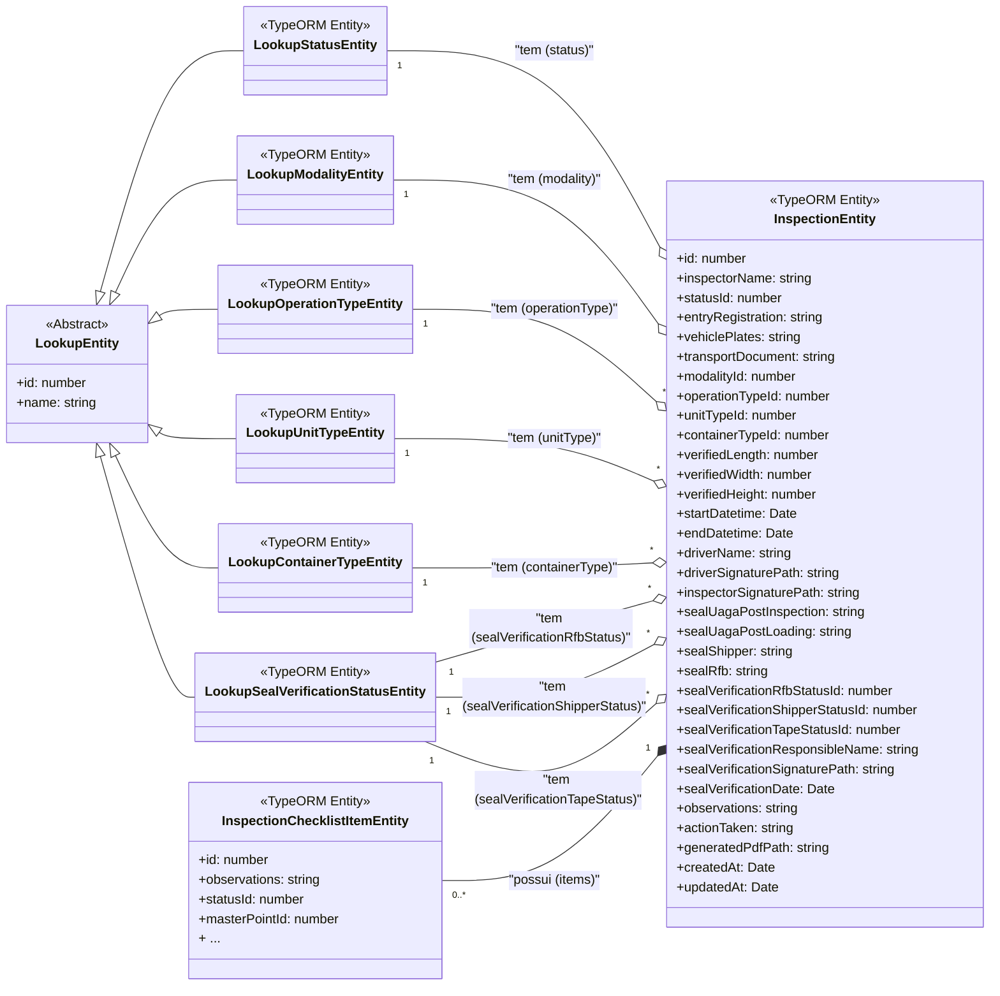
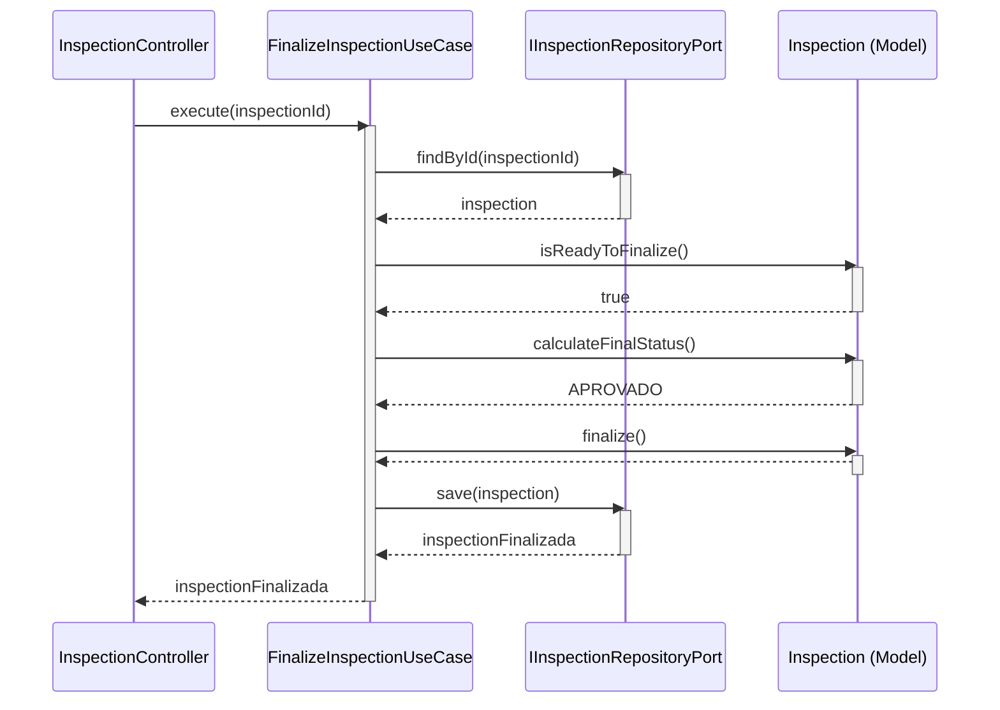
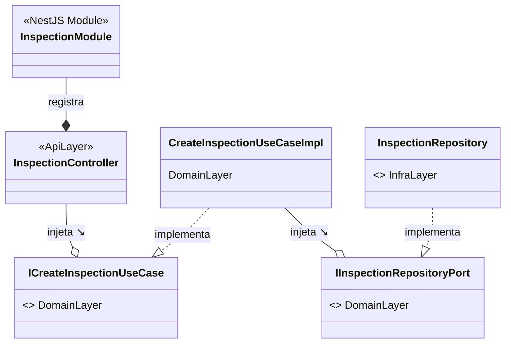
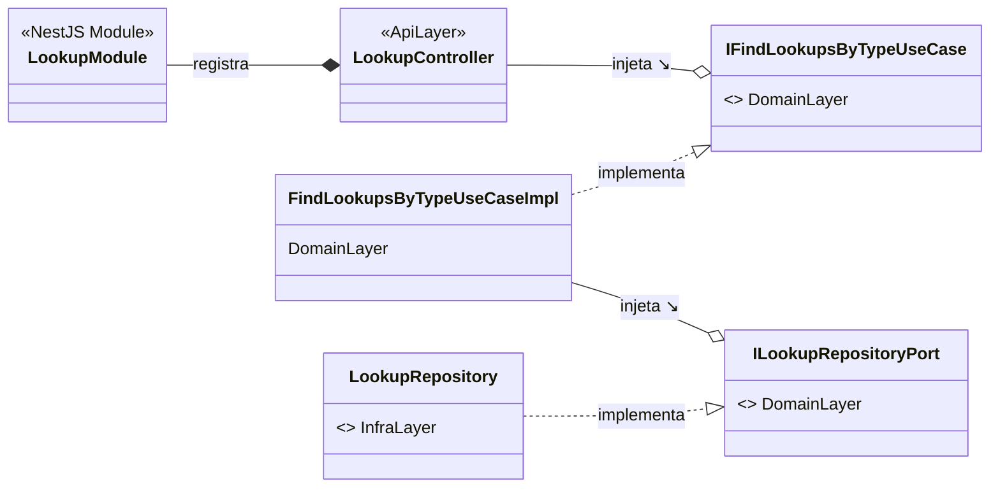

    
    <h1 align="center">Documentação do Backend - Inspeção Digital 8/18</h1>
    

        
        
        
    

<h2 id="visao-geral">📜 Visão Geral</h2>

    Bem-vindo à API do sistema de Inspeção Digital. Este serviço, construído com <strong>NestJS</strong>, é o coração da
    aplicação, responsável por toda a lógica de negócio, processamento de dados e interações com a infraestrutura (banco
    de dados, sistema de arquivos, etc.).

    Sua arquitetura foi desenhada com foco em <strong>qualidade, testabilidade e manutenibilidade</strong>, utilizando
    padrões como Clean Architecture e Domain-Driven Design (DDD).

<h2 id="sumario">📖 Sumário</h2>
<ul>
    <li><a href="#guia-rapido">Guia Rápido (Como Começar)</a></li>
    <li><a href="#guia-de-contribuicao">Guia de Contribuição (Específico do Backend)</a>
        <ul>
            <li><a href="#desenvolvimento-paralelo">Trabalhando sem Bloqueios (Frontend & BD)</a></li>
            <li><a href="#testes">A Importância dos Testes</a></li>
            <li><a href="#padroes-codigo">Padrões de Código</a></li>
        </ul>
    </li>
    <li><a href="#arquitetura-detalhada">Arquitetura Detalhada: Clean Architecture & DDD</a></li>
    <li><a href="#estrutura-de-pastas">Estrutura de Pastas</a></li>
    <li><a href="#referencia-api">Referência da API (Swagger)</a></li>
    <li><a href="#apendice">Guias Avanaçados e Stack Tecnológico Completo</a></li>
</ul>

<h2 id="guia-rapido">🚀 Guia Rápido (Como Começar)</h2>

    A forma mais rápida e recomendada de executar o ambiente de desenvolvimento é via contêiner, que já inclui o banco
    de dados e o pipeline de testes.

<ol>
    <li>Navegue até esta pasta: <code>cd checklist-8-18-back</code></li>
    <li>Execute o comando para construir e iniciar os serviços:
        <pre><code># Usando Podman (recomendado)
podman-compose up --build

# Usando Docker

docker compose build

# Após o build bem sucedido, basta subir o container

docker compose up
</code></pre>
    </li>
</ol>

    Este comando irá construir a imagem, subir um banco de dados de teste, <strong>rodar todos os testes unitários e
        E2E</strong> e, se tudo passar, iniciar a API em modo de desenvolvimento.

    ✅ Após a inicialização, a documentação interativa da API (Swagger) estará disponível em <a
        href="http://localhost:8888/api"><strong>http://localhost:8888/api</strong></a>.

    Para instruções de execução local (Node.js na máquina) ou em modo de produção, consulte o <strong><a
            href="#ambiente-de-desenvolvimento-avancado">Guia de Ambiente Avançado</a></strong>.

<h2 id="guia-de-contribuicao">🤝 Guia de Contribuição (Específico do Backend)</h2>

    Para as diretrizes gerais do projeto (branching, PRs, DoD, etc.), consulte o <a href="../CONTRIBUTING.md">Guia de
        Contribuição Principal</a>. Abaixo estão as nuances específicas para o desenvolvimento do backend.

<h3 id="desenvolvimento-paralelo">Trabalhando sem Bloqueios (Frontend & Banco de Dados)</h3>

    Nossa filosofia é que o desenvolvimento do backend <strong>não deve ser um gargalo</strong>. Seguimos dois
    princípios para habilitar o trabalho paralelo:

<ol>
    <li>
        <strong>O Backend Define o Contrato para o Frontend:</strong> 
        Assim que uma nova funcionalidade é planejada, a primeira tarefa do backend é definir o <strong>contrato da
            API</strong>. Isso significa criar o Controller, os DTOs (Data Transfer Objects) com validações
        (<code>class-validator</code>) e documentar o endpoint no Swagger. Com este contrato claro, o <strong>time de
            Frontend pode começar a trabalhar imediatamente</strong>, mockando as chamadas da API sem precisar que a
        lógica de negócio esteja pronta.
    </li>
    <li>
        <strong>O Backend Trabalha com um Contrato do Banco de Dados:</strong> 
        O backend não precisa esperar que o DBA aplique novas migrações. Com base no <a
            href="../checklist-8-18-bd/README.md">Dicionário de Dados</a>, criamos as <strong>Interfaces de Repositório
            (Portas)</strong> e as <strong>Entidades do TypeORM</strong>. Durante o desenvolvimento, podemos usar um
        repositório "em memória" (mock) para construir e testar toda a lógica de negócio (Use Cases) de forma isolada e
        desacoplada da implementação real do banco.
    </li>
</ol>

<h3 id="testes">A Cultura de Testes</h3>

    Testes não são opcionais. <strong>100% dos Use Cases devem ter testes unitários</strong> que validem a lógica de
    negócio de forma isolada. Funcionalidades críticas também devem ser cobertas por <strong>testes E2E</strong>, que
    simulam uma chamada HTTP real e verificam a integração de todas as camadas.

    Use os comandos <code>yarn test</code> para testes unitários e <code>yarn test:e2e</code> para os testes End-to-End.
    Lembre-se que o pipeline de CI no contêiner executa ambos antes de iniciar a aplicação.

<h3 id="padroes-codigo">Padrões de Código</h3>
<ul>
    <li><strong>Siga a Arquitetura:</strong> Respeite a separação de camadas. Controllers chamam Use Cases. Use Cases
        dependem de Interfaces de Repositório. A Infraestrutura implementa as interfaces.</li>
    <li><strong>DTOs para Tudo:</strong> Toda entrada e saída de dados na camada de API deve ser feita através de DTOs.
        Nunca exponha as entidades do domínio diretamente.</li>
    <li><strong>Injeção de Dependência:</strong> Sempre use o sistema de DI do NestJS. Evite instanciar classes
        manualmente com <code>new</code>.</li>
</ul>

<h2 id="arquitetura-detalhada">🏛️ Arquitetura Detalhada: Clean Architecture & DDD</h2>

    A arquitetura desta API é o seu maior diferencial, projetada com <strong>Clean Architecture</strong> e
    <strong>Domain-Driven Design (DDD)</strong> para criar um sistema desacoplado, testável e manutenível. O princípio
    fundamental é a <strong>Regra da Dependência</strong>: as setas de dependência apontam sempre para o centro, para o
    domínio.

Para uma análise aprofundada das decisões de arquitetura e diagramas de classe/sequência, consulte o <strong><a
            href="#documentacao-avancada">Apêndice de Documentação Avançada</a></strong>.

<h2 id="estrutura-de-pastas">📁 Estrutura de Pastas</h2>

    A estrutura de pastas reflete diretamente a Clean Architecture, com uma pasta <code>/test</code> que espelha a de
    <code>/src</code>.

<pre><code>
├── src/
│    ├── api/       (Controllers, DTOs)
│   ├── domain/    (Models, Use Cases, Ports)
│   ├── infra/     (Adapters: TypeORM, etc.)
│   └── modules/   (Módulos do NestJS)
└── test/
    ├── unit/
    └── e2e/
</code></pre>

<ul>
      <li>
            <code><strong>/src</strong></code>: Contém todo o código-fonte da aplicação.
            <ul>
                  <li><code>/api</code>: A <strong>Camada de Apresentação</strong> (Controllers, DTOs, Pipes).</li>
                  <li><code>/domain</code>: O <strong>Coração do Negócio</strong> (Models, Use Cases, Ports,
                Repositories).</li>
                  <li><code>/infra</code>: Os <strong>Detalhes de Implementação</strong> (TypeORM, File System, PDF).
            </li>
                  <li><code>/modules</code>: Os <strong>Módulos do NestJS</strong> que organizam a injeção de
                dependência.</li>
                </ul>
          </li>
      <li>
            <code><strong>/test</strong></code>: Contém todos os testes automatizados da aplicação.
            <ul>
                  <li>
                        <code>/unit</code>: Testes <strong>Unitários e de Integração</strong>.
                        <ul>
                              <li>A sua estrutura espelha a de <code>src/</code>. Por exemplo, os testes para os Use
                        Cases em <code>src/domain/use-cases</code> encontram-se em
                        <code>test/unit/domain/use-cases</code>.</li>
                              <li>Isto inclui testes isolados para <strong>Use Cases</strong> (regras de negócio),
                        <strong>Controllers</strong> (camada HTTP) e <strong>Services</strong> da infraestrutura
                        (adaptadores).</li>
                            </ul>
                      </li>
                  <li>
                        <code>/e2e</code>: Testes <strong>End-to-End</strong>.
                        <ul>
                              <li>Estes testes iniciam uma instância completa da aplicação e interagem com a API e o
                        banco de dados de teste para validar os fluxos de usuário de ponta a ponta.</li>
                            </ul>
                      </li>
                  <li><code>jest-e2e.json</code>: Ficheiro de configuração específico para a execução dos testes E2E.
            </li>
                </ul>
          </li>
</ul>

<h2 id="referencia-api">📡 Referência da API (Swagger)</h2>

    Após iniciar a aplicação, a documentação completa e interativa da API está disponível em: 
    <a href="http://localhost:8888/api"><strong>http://localhost:8888/api</strong></a>

      
<strong>Clique para expandir a lista de Endpoints da API</strong>

      
A seguir, a lista dos principais endpoints da API. Uma documentação interativa completa está disponível via
        <strong>Swagger</strong> em <code>/api</code> após a aplicação ser iniciada.

      <table border="1" style="border-collapse: collapse; width:100%;">
            <thead>
                  <tr>
                        <th align="left">Método</th>
                        <th align="left">Endpoint</th>
                        <th align="left">Descrição</th>
                      </tr>
                </thead>
            <tbody>
                  <tr bgcolor="#f8f9fa">
                <td colspan="3" align="center"><strong>Lookups (Dados de Suporte)</strong></td>
            </tr>
                  <tr>
                <td><code>GET</code></td>
                <td><code>/lookups/:type</code></td>
                <td>Busca uma lista de valores de suporte (ex: status, modalidades).</td>
            </tr>
                  <tr bgcolor="#f8f9fa">
                <td colspan="3" align="center"><strong>Gestão de Inspeções</strong></td>
            </tr>
                  <tr>
                <td><code>POST</code></td>
                <td><code>/inspections/check-existing</code></td>
                <td>Verifica se uma inspeção similar já existe.</td>
            </tr>
                  <tr>
                <td><code>POST</code></td>
                <td><code>/inspections</code></td>
                <td>Cria um novo registro de inspeção.</td>
            </tr>
                  <tr>
                <td><code>GET</code></td>
                <td><code>/inspections</code></td>
                <td>Lista todas as inspeções.</td>
            </tr>
                  <tr>
                <td><code>GET</code></td>
                <td><code>/inspections/:id</code></td>
                <td>Retorna os detalhes completos de uma inspeção.</td>
            </tr>
                  <tr>
                <td><code>PATCH</code></td>
                <td><code>/inspections/:id</code></td>
                <td>Atualiza os dados de cabeçalho de uma inspeção.</td>
            </tr>
                  <tr>
                <td><code>DELETE</code></td>
                <td><code>/inspections/:id</code></td>
                <td>Apaga uma inspeção (se não finalizada).</td>
            </tr>
                  <tr>
                <td><code>PATCH</code></td>
                <td><code>/inspections/:id/finalize</code></td>
                <td>Finaliza uma inspeção, calculando o status final.</td>
            </tr>
                  <tr bgcolor="#f8f9fa">
                <td colspan="3" align="center"><strong>Itens do Checklist e Evidências</strong></td>
            </tr>
                  <tr>
                <td><code>PATCH</code></td>
                <td><code>/inspections/:inspectionId/points/:pointNumber</code></td>
                <td>Atualiza um item do checklist.</td>
            </tr>
                  <tr>
                <td><code>POST</code></td>
                <td><code>/inspections/:inspectionId/points/:pointNumber/evidence</code></td>
                <td>Faz o upload de uma evidência.</td>
            </tr>
                  <tr>
                <td><code>DELETE</code></td>
                <td><code>/inspections/:inspectionId/points/:pointNumber/evidence</code></td>
                <td>Apaga uma evidência específica.</td>
            </tr>
                  <tr>
                <td><code>GET</code></td>
                <td><code>/inspections/:inspectionId/points/:pointNumber/evidence/:fileName</code></td>
                <td>Baixa um ficheiro de evidência específico.</td>
            </tr>
                  <tr bgcolor="#f8f9fa">
                <td colspan="3" align="center"><strong>Relatórios</strong></td>
            </tr>
                  <tr>
                <td><code>GET</code></td>
                <td><code>/inspections/:id/report/html</code></td>
                <td>Obtém a versão HTML do relatório para pré-visualização.</td>
            </tr>
                  <tr>
                <td><code>GET</code></td>
                <td><code>/inspections/:id/report/pdf</code></td>
                <td>Gera e baixa o relatório PDF.</td>
            </tr>
                </tbody>
          </table>

<h2 id="apendice">📚 Apêndice: Guias Avançados</h2>

    
<strong>Clique para expandir: Guia de Ambiente Avançado (Local, Produção, Deploy)</strong>

    <h3 id="ambiente-de-desenvolvimento-avancado">Ambiente de Desenvolvimento Avançado</h3>
    

        Para desenvolvedores que preferem rodar o Node.js diretamente na máquina host.
    

    <h4>Pré-requisitos</h4>
    <ul>
        <li>
            <strong>Node.js:</strong> Versão 20 ou superior. Recomenda-se o uso de um gestor de versões como o <a
                href="https://github.com/nvm-sh/nvm">nvm</a> para instalar e gerir as versões do Node.js.
        </li>
        <li>
            <strong>Yarn:</strong> Gestor de pacotes do projeto. (<a
                href="https://yarnpkg.com/getting-started/install">Instalação</a>)
        </li>
        <li>
            <strong>Instância MySQL:</strong> Um servidor de banco de dados MySQL deve estar a correr e acessível a
            partir da sua máquina. Pode usar o contêiner do passo anterior (<code>podman-compose up -d db</code>) ou uma
            instalação local.
        </li>
    </ul>
    <h4>Instruções Passo a Passo</h4>
    <ol>
        <li>
            <strong>Instale as Dependências:</strong>
            <pre><code>yarn install</code></pre>
        </li>
        <li>
            <strong>Configure as Variáveis de Ambiente:</strong>
            
Copie o ficheiro <code>.env.example</code> para <code>.env</code> e preencha com as credenciais do seu
                banco de dados local (ex: <code>DB_HOST=localhost</code>).

            <pre><code>cp .env.example .env</code></pre>
        </li>
        <li>
            <strong>Execute o Pipeline de Qualidade (Manual):</strong> 
            Para simular o nosso CI e garantir a qualidade do seu código, execute os testes na mesma ordem que o
            ambiente containerizado faria.
            
Primeiro, os testes unitários:

            <pre><code>yarn test</code></pre>
            
Depois, os testes End-to-End (garanta que o seu <code>.env</code> aponta para um banco de dados de
                teste):

            <pre><code>yarn test:e2e</code></pre>
        </li>
        <li>
            <strong>Inicie o Servidor de Desenvolvimento:</strong>
            
Se todos os testes passaram, inicie o servidor em modo de desenvolvimento com hot-reload.

            <pre><code>yarn start:dev</code></pre>
        </li>
    </ol>
    

    <h3>Executando em Modo de Produção</h3>
    

        Para executar a aplicação num ambiente de produção, o processo é diferente. Não usamos o modo de desenvolvimento
        (`start:dev`), mas sim o código transpilado e otimizado.
    

    <ol>
        <li>
            <strong>Gere o Build de Produção:</strong> 
            Este comando transpila o código TypeScript para JavaScript puro numa pasta <code>/dist</code>.
            <pre><code>yarn build</code></pre>
        </li>
        <li>
            <strong>Inicie a Aplicação em Modo de Produção:</strong> 
            Este comando executa o ficheiro <code>main.js</code> a partir da pasta <code>/dist</code> usando o Node.js.
            <pre><code>yarn start:prod</code></pre>
        </li>
    </ol>
    <blockquote>
        

            <strong>Nota Importante:</strong> Para um ambiente de produção real, é altamente recomendável utilizar um
            gestor de processos como o <a href="https://pm2.keymetrics.io/">PM2</a>. Ele garante que a sua aplicação
            reinicie automaticamente em caso de falhas, além de oferecer balanceamento de carga, monitorização e gestão
            de logs.  Exemplo com PM2: <code>pm2 start dist/main.js --name "checklist-api"</code>
        

    </blockquote>
    <h3 id="deploy-em-producao-iis">🚢 Deploy em Produção (IIS)</h3>
    
Guia preliminar para a publicação da aplicação em um ambiente Windows Server com IIS.

    <h3>Pré-requisitos no Servidor</h3>
    <ul>
        <li><strong>IIS</strong> com o módulo <strong>URL Rewrite</strong> instalado.</li>
        <li><strong><a href="https://github.com/tjanczuk/iisnode">iisnode</a></strong>: Módulo para hospedar aplicações
            Node.js no IIS.</li>
        <li><strong>Node.js</strong> (versão LTS) instalado no servidor.</li>
    </ul>
    <h3>Passos para o Deploy</h3>
    <ol>
        <li><strong>Build da Aplicação:</strong> Gere a versão de produção com <code>yarn build</code>.</li>
        <li><strong>Transferência de Ficheiros:</strong> Copie a pasta <code>/dist</code>, <code>node_modules</code> e
            <code>package.json</code> para uma pasta no servidor (ex: <code>C:\inetpub\wwwroot\checklist-api</code>).
        </li>
        <li><strong>Configurar o IIS:</strong> Crie um novo Site no IIS apontando para a pasta do projeto. Configure o
            seu Application Pool para "No Managed Code".</li>
        <li><strong>Criar o <code>web.config</code>:</strong> Crie um ficheiro <code>web.config</code> na raiz da pasta
            no servidor. Este ficheiro instrui o IIS a usar o iisnode para lidar com as requisições.
            <pre><code>&lt;configuration&gt;
&lt;system.webServer&gt;
&lt;handlers&gt;
&lt;add name="iisnode" path="main.js" verb="*" modules="iisnode" /&gt;
&lt;/handlers&gt;
&lt;rewrite&gt;
&lt;rules&gt;
&lt;rule name="NodeInspector" patternSyntax="ECMAScript" stopProcessing="true"&gt;
&lt;match url="^main.js/debug[/]?" /&gt;
&lt;/rule&gt;
&lt;rule name="DynamicContent"&gt;
&lt;conditions&gt;
&lt;add input="{REQUEST_FILENAME}" matchType="IsFile" negate="True" /&gt;
&lt;/conditions&gt;
&lt;action type="Rewrite" url="main.js" /&gt;
&lt;/rule&gt;
&lt;/rules&gt;
&lt;/rewrite&gt;
&lt;!-- Outras configurações como logging do iisnode podem ser adicionadas aqui --&gt;
&lt;/system.webServer&gt;
&lt;/configuration&gt;
</code></pre>
        </li>
        <li><strong>Variáveis de Ambiente:</strong> Configure as variáveis de ambiente (conexão com o banco de produção,
            JWT_SECRET, etc.) no painel de configuração do site no IIS ou diretamente no <code>web.config</code>.</li>
    </ol>

    
<strong>Clique para expandir: Stack Tecnológico Completo</strong>

    <h3 id="stack-tecnologico">🛠️ Stack Tecnológico</h3>
    <table border="1" style="border-collapse: collapse; width:100%;">
        <thead bgcolor="#f2f2f2">
            <tr>
                <th align="left">Categoria</th>
                <th align="left">Tecnologia/Ferramenta</th>
                <th align="left">Propósito</th>
            </tr>
        </thead>
        <tbody>
            <tr>
                <td>Framework Principal</td>
                <td><strong>NestJS 10.x</strong></td>
                <td>Estrutura da aplicação, DI, modularidade.</td>
            </tr>
            <tr>
                <td>Linguagem</td>
                <td><strong>TypeScript 5.x</strong></td>
                <td>Tipagem estática e funcionalidades modernas de JS.</td>
            </tr>
            <tr>
                <td>Acesso a Dados</td>
                <td><strong>TypeORM</strong></td>
                <td>ORM para interação com o banco de dados.</td>
            </tr>
            <tr>
                <td>Banco de Dados</td>
                <td><strong>MySQL 8.0</strong></td>
                <td>Persistência dos dados relacionais.</td>
            </tr>
            <tr>
                <td>Testes</td>
                <td><strong>Jest & Supertest</strong></td>
                <td>Testes unitários, de integração e E2E.</td>
            </tr>
            <tr>
                <td>Serviços Auxiliares</td>
                <td><strong>Puppeteer / Multer</strong></td>
                <td>Geração de PDF e upload de ficheiros.</td>
            </tr>
            <tr>
                <td>Containerização</td>
                <td><strong>Docker / Podman</strong></td>
                <td>Ambiente de desenvolvimento e CI.</td>
            </tr>
        </tbody>
    </table>

    
<strong>Clique para expandir: Documentação Avançada de Arquitetura</strong>

    <h3 id="documentacao-avancada">💡 Filosofia e Diagramas de Arquitetura</h3>
    
Aprofundamento nas decisões de arquitetura e diagramas de classe/sequência que modelam o sistema.

    

  Os diagramas a seguir não são apenas documentação; são a representação visual da nossa filosofia de arquitetura. Eles mostram como os princípios de <strong>Clean Architecture</strong>, <strong>DDD</strong> e <strong>SOLID</strong> foram aplicados na prática para construir um sistema desacoplado, testável e robusto.

  Vamos explorar a estrutura em três níveis: o <strong>Modelo de Domínio</strong> (a estrutura dos dados), o <strong>Comportamento Dinâmico</strong> (como os objetos colaboram) e a <strong>Orquestração dos Módulos</strong> (como o NestJS conecta tudo).

<h3>1. O Coração do Domínio: A Entidade <code>InspectionEntity</code></h3>

  Tudo começa com a nossa entidade principal, a <code>InspectionEntity</code>. Este diagrama de classe mostra a estrutura de dados central da aplicação e as suas relações diretas com as entidades de suporte (Lookups) e as entidades filhas (Checklist Items). É o mapa de dados fundamental do sistema.

<h4>Como Ler Este Diagrama:</h4>
<ul>
<li><code><<Estereótipos>></code>: Indicam o "tipo" da classe. <code><<TypeORM Entity>></code> é uma classe mapeada para o banco, e <code><<Abstract>></code> é uma classe base.</li>
<li><code>*--</code> (Composição): A seta preenchida mostra que os <code>items</code> são "parte de" uma <code>InspectionEntity</code>. Se a inspeção for apagada, os seus itens também são.</li>
<li><code>o--</code> (Agregação): A seta vazia mostra que a <code>InspectionEntity</code> "tem uma" referência a uma entidade de Lookup, mas esta existe independentemente.</li>
</ul>

<h3>2. Colaboração em Ação: O Fluxo de Finalização (Diagrama de Sequência)</h3>

Um diagrama de classes mostra a estrutura, mas um <strong>diagrama de sequência</strong> mostra a colaboração. Este diagrama detalha, passo a passo, como os diferentes componentes do sistema interagem ao longo do tempo para executar um dos nossos casos de uso mais críticos: a finalização de uma inspeção.

<h4>Como Ler Este Diagrama:</h4>
<ul>
<li><strong>Atores:</strong> Cada coluna representa um objeto ou classe.</li>
<li><strong>Linha do Tempo:</strong> A leitura é feita de cima para baixo.</li>
<li><strong>Setas:</strong> Indicam chamadas de métodos. As setas a tracejado indicam o retorno.</li>
<li><strong>O Padrão de Arquitetura em Ação:</strong> Note como o <code>Controller</code> apenas chama o <code>UseCase</code>. O <code>UseCase</code> orquestra tudo: ele busca o modelo de domínio (Inspection) através da porta do <code>Repository</code>, executa a lógica de negócio no próprio modelo e, finalmente, pede ao <code>Repository</code> para persistir o resultado.</li>
</ul>

<h3>3. A Orquestração: Como o NestJS Conecta Tudo (Diagramas de Módulo)</h3>

Finalmente, os diagramas de módulo mostram como o NestJS, através de seu poderoso sistema de <strong>Injeção de Dependência</strong>, "conecta" todas as peças. Eles são a planta baixa da configuração do nosso contêiner de DI, demonstrando a aplicação prática do <strong>Princípio da Inversão de Dependência (SOLID)</strong>.

<h4>3.1 - O Módulo Principal: <code>InspectionModule</code></h4>

<h4>3.2 - O Módulo de Suporte: <code>LookupModule</code></h4>

<h4>Como Ler Estes Diagramas:</h4>
<ul>
<li><strong>Injeção de Dependência (--o):</strong> A seta com círculo vazio mostra a injeção. O ponto mais importante é que os componentes sempre dependem de <strong>abstrações</strong> (<code><<Interface>></code>), nunca de classes concretas de outras camadas. O <code>Controller</code> não "sabe" que <code>CreateInspectionUseCaseImpl</code> existe; ele apenas pede por <code>ICreateInspectionUseCase</code>.</li>
<li><strong>Implementação (..|&gt;):</strong> A seta pontilhada mostra qual classe concreta implementa uma interface. É no <code>providers</code> do Módulo que esta "ligação" é feita.</li>
</ul>

