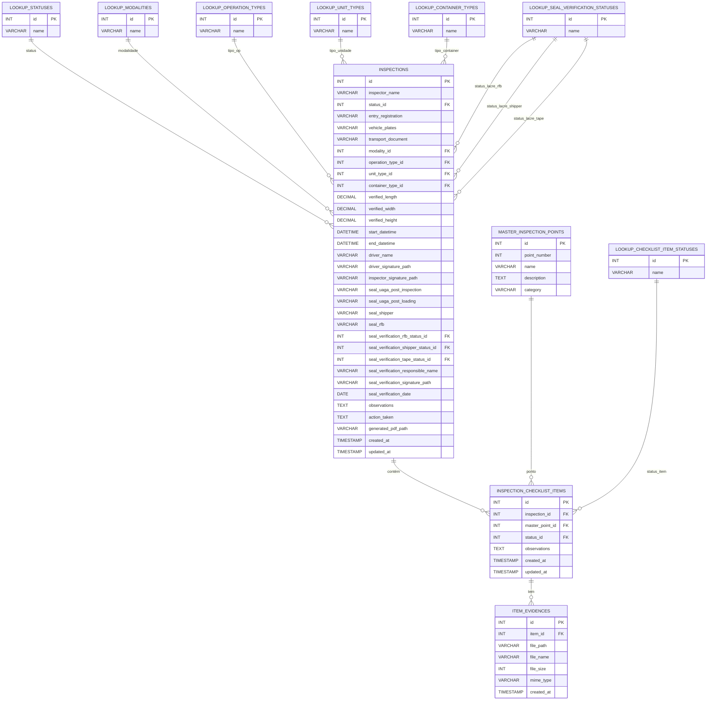

      
      <h1 align="center">Documentação do Banco de Dados - Inspeção Digital 8/18</h1>
      

            
            
            
          

<h2 id="visao-geral">📜 Visão Geral</h2>

    Este repositório contém toda a documentação, scripts e artefatos relacionados à camada de persistência da Aplicação
    de Inspeção Digital. O objetivo é servir como a <strong>fonte única da verdade</strong> para a estrutura de dados
    que suporta o sistema.

<h2 id="sumario">📖 Sumário</h2>
<ul>
    <li><a href="#guia-rapido">Guia Rápido (Como Começar)</a></li>
    <li><a href="#guia-de-contribuicao">Guia de Contribuição (Específico do BD)</a>
        <ul>
            <li><a href="#desenvolvimento-paralelo">O BD como Contrato para o Desenvolvimento Paralelo</a></li>
            <li><a href="#governanca-schema">Governança e Evolução do Schema</a></li>
            <li><a href="#scripts-uteis">Scripts Úteis para Desenvolvimento</a></li>
        </ul>
    </li>
    <li><a href="#arquitetura-dados">Arquitetura e Dicionário de Dados</a>
        <ul>
            <li><a href="#mer">Modelo de Entidade-Relacionamento (MER)</a></li>
            <li><a href="#dicionario-de-dados-completo">Dicionário de Dados Completo</a></li>
            <li><a href="#decisoes-design">Decisões de Design</a></li>
        </ul>
    </li>
    <li><a href="#detalhes-implementacao">Detalhes de Implementação</a></li>
</ul>

<h2 id="guia-rapido">🚀 Guia Rápido (Como Começar)</h2>

Esta seção é para você que precisa apenas "subir" o banco de dados para trabalhar em outra frente do projeto.

<h4>Para Desenvolvedores (Backend/Frontend)</h4>

    Para iniciar o banco de dados como parte do ambiente de desenvolvimento completo, execute o seguinte comando a
    partir da <strong>pasta raiz do projeto principal</strong>:

<pre><code># Usando Docker
docker compose up -d db

# Usando Podman
podman-compose up -d db</code></pre>

O banco de dados estará acessível em <code>localhost:3306</code> e pronto para ser consumido pela API.

<h4>Para DBAs e Desenvolvimento Focado no Banco</h4>

    Se você precisa trabalhar exclusivamente no schema, execute os comandos a partir <strong>desta pasta</strong>
    (<code>/checklist-8-18-bd</code>):

<pre><code>podman-compose up --build -d</code></pre>

<h2 id="guia-de-contribuicao">🤝 Guia de Contribuição (Específico do BD)</h2>

    Para as diretrizes gerais do projeto (branching, PRs, etc.), consulte o <a href="../CONTRIBUTING.md">Guia de
        Contribuição Principal</a>. Abaixo estão as nuances específicas para trabalhar com o banco de dados.

<h3 id="desenvolvimento-paralelo">O Banco de Dados como Contrato para o Desenvolvimento Paralelo</h3>

    Nossa filosofia de trabalho visa minimizar bloqueios entre as equipes. O schema do banco de dados, definido e
    documentado neste repositório, funciona como um <strong>contrato imutável</strong> para o time de Backend.

<blockquote>
    

        <strong>Como isso funciona na prática?</strong> 
        Uma vez que uma nova estrutura de tabela ou coluna é definida, documentada no Dicionário de Dados e aprovada, o
        <strong>time de Backend não precisa esperar</strong> a migração ser aplicada em todos os ambientes. Eles podem
        imediatamente começar a desenvolver suas lógicas de negócio, mockando a camada de acesso a dados (repositórios)
        com base neste contrato.
    

</blockquote>

<h3 id="governanca-schema">Governança e Evolução do Schema ("Database First")</h3>

    A evolução do schema segue uma abordagem estrita e segura de <strong>"Database First"</strong>. A autoridade para
    modificar o schema pertence ao DBA, com validação do Product Owner (PO). A aplicação backend <strong>nunca</strong>
    deve alterar o banco (<code>DB_SYNCHRONIZE='false'</code>).

O fluxo para qualquer alteração é:

<ol>
    <li><strong>Proposta de Mudança:</strong> O Desenvolvedor ou PO formaliza a necessidade.</li>
    <li><strong>Análise e Aprovação:</strong> O PO valida o valor de negócio e o DBA analisa o impacto técnico.</li>
    <li><strong>Desenvolvimento da Migração:</strong> O DBA cria um script SQL de migração versionado (ex:
        <code>V2__Add_inspections_priority_column.sql</code>).
    </li>
    <li><strong>Aplicação Controlada:</strong> O DBA aplica o script nos ambientes.</li>
    <li><strong>Sincronização da Aplicação:</strong> Somente após a migração, o Desenvolvedor backend atualiza as
        entidades do TypeORM no código.</li>
</ol>

<h3 id="scripts-uteis">Scripts Úteis para Desenvolvimento e Validação</h3>
<ul>
    <li><strong><code>casosDeUso.sql</code>:</strong> Um script poderoso que simula os fluxos da aplicação diretamente
        no banco. Excelente para testar a integridade do modelo e otimizações.</li>
    <li><strong>Script de Limpeza:</strong> Antes de rodar o <code>casosDeUso.sql</code>, use o script de reset abaixo
        para limpar os dados transacionais e evitar conflitos.</li>
</ul>
<pre><code>-- Desativa a verificação de chaves estrangeiras
SET FOREIGN_KEY_CHECKS = 0;
-- Limpa as tabelas transacionais
TRUNCATE TABLE `item_evidences`, `inspection_checklist_items`, `inspections`;
-- Reativa a verificação
SET FOREIGN_KEY_CHECKS = 1;</code></pre>

<h2 id="arquitetura-dados">🏛️ Arquitetura e Dicionário de Dados</h2>

<h3 id="mer">Modelo de Entidade-Relacionamento (MER)</h3>

O diagrama a seguir ilustra a estrutura das tabelas e seus relacionamentos.

<blockquote>
    <strong>Nota:</strong> O código abaixo é Mermaid. Se não for renderizado corretamente no seu visualizador, você pode
    usar um editor online como o <a href="https://mermaid.live/" target="_blank">Mermaid Live Editor</a> para colar o
    código e ver o diagrama.
</blockquote>

<h2 id="dicionario-de-dados-completo">📖 Dicionário de Dados Completo</h2>

A seguir, uma descrição detalhada de cada tabela e das suas respetivas colunas.

<h3>Tabelas de Lookup (Mestras)</h3>

Estas tabelas contêm valores estáticos para garantir a consistência dos dados em toda a aplicação.

<table border="1" style="border-collapse: collapse; width:100%;">
    <thead>
        <tr>
            <th align="left">Tabela</th>
            <th align="left">Descrição</th>
        </tr>
    </thead>
    <tbody>
        <tr>
            <td><code>lookup_statuses</code></td>
            <td>Status possíveis para uma inspeção geral (ex: EM_INSPECAO, APROVADO).</td>
        </tr>
        <tr>
            <td><code>lookup_modalities</code></td>
            <td>Modalidades de transporte disponíveis (ex: RODOVIARIO, MARITIMO).</td>
        </tr>
        <tr>
            <td><code>lookup_operation_types</code></td>
            <td>Tipos de operação aduaneira, geralmente indicando nível de risco (ex: VERDE, VERMELHA).</td>
        </tr>
        <tr>
            <td><code>lookup_unit_types</code></td>
            <td>Tipos de unidade de carga (ex: CONTAINER, BAU).</td>
        </tr>
        <tr>
            <td><code>lookup_container_types</code></td>
            <td>Tipos específicos de contêineres (ex: DRY_20, REEFER_40).</td>
        </tr>
        <tr>
            <td><code>lookup_checklist_item_statuses</code></td>
            <td>Status para cada item da inspeção (ex: CONFORME, NAO_CONFORME).</td>
        </tr>
        <tr>
            <td><code>lookup_seal_verification_statuses</code></td>
            <td>Status para a verificação de lacres de saída (ex: OK, NAO_OK).</td>
        </tr>
    </tbody>
</table>

<h3>Tabelas Principais</h3>

<h4><strong><code>master_inspection_points</code></strong></h4>

Tabela mestre com a definição dos 18 pontos de inspeção padrão. Esta tabela é imutável e serve como base para todos
    os checklists.

<table border="1" style="border-collapse: collapse; width:100%;">
    <thead>
        <tr>
            <th align="left">Nome da Coluna</th>
            <th align="left">Tipo de Dado</th>
            <th align="left">Chave</th>
            <th align="left">Nulo?</th>
            <th align="left">Descrição / Regra de Negócio</th>
            <th align="left">Exemplo</th>
        </tr>
    </thead>
    <tbody>
        <tr>
            <td><code>id</code></td>
            <td>INT</td>
            <td>PK</td>
            <td>Não</td>
            <td>Identificador único do ponto de inspeção.</td>
            <td><code>5</code></td>
        </tr>
        <tr>
            <td><code>point_number</code></td>
            <td>INT</td>
            <td>UNIQUE</td>
            <td>Não</td>
            <td>Número oficial do ponto (1 a 18).</td>
            <td><code>5</code></td>
        </tr>
        <tr>
            <td><code>name</code></td>
            <td>VARCHAR(255)</td>
            <td></td>
            <td>Não</td>
            <td>Nome resumido do ponto.</td>
            <td><code>"PISO DO CAMINHÃO"</code></td>
        </tr>
        <tr>
            <td><code>description</code></td>
            <td>TEXT</td>
            <td></td>
            <td>Sim</td>
            <td>Descrição detalhada do procedimento de inspeção.</td>
            <td><code>"Levantar o carpete..."</code></td>
        </tr>
        <tr>
            <td><code>category</code></td>
            <td>VARCHAR(50)</td>
            <td></td>
            <td>Não</td>
            <td>Agrupador do ponto: 'VEICULO' ou 'CONTEINER'.</td>
            <td><code>"VEICULO"</code></td>
        </tr>
    </tbody>
</table>

<h4><strong><code>inspections</code></strong></h4>

Tabela central que armazena cada registo de inspeção, contendo todos os dados do cabeçalho do formulário.

<table border="1" style="border-collapse: collapse; width:100%;">
    <thead>
        <tr>
            <th align="left">Nome da Coluna</th>
            <th align="left">Tipo de Dado</th>
            <th align="left">Chave</th>
            <th align="left">Nulo?</th>
            <th align="left">Descrição</th>
            <th align="left">Exemplo</th>
        </tr>
    </thead>
    <tbody>
        <tr>
            <td><code>id</code></td>
            <td>INT</td>
            <td>PK</td>
            <td>Não</td>
            <td>ID único da inspeção (auto-incremento).</td>
            <td><code>1001</code></td>
        </tr>
        <tr>
            <td><code>inspector_name</code></td>
            <td>VARCHAR(255)</td>
            <td></td>
            <td>Não</td>
            <td>Nome do inspetor responsável.</td>
            <td><code>"Carlos Souza"</code></td>
        </tr>
        <tr>
            <td><code>status_id</code></td>
            <td>INT</td>
            <td>FK</td>
            <td>Não</td>
            <td>ID do status geral (ref. <code>lookup_statuses</code>).</td>
            <td><code>2</code></td>
        </tr>
        <tr>
            <td><code>entry_registration</code></td>
            <td>VARCHAR(100)</td>
            <td></td>
            <td>Sim</td>
            <td>Número do registo de entrada.</td>
            <td><code>"RE-2025-099"</code></td>
        </tr>
        <tr>
            <td><code>vehicle_plates</code></td>
            <td>VARCHAR(20)</td>
            <td></td>
            <td>Sim</td>
            <td>Placa do veículo inspecionado.</td>
            <td><code>"BRA2E19"</code></td>
        </tr>
        <tr>
            <td><code>transport_document</code></td>
            <td>VARCHAR(100)</td>
            <td></td>
            <td>Sim</td>
            <td>Nº do documento de transporte (CTe, etc.).</td>
            <td><code>"CTE123456"</code></td>
        </tr>
        <tr>
            <td><code>modality_id</code></td>
            <td>INT</td>
            <td>FK</td>
            <td>Não</td>
            <td>ID da modalidade (ref. <code>lookup_modalities</code>).</td>
            <td><code>1</code></td>
        </tr>
        <tr>
            <td><code>operation_type_id</code></td>
            <td>INT</td>
            <td>FK</td>
            <td>Não</td>
            <td>ID do tipo de operação (ref. <code>lookup_operation_types</code>).</td>
            <td><code>1</code></td>
        </tr>
        <tr>
            <td><code>unit_type_id</code></td>
            <td>INT</td>
            <td>FK</td>
            <td>Não</td>
            <td>ID do tipo de unidade (ref. <code>lookup_unit_types</code>).</td>
            <td><code>1</code></td>
        </tr>
        <tr>
            <td><code>container_type_id</code></td>
            <td>INT</td>
            <td>FK</td>
            <td>Sim</td>
            <td>ID do tipo de contêiner (ref. <code>lookup_container_types</code>).</td>
            <td><code>2</code></td>
        </tr>
        <tr>
            <td><code>verified_length</code></td>
            <td>DECIMAL(10,2)</td>
            <td></td>
            <td>Sim</td>
            <td>Comprimento verificado em metros.</td>
            <td><code>12.02</code></td>
        </tr>
        <tr>
            <td><code>verified_width</code></td>
            <td>DECIMAL(10,2)</td>
            <td></td>
            <td>Sim</td>
            <td>Largura verificada em metros.</td>
            <td><code>2.35</code></td>
        </tr>
        <tr>
            <td><code>verified_height</code></td>
            <td>DECIMAL(10,2)</td>
            <td></td>
            <td>Sim</td>
            <td>Altura verificada em metros.</td>
            <td><code>2.69</code></td>
        </tr>
        <tr>
            <td><code>start_datetime</code></td>
            <td>DATETIME</td>
            <td></td>
            <td>Não</td>
            <td>Data e hora de início da inspeção.</td>
            <td><code>"2025-08-11 14:30:00"</code></td>
        </tr>
        <tr>
            <td><code>end_datetime</code></td>
            <td>DATETIME</td>
            <td></td>
            <td>Sim</td>
            <td>Data e hora de finalização da inspeção.</td>
            <td><code>"2025-08-11 15:15:00"</code></td>
        </tr>
        <tr>
            <td><code>driver_name</code></td>
            <td>VARCHAR(255)</td>
            <td></td>
            <td>Não</td>
            <td>Nome do motorista.</td>
            <td><code>"José da Silva"</code></td>
        </tr>
        <tr>
            <td><code>driver_signature_path</code></td>
            <td>VARCHAR(512)</td>
            <td></td>
            <td>Sim</td>
            <td>Caminho para o ficheiro da assinatura do motorista.</td>
            <td><code>"/uploads/signatures/driver_1001.png"</code></td>
        </tr>
        <tr>
            <td><code>inspector_signature_path</code></td>
            <td>VARCHAR(512)</td>
            <td></td>
            <td>Sim</td>
            <td>Caminho para o ficheiro da assinatura do inspetor.</td>
            <td><code>"/uploads/signatures/inspector_1001.png"</code></td>
        </tr>
        <tr>
            <td><code>seal_uaga_post_inspection</code></td>
            <td>VARCHAR(100)</td>
            <td></td>
            <td>Sim</td>
            <td>Nº do lacre UAGA pós-inspeção.</td>
            <td><code>"UAGA1234"</code></td>
        </tr>
        <tr>
            <td><code>seal_uaga_post_loading</code></td>
            <td>VARCHAR(100)</td>
            <td></td>
            <td>Sim</td>
            <td>Nº do lacre UAGA pós-carregamento.</td>
            <td><code>"UAGA5678"</code></td>
        </tr>
        <tr>
            <td><code>seal_shipper</code></td>
            <td>VARCHAR(100)</td>
            <td></td>
            <td>Sim</td>
            <td>Lacre do armador (shipper).</td>
            <td><code>"SHIPPER321"</code></td>
        </tr>
        <tr>
            <td><code>seal_rfb</code></td>
            <td>VARCHAR(100)</td>
            <td></td>
            <td>Sim</td>
            <td>Lacre da Receita Federal (RFB).</td>
            <td><code>"RFB987"</code></td>
        </tr>
        <tr>
            <td><code>seal_verification_rfb_status_id</code></td>
            <td>INT</td>
            <td>FK</td>
            <td>Sim</td>
            <td>Status do lacre RFB (ref. <code>lookup_seal_verification_statuses</code>).</td>
            <td><code>1</code></td>
        </tr>
        <tr>
            <td><code>seal_verification_shipper_status_id</code></td>
            <td>INT</td>
            <td>FK</td>
            <td>Sim</td>
            <td>Status do lacre Shipper (ref. <code>lookup_seal_verification_statuses</code>).</td>
            <td><code>1</code></td>
        </tr>
        <tr>
            <td><code>seal_verification_tape_status_id</code></td>
            <td>INT</td>
            <td>FK</td>
            <td>Sim</td>
            <td>Status da fita lacre (ref. <code>lookup_seal_verification_statuses</code>).</td>
            <td><code>1</code></td>
        </tr>
        <tr>
            <td><code>seal_verification_responsible_name</code></td>
            <td>VARCHAR(255)</td>
            <td></td>
            <td>Sim</td>
            <td>Nome do responsável pela verificação dos lacres.</td>
            <td><code>"Ana Souza"</code></td>
        </tr>
        <tr>
            <td><code>seal_verification_signature_path</code></td>
            <td>VARCHAR(512)</td>
            <td></td>
            <td>Sim</td>
            <td>Caminho para a assinatura do responsável.</td>
            <td><code>"/uploads/signatures/verifier_1001.png"</code></td>
        </tr>
        <tr>
            <td><code>seal_verification_date</code></td>
            <td>DATE</td>
            <td></td>
            <td>Sim</td>
            <td>Data da verificação dos lacres de saída.</td>
            <td><code>"2025-08-11"</code></td>
        </tr>
        <tr>
            <td><code>observations</code></td>
            <td>TEXT</td>
            <td></td>
            <td>Sim</td>
            <td>Observações gerais da inspeção.</td>
            <td><code>"Veículo em bom estado."</code></td>
        </tr>
        <tr>
            <td><code>action_taken</code></td>
            <td>TEXT</td>
            <td></td>
            <td>Sim</td>
            <td>Providências tomadas em caso de inconformidade.</td>
            <td><code>"N/A"</code></td>
        </tr>
        <tr>
            <td><code>generated_pdf_path</code></td>
            <td>VARCHAR(512)</td>
            <td></td>
            <td>Sim</td>
            <td>Caminho para o relatório PDF gerado.</td>
            <td><code>"/reports/inspecao_1001.pdf"</code></td>
        </tr>
        <tr>
            <td><code>created_at</code></td>
            <td>TIMESTAMP</td>
            <td></td>
            <td>Não</td>
            <td>Timestamp da criação do registo.</td>
            <td><code>"2025-08-11 14:30:00"</code></td>
        </tr>
        <tr>
            <td><code>updated_at</code></td>
            <td>TIMESTAMP</td>
            <td></td>
            <td>Não</td>
            <td>Timestamp da última atualização do registo.</td>
            <td><code>"2025-08-11 15:15:00"</code></td>
        </tr>
    </tbody>
</table>

<h4><strong><code>inspection_checklist_items</code></strong></h4>

Tabela associativa que regista o estado de cada um dos 18 pontos para uma inspeção específica.

<table border="1" style="border-collapse: collapse; width:100%;">
    <thead>
        <tr>
            <th align="left">Nome da Coluna</th>
            <th align="left">Tipo de Dado</th>
            <th align="left">Chave</th>
            <th align="left">Nulo?</th>
            <th align="left">Descrição</th>
            <th align="left">Exemplo</th>
        </tr>
    </thead>
    <tbody>
        <tr>
            <td><code>id</code></td>
            <td>INT</td>
            <td>PK</td>
            <td>Não</td>
            <td>ID único do item de checklist.</td>
            <td><code>5001</code></td>
        </tr>
        <tr>
            <td><code>inspection_id</code></td>
            <td>INT</td>
            <td>FK</td>
            <td>Não</td>
            <td>ID da inspeção relacionada (ref. <code>inspections</code>).</td>
            <td><code>1001</code></td>
        </tr>
        <tr>
            <td><code>master_point_id</code></td>
            <td>INT</td>
            <td>FK</td>
            <td>Não</td>
            <td>ID do ponto de inspeção (ref. <code>master_inspection_points</code>).</td>
            <td><code>11</code></td>
        </tr>
        <tr>
            <td><code>status_id</code></td>
            <td>INT</td>
            <td>FK</td>
            <td>Não</td>
            <td>ID do status do item (ref. <code>lookup_checklist_item_statuses</code>).</td>
            <td><code>2</code></td>
        </tr>
        <tr>
            <td><code>observations</code></td>
            <td>TEXT</td>
            <td></td>
            <td>Sim</td>
            <td>Observações específicas para este ponto.</td>
            <td><code>"Pneu dianteiro direito com desgaste."</code></td>
        </tr>
        <tr>
            <td><code>created_at</code></td>
            <td>TIMESTAMP</td>
            <td></td>
            <td>Não</td>
            <td>Timestamp da criação do registo.</td>
            <td><code>"2025-08-11 14:45:10"</code></td>
        </tr>
        <tr>
            <td><code>updated_at</code></td>
            <td>TIMESTAMP</td>
            <td></td>
            <td>Não</td>
            <td>Timestamp da última atualização do registo.</td>
            <td><code>"2025-08-11 14:45:10"</code></td>
        </tr>
    </tbody>
</table>

<h4><strong><code>item_evidences</code></strong></h4>

Armazena os metadados das evidências (imagens) anexadas a um item de checklist.

<table border="1" style="border-collapse: collapse; width:100%;">
    <thead>
        <tr>
            <th align="left">Nome da Coluna</th>
            <th align="left">Tipo de Dado</th>
            <th align="left">Chave</th>
            <th align="left">Nulo?</th>
            <th align="left">Descrição</th>
            <th align="left">Exemplo</th>
        </tr>
    </thead>
    <tbody>
        <tr>
            <td><code>id</code></td>
            <td>INT</td>
            <td>PK</td>
            <td>Não</td>
            <td>ID único da evidência.</td>
            <td><code>9001</code></td>
        </tr>
        <tr>
            <td><code>item_id</code></td>
            <td>INT</td>
            <td>FK</td>
            <td>Não</td>
            <td>ID do item de checklist relacionado (ref. <code>inspection_checklist_items</code>).</td>
            <td><code>5001</code></td>
        </tr>
        <tr>
            <td><code>file_path</code></td>
            <td>VARCHAR(512)</td>
            <td></td>
            <td>Não</td>
            <td>Caminho relativo para o ficheiro no sistema de armazenamento.</td>
            <td><code>"1001/11_1660234210.png"</code></td>
        </tr>
        <tr>
            <td><code>file_name</code></td>
            <td>VARCHAR(255)</td>
            <td></td>
            <td>Não</td>
            <td>Nome original do ficheiro enviado.</td>
            <td><code>"foto_pneu.png"</code></td>
        </tr>
        <tr>
            <td><code>file_size</code></td>
            <td>INT</td>
            <td></td>
            <td>Não</td>
            <td>Tamanho do ficheiro em bytes.</td>
            <td><code>312456</code></td>
        </tr>
        <tr>
            <td><code>mime_type</code></td>
            <td>VARCHAR(100)</td>
            <td></td>
            <td>Não</td>
            <td>Tipo MIME do ficheiro (ex: image/png).</td>
            <td><code>"image/png"</code></td>
        </tr>
        <tr>
            <td><code>created_at</code></td>
            <td>TIMESTAMP</td>
            <td></td>
            <td>Não</td>
            <td>Timestamp do upload do ficheiro.</td>
            <td><code>"2025-08-11 14:46:05"</code></td>
        </tr>
    </tbody>
</table>

<h3 id="decisoes-design">Decisões de Design (Normalização e Indexação)</h3>
<ul>
    <li><strong>Normalização (3FN):</strong> O schema está na Terceira Forma Normal para eliminar redundância e garantir
        a consistência dos dados, principalmente através do uso intensivo de <strong>Tabelas de Lookup</strong>
        (<code>lookup_*</code>).</li>
    <li><strong>Integridade Referencial:</strong> Todas as relações são reforçadas com chaves estrangeiras
        (<code>FK</code>), utilizando <code>ON DELETE CASCADE</code> onde apropriado para manter a consistência.</li>
    <li><strong>Indexação:</strong> Índices foram criados em todas as colunas de chave estrangeira para acelerar
        consultas e, crucialmente, para evitar <strong>table locks</strong> durante transações.</li>
</ul>

<h2 id="detalhes-implementacao">⚙️ Detalhes de Implementação</h2>

    Esta seção contém informações sobre os artefatos técnicos e o racional por trás das escolhas de tecnologia.

<h3>Script de Inicialização (init.sql)</h3>

    O arquivo <code>init.sql</code> contém os comandos DDL (<code>CREATE TABLE</code>) e DML (<code>INSERT</code>) para
    criar o schema e popular as tabelas mestras. Ele é executado <strong>automaticamente</strong> na primeira
    inicialização do contêiner do banco.

<h3>Tecnologia e Racional</h3>

    O <strong>MySQL 8.0</strong> foi escolhido por ser uma tecnologia robusta e já existente na infraestrutura da UAGA.
    A aplicação utiliza o ORM <strong>TypeORM</strong>, o que a desacopla da tecnologia específica do banco, permitindo
    futuras migrações com impacto mínimo.

