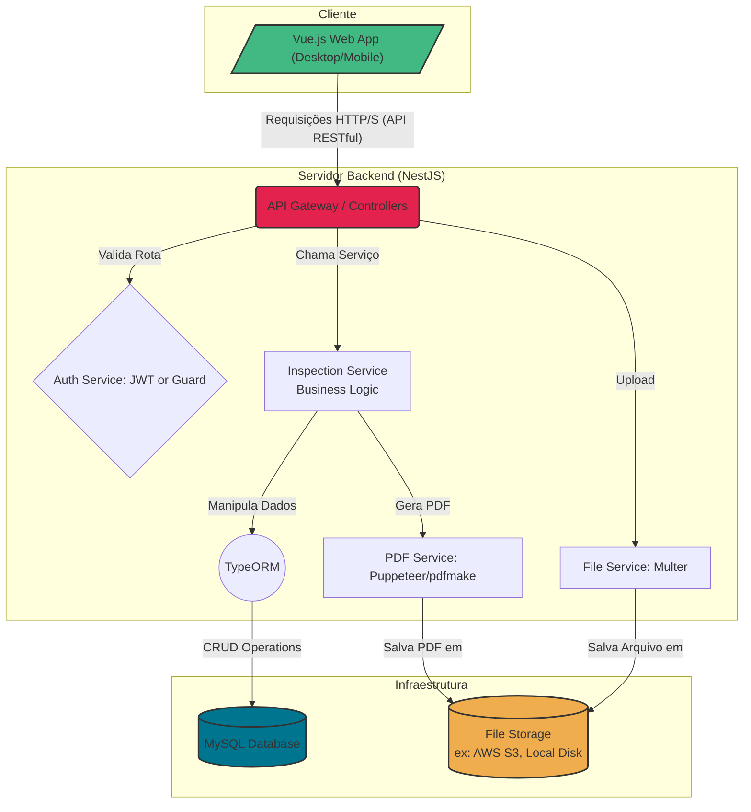
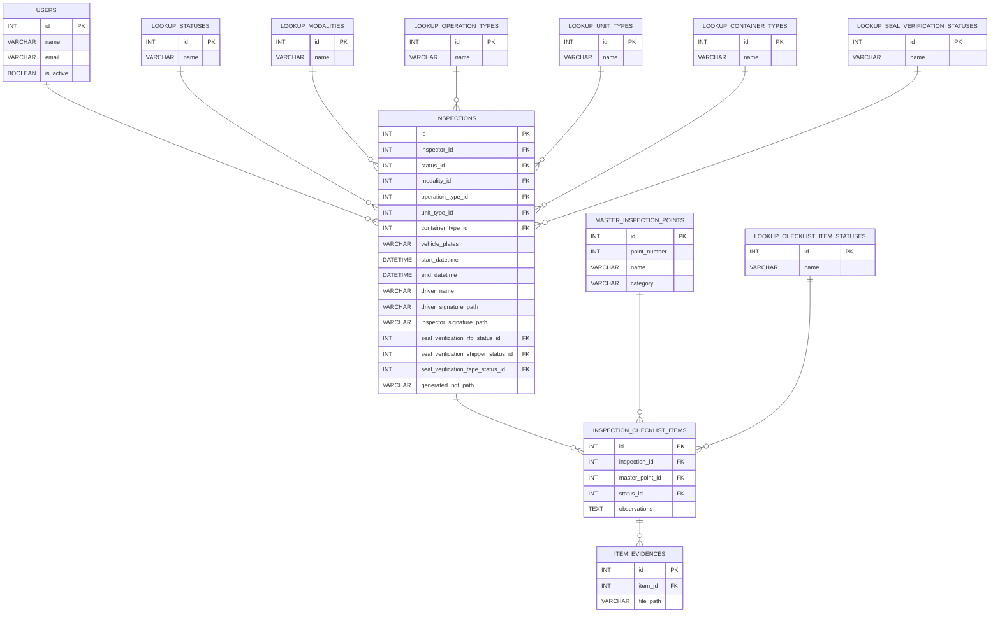
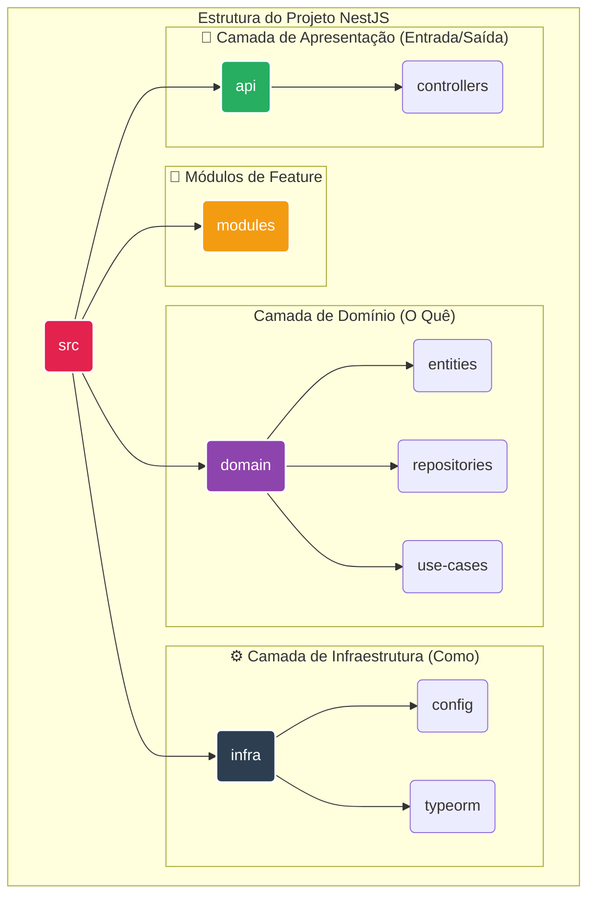

# App de Inspeção Digital - API (checklist-nestjs)

<p align="center">
  <a href="http://nestjs.com/" target="blank"></a>
</p>

<p align="center">
Backend desenvolvido com <a href="http://nodejs.org" target="_blank">Node.js</a> e NestJS para o sistema de inspeção de unidades de carga.
</p>

## Sumário

- [App de Inspeção Digital - API (checklist-nestjs)](#app-de-inspeção-digital---api-checklist-nestjs)
  - [Sumário](#sumário)
  - [📝 Visão Geral do Projeto](#-visão-geral-do-projeto)
  - [🏛️ Arquitetura do Sistema](#️-arquitetura-do-sistema)
  - [Modelo de Dados (MER)](#modelo-de-dados-mer)
    - [Tabelas de Lookup (Mestras)](#tabelas-de-lookup-mestras)
    - [Tabelas Principais](#tabelas-principais)
      - [**`users`**](#users)
      - [**`master_inspection_points`**](#master_inspection_points)
      - [**`inspections`**](#inspections)
      - [**`inspection_checklist_items`**](#inspection_checklist_items)
      - [**`item_evidences`**](#item_evidences)
  - [🏛️ Estrutura de Pastas e Filosofia](#️-estrutura-de-pastas-e-filosofia)
  - [✅ Pré-requisitos](#-pré-requisitos)
  - [🚀 Instalação e Configuração](#-instalação-e-configuração)
    - [1. Clone o Repositório](#1-clone-o-repositório)
    - [📦 2. Instale as Dependências](#-2-instale-as-dependências)
    - [📝 3. Configure as Variáveis de Ambiente](#-3-configure-as-variáveis-de-ambiente)
    - [🐳 4. Inicie o Banco de Dados com Contêineres](#-4-inicie-o-banco-de-dados-com-contêineres)
  - [▶️ Executando a Aplicação](#️-executando-a-aplicação)
  - [🧪 Executando os Testes](#-executando-os-testes)
  - [📡 Endpoints da API](#-endpoints-da-api)
  - [🗺️ Jornadas do Usuário (User Flows)](#️-jornadas-do-usuário-user-flows)
      - [**Fluxo 1: Autenticação do Inspetor**](#fluxo-1-autenticação-do-inspetor)
      - [**Fluxo 2: Realização de uma Nova Inspeção**](#fluxo-2-realização-de-uma-nova-inspeção)
      - [**Fluxo 3: Finalização da Inspeção**](#fluxo-3-finalização-da-inspeção)
      - [**Fluxo 4: Consulta e Análise no Dashboard**](#fluxo-4-consulta-e-análise-no-dashboard)
  - [🔄 Nosso Acordo de Trabalho: Fluxo de Desenvolvimento e Contribuição](#-nosso-acordo-de-trabalho-fluxo-de-desenvolvimento-e-contribuição)
    - [1. 🌿 Início do Trabalho: Criando sua Branch](#1--início-do-trabalho-criando-sua-branch)
    - [2. 🔄 Sincronização e Teste Local (Passo Crucial)](#2--sincronização-e-teste-local-passo-crucial)
    - [3. ✅ Pull Request (PR) e Revisão de Código](#3--pull-request-pr-e-revisão-de-código)
    - [4. 🤝 Merge e Validação Final](#4--merge-e-validação-final)
  - [✅ Definition of Ready (DoR) \& Definition of Done (DoD)](#-definition-of-ready-dor--definition-of-done-dod)
    - [✅ **Definition of Ready (DoR)**](#-definition-of-ready-dor)
    - [🔧 **Definições Técnicas para o MVP**](#-definições-técnicas-para-o-mvp)
    - [🏁 **Definition of Done (DoD)**](#-definition-of-done-dod)
  - [📄 **Licença**](#-licença)

## 📝 Visão Geral do Projeto

Este projeto é a implementação do backend para o **App de Inspeção Digital 8/18**. O objetivo é substituir o processo de inspeção manual, baseado no formulário físico **"Form. 24 - Inspeção de Unidade de Carga"**, por uma solução digital inteligente e rastreável.

O sistema permite que inspetores realizem inspeções ponto a ponto, coletem evidências (texto e imagens), capturem assinaturas digitais, e gera um relatório PDF idêntico ao formulário físico para fins de auditoria e conformidade.

---

## 🏛️ Arquitetura do Sistema

A aplicação segue uma arquitetura desacoplada, separando as responsabilidades entre o cliente (Frontend), o servidor (Backend) e a infraestrutura de dados e arquivos.




## Modelo de Dados (MER)

O modelo de entidade-relacionamento a seguir ilustra a estrutura do banco de dados MySQL, utilizando tabelas de lookup para garantir a integridade e flexibilidade dos dados.



<details>
<summary>Clique para expandir o Dicionário de Dados Completo</summary>

### Tabelas de Lookup (Mestras)
Estas tabelas contêm valores estáticos para garantir a consistência dos dados.

| Tabela | Descrição |
| :--- | :--- |
| `lookup_statuses` | Status possíveis para uma inspeção geral. |
| `lookup_modalities` | Modalidades de transporte disponíveis. |
| `lookup_operation_types` | Tipos de operação aduaneira (nível de risco). |
| `lookup_unit_types` | Tipos de unidade de carga. |
| `lookup_container_types` | Tipos específicos de contêineres. |
| `lookup_checklist_item_statuses` | Status possíveis para cada item individual da inspeção. |
| `lookup_seal_verification_statuses`| Status para a verificação de lacres na saída. |

---
### Tabelas Principais

#### **`users`**
Armazena os dados dos usuários autorizados a realizar inspeções.

| Nome da Coluna | Tipo de Dado | Chave | Nulo? | Descrição / Regra de Negócio | Exemplo |
| :--- | :--- | :--- | :--- | :--- | :--- |
| `id` | INT | PK | Não | Identificador único do usuário (auto-incremento). | `101` |
| `name` | VARCHAR(255) | | Não | Nome completo do inspetor ou administrador. | `"Carlos Andrade"` |
| `email` | VARCHAR(255) | UNIQUE | Não | E-mail usado para login. Deve ser único. | `"carlos.a@unive.com"` |
| `password` | VARCHAR(255) | | Não | Senha do usuário, armazenada com hash seguro. | `"$2b$10$..."` |
| `is_active` | BOOLEAN | | Não | Controla se o usuário pode acessar o sistema. | `true` |

#### **`master_inspection_points`**
Tabela mestre com a definição dos 18 pontos de inspeção padrão.

| Nome da Coluna | Tipo de Dado | Chave | Nulo? | Descrição / Regra de Negócio | Exemplo |
| :--- | :--- | :--- | :--- | :--- | :--- |
| `id` | INT | PK | Não | Identificador único do ponto de inspeção. | `11` |
| `point_number`| INT | UNIQUE | Não | Número de ordem do ponto de inspeção (1 a 18). | `11` |
| `name` | VARCHAR(255) | | Não | Nome do ponto de inspeção. | `"PNEUS"` |
| `description` | TEXT | | Sim | Descrição detalhada do procedimento de verificação. | `"Martelar levemente em todo pneu."` |
| `category` | VARCHAR | | Não | Categoria do ponto: 'VEICULO' ou 'CONTEINER'. | `"VEICULO"` |

#### **`inspections`**
Tabela central que armazena cada registro de inspeção (checklist).

| Nome da Coluna | Tipo de Dado | Chave | Nulo? | Descrição / Regra de Negócio | Exemplo |
| :--- | :--- | :--- | :--- | :--- | :--- |
| `id` | INT | PK | Não | Identificador único da inspeção (auto-incremento). | `2024001` |
| `inspector_id`| INT | FK | Não | ID do usuário (`users`) que realizou a inspeção. | `101` |
| `status_id` | INT | FK | Não | ID do status geral da inspeção (`lookup_statuses`). | `2` (`APROVADO`) |
| `modality_id` | INT | FK | Não | ID da modalidade (`lookup_modalities`). | `1` (`RODOVIARIO`) |
| `operation_type_id` | INT | FK | Não | ID do tipo de operação (`lookup_operation_types`). | `1` (`VERDE`) |
| `unit_type_id`| INT | FK | Não | ID do tipo de unidade (`lookup_unit_types`). | `1` (`CONTAINER`) |
| `container_type_id` | INT | FK | Sim | ID do tipo de contêiner (`lookup_container_types`). | `2` (`DRY_40`) |
| `vehicle_plates`| VARCHAR(20) | | Sim | Placas do veículo. | `"BRA2E19"` |
| `start_datetime`| DATETIME | | Não | Data e hora de início da inspeção. | `"2025-06-27 14:30:00"` |
| `end_datetime` | DATETIME | | Sim | Data e hora de término da inspeção. | `"2025-06-27 15:15:00"` |
| `driver_name` | VARCHAR(255) | | Não | Nome do motorista do veículo. | `"José de Almeida"` |
| `driver_signature_path` | VARCHAR(512)| | Sim | Caminho para o arquivo de imagem da assinatura do motorista. | `"/sig/insp_2024001_driver.png"`|
| `inspector_signature_path`| VARCHAR(512)| | Sim | Caminho para o arquivo da assinatura do inspetor. | `"/sig/insp_2024001_inspector.png"`|
| `generated_pdf_path`| VARCHAR(512)| | Sim | Caminho para o arquivo PDF gerado. | `"/reports/insp_2024001.pdf"`|

#### **`inspection_checklist_items`**
Armazena o status de cada um dos 18 pontos para uma inspeção específica.

| Nome da Coluna | Tipo de Dado | Chave | Nulo? | Descrição / Regra de Negócio | Exemplo |
| :--- | :--- | :--- | :--- | :--- | :--- |
| `id` | INT | PK | Não | Identificador único do item de checklist. | `5432` |
| `inspection_id`| INT | FK | Não | ID da inspeção (`inspections`) a que este item pertence. | `2024001` |
| `master_point_id` | INT | FK | Não | ID do ponto de inspeção (`master_inspection_points`). | `11` (`PNEUS`) |
| `status_id` | INT | FK | Não | ID do status deste item (`lookup_checklist_item_statuses`). | `2` (`CONFORME`) |
| `observations`| TEXT | | Sim | Observações do inspetor para este ponto. | `"Pneu dianteiro com leve desgaste."` |

#### **`item_evidences`**
Armazena as evidências (imagens) para cada item de checklist.

| Nome da Coluna | Tipo de Dado | Chave | Nulo? | Descrição / Regra de Negócio | Exemplo |
| :--- | :--- | :--- | :--- | :--- | :--- |
| `id` | INT | PK | Não | Identificador único da evidência. | `9876` |
| `item_id` | INT | FK | Não | ID do item de checklist (`inspection_checklist_items`). | `5432` |
| `file_path` | VARCHAR(512)| | Não | Caminho para o arquivo de imagem no storage. | `"/evidences/insp_2024001_p11_01.jpg"` |

</details>


## 🏛️ Estrutura de Pastas e Filosofia

> O projeto utiliza **Arquitetura Limpa (Clean Architecture)** e princípios de **Domain-Driven Design (DDD)** para separar as responsabilidades e garantir um código manutenível e testável.

A estrutura de pastas reflete essa separação:

-   **`src/domain`**:  O **coração da aplicação**. Contém a lógica de negócio pura, sem depender de detalhes externos como banco de dados ou frameworks.
    -   `entities`: Representam os objetos do seu negócio (Ex: `Checklist`, `Item`).
    -   `repositories`: Define "contratos" (interfaces/ports) de como buscar e salvar dados.
    -   `use-cases`: Orquestram as entidades e repositórios para executar regras de negócio.

-   **`src/infra`**: ⚙️ Os **detalhes técnicos**. Contém as implementações concretas dos contratos definidos no domínio.
    -   `config`: Gerenciamento de variáveis de ambiente (`.env`).
    -   `typeorm`: Configuração do ORM, conexão com o banco e implementações concretas dos repositórios.

-   **`src/modules`**: 🧩 **Módulos de Feature**. Cada feature (ex: `Checklist`, `Auth`, `Lookup`) tem seu próprio módulo, que provê os use cases e repositórios para o resto da aplicação.

-   **`src/api`**: 📡 A **camada de apresentação**.
    -   `controllers`: Recebem as requisições HTTP, validam os DTOs (Data Transfer Objects) e invocam os use cases.
-   



---

## ✅ Pré-requisitos

Para rodar este projeto, você precisará ter as seguintes ferramentas instaladas em seu ambiente:

* **[Node.js](https://nodejs.org/)** (versão 18.x ou superior)
* **[Yarn](https://yarnpkg.com/)** (gerenciador de pacotes principal)
* **[Docker](https://www.docker.com/)** (recomendado para rodar o banco de dados)

## 🚀 Instalação e Configuração

Siga os passos abaixo para configurar e rodar o ambiente de desenvolvimento localmente.

### 1. Clone o Repositório

Primeiro, clone o projeto para a sua máquina local.

```bash
git clone <URL_DO_SEU_REPOSITORIO>
cd checklist-nestjs
```


### 📦 2. Instale as Dependências

O projeto utiliza `Yarn` como gerenciador de pacotes. Execute o comando abaixo para instalar todas as dependências necessárias.

```bash
yarn install
```

### 📝 3. Configure as Variáveis de Ambiente

É necessário criar um arquivo `.env` para armazenar as configurações sensíveis do projeto.

-   Primeiro, copie o arquivo de exemplo `.env.example` para criar seu arquivo de configuração local:

    ```bash
    cp .env.example .env
    ```

-   Em seguida, edite o arquivo `.env` com as suas credenciais de banco de dados e outras configurações:

    ```env
    # Application Port
    PORT=3000
    
    # Database Configuration
    DB_HOST=localhost
    DB_PORT=3306
    DB_USER=root
    DB_PASSWORD=your_password
    DB_NAME=checklist_db
    
    # JWT Secret for Authentication
    JWT_SECRET=your_super_secret_key
    ```

### 🐳 4. Inicie o Banco de Dados com Contêineres

A forma mais simples e recomendada de rodar o banco de dados MySQL é utilizando uma ferramenta de contêineres como **Docker** ou **Podman**. Isso garante um ambiente limpo, isolado e consistente.

-   Primeiro, crie um arquivo `docker-compose.yml` na raiz do projeto. O formato é compatível com ambas as ferramentas.

    ```yaml
    # docker-compose.yml
    version: '3.8'
    services:
      db:
        image: mysql:8.0
        command: --default-authentication-plugin=mysql_native_password
        restart: always
        environment:
          MYSQL_ROOT_PASSWORD: sua_senha_secreta
          MYSQL_DATABASE: uagadb
        ports:
          - "3306:3306"
        volumes:
          - ./init.sql:/docker-entrypoint-initdb.d/init.sql
    ```

-   Agora, execute o comando correspondente à sua ferramenta para iniciar o contêiner em segundo plano:

    -   **Se você usa Docker:**
        ```bash
        docker-compose up -d
        ```

    -   **Se você usa Podman** (requer `podman-compose` instalado):
        ```bash
        podman-compose up -d
        ```

> **Nota:** O arquivo `init.sql` será executado automaticamente na primeira vez que o contêiner for criado, preparando todo o esquema de tabelas e populando os dados iniciais (lookups).

## ▶️ Executando a Aplicação

Com o ambiente configurado, você pode iniciar o servidor NestJS nos seguintes modos:

-   **Modo de Desenvolvimento** (com auto-reload):
    ```bash
    yarn run start:dev
    ```

-   **Modo de Produção**:
    ```bash
    yarn run start:prod
    ```

> Após iniciar, a API estará disponível em `http://localhost:3000`.

---

## 🧪 Executando os Testes

Para garantir a qualidade e a integridade do código, execute os comandos de teste abaixo:

-   **Testes Unitários**:
    ```bash
    yarn run test
    ```

-   **Testes End-to-End (E2E)**:
    ```bash
    yarn run test:e2e
    ```

-   **Relatório de Cobertura de Testes**:
    ```bash
    yarn run test:cov
    ```

## 📡 Endpoints da API

A seguir, a lista dos principais endpoints da API. Uma documentação interativa completa estará disponível via **Swagger** em `http://localhost:3000/api-docs` após a aplicação ser iniciada.

| Método | Endpoint                                             | Descrição                                                              |
| :----- | :--------------------------------------------------- | :--------------------------------------------------------------------- |
| `POST` | `/api/auth/login`                                    | Autentica um usuário e retorna um token JWT.                            |
| `GET`  | `/api/lookups/:type`                                 | Retorna a lista de valores para um tipo de lookup (ex: `/modalities`). |
| `POST` | `/api/inspections`                                   | Cria um novo registro de inspeção.                                     |
| `GET`  | `/api/inspections`                                   | Lista todas as inspeções, com suporte a filtros via query params.        |
| `GET`  | `/api/inspections/:id`                               | Retorna os detalhes completos de uma inspeção específica.              |
| `PATCH`| `/api/inspections/:id/items/:itemId`                 | Atualiza o status e as observações de um item do checklist.             |
| `POST` | `/api/inspections/:id/items/:itemId/evidence`        | Faz o upload de uma imagem de evidência para um item.                    |
| `POST` | `/api/inspections/:id/finalize`                      | Finaliza a inspeção, coletando assinaturas e gerando o PDF.            |

---

## 🗺️ Jornadas do Usuário (User Flows)

Esta seção descreve os caminhos que os usuários percorrem para realizar tarefas chave no sistema.

<details>
<summary>Clique para expandir as Jornadas do Usuário</summary>

#### **Fluxo 1: Autenticação do Inspetor**
* **Ator:** Inspetor
* **Objetivo:** Acessar o sistema de inspeção de forma segura.
* **Passos:**
    1.  Abre a aplicação e vê a tela de login.
    2.  Insere e-mail e senha.
    3.  Clica em "Entrar".
    4.  O sistema valida as credenciais. Se corretas, direciona para a tela inicial.

#### **Fluxo 2: Realização de uma Nova Inspeção**
* **Ator:** Inspetor
* **Objetivo:** Preencher um checklist de inspeção de 18 pontos.
* **Passos:**
    1.  Seleciona uma inspeção pendente na tela inicial.
    2.  [cite_start]Preenche os campos do cabeçalho (Modalidade, Operação, etc.).
    3.  Navega pela lista dos 18 pontos de inspeção.
    4.  [cite_start]Para cada ponto, seleciona um status (`CONFORME`, `NÃO CONFORME`, `N/A`), adiciona observações e anexa imagens como evidência.
    5.  O progresso é salvo continuamente.

#### **Fluxo 3: Finalização da Inspeção**
* **Ator:** Inspetor, Motorista
* **Objetivo:** Concluir a inspeção, coletar assinaturas e gerar o relatório.
* **Passos:**
    1.  Após avaliar todos os 18 pontos, clica em "Finalizar".
    2.  [cite_start]O sistema aplica a regra de avaliação automática (se houver `NÃO CONFORME` → `REPROVADO`, senão `APROVADO`).
    3.  Inspetor e motorista assinam digitalmente na tela.
    4.  [cite_start]O sistema gera e armazena o relatório em PDF, idêntico ao formulário físico.

#### **Fluxo 4: Consulta e Análise no Dashboard**
* **Ator:** Administrador, Inspetor
* **Objetivo:** Visualizar, filtrar e exportar dados de inspeções.
* **Passos:**
    1.  Acessa o Dashboard.
    2.  Visualiza a lista de inspeções.
    3.  [cite_start]Usa os filtros de busca (por data, status, motorista, etc.) para encontrar inspeções específicas.
    4.  Clica em uma inspeção para ver os detalhes e baixar o PDF gerado.

</details>

<h2>Planejamento Ágil para MVP</h2>
<p>O objetivo do MVP é entregar o fluxo principal de valor: <strong>digitalizar o preenchimento do checklist e gerar um PDF fiel ao formulário original</strong>. Funcionalidades de gestão e automação avançada serão adicionadas em iterações futuras.</p>

<table border="1" cellpadding="10" cellspacing="0" width="100%">
    <thead>
        <tr bgcolor="#f2f2f2">
            <th><b>Épico</b></th>
            <th><b>ID</b></th>
            <th><b>História de Usuário (User Story)</b></th>
            <th><b>Critérios de Aceite</b></th>
            <th><b>Prioridade MVP</b></th>
            <th><b>Observações / Simplificação para MVP</b></th>
        </tr>
    </thead>
    <tbody>
        <tr>
            <td valign="top">Gestão de Inspeções (Core)</td>
            <td valign="top"><strong>US-01</strong></td>
            <td valign="top"><strong>Como um</strong> inspetor, <strong>eu quero</strong> iniciar um novo checklist, <strong>para que</strong> eu possa preencher os dados iniciais da inspeção.</td>
            <td valign="top">
                <ul>
                    <li>O sistema deve abrir um novo formulário de checklist.</li>
                    <li>O campo "Nome do Inspetor" deve estar disponível para preenchimento (texto livre).</li>
                    <li>A data/hora de início é registrada.</li>
                    <li>Os campos do cabeçalho (Modalidade, etc.) devem ser de preenchimento obrigatório.</li>
                </ul>
            </td>
            <td valign="top" bgcolor="#ffebee">🔴 <b>Essencial</b></td>
            <td valign="top">O nome do inspetor será um campo de texto simples, sem vínculo com um usuário logado.</td>
        </tr>
        <tr>
            <td valign="top">Gestão de Inspeções (Core)</td>
            <td valign="top"><strong>US-02</strong></td>
            <td valign="top"><strong>Como um</strong> inspetor, <strong>eu quero</strong> avaliar cada um dos 18 pontos do checklist, adicionando status e observações, <strong>para que</strong> eu possa registrar o resultado da verificação.</td>
            <td valign="top">
                <ul>
                    <li>Para cada item, deve ser possível selecionar CONFORME, NÃO CONFORME ou N/A.</li>
                    <li>Deve ser possível adicionar um texto de observação.</li>
                    <li>Deve ser possível anexar uma ou mais fotos como evidência para qualquer item.</li>
                </ul>
            </td>
            <td valign="top" bgcolor="#ffebee">🔴 <b>Essencial</b></td>
            <td valign="top">A funcionalidade de upload de imagens é o "ponto de corte" técnico. Se for complexa, podemos avaliar deixá-la para a v1.1, mas o ideal é que entre no MVP.</td>
        </tr>
        <tr>
            <td valign="top">Gestão de Inspeções (Core)</td>
            <td valign="top"><strong>US-03</strong></td>
            <td valign="top"><strong>Como um</strong> inspetor, <strong>eu quero</strong> finalizar o checklist, <strong>para que</strong> o sistema determine o resultado final.</td>
            <td valign="top">
                <ul>
                    <li>O botão "Finalizar" deve estar habilitado após a avaliação dos 18 pontos.</li>
                    <li>Ao finalizar, o status geral da inspeção deve ser definido como APROVADO ou REPROVADO baseado nas regras.</li>
                </ul>
            </td>
            <td valign="top" bgcolor="#fffde7">🟡 <b>Importante</b></td>
            <td valign="top">A assinatura digital é adiada. A lógica de APROVADO/REPROVADO é essencial, mas a coleta de assinatura será feita manually no PDF gerado.</td>
        </tr>
        <tr>
            <td valign="top">Relatórios e Análise</td>
            <td valign="top"><strong>US-05</strong></td>
            <td valign="top"><strong>Como um</strong> inspetor, <strong>eu quero</strong> que um relatório em PDF seja gerado ao final de cada inspeção, <strong>para que</strong> eu tenha um documento oficial.</td>
            <td valign="top">
                <ul>
                    <li>O PDF gerado deve ter um layout idêntico ao do "Form. 24".</li>
                    <li>O PDF deve conter todos os dados do cabeçalho e dos 18 pontos.</li>
                    <li>Os campos de assinatura no PDF devem ser deixados em branco para assinatura manual.</li>
                </ul>
            </td>
            <td valign="top" bgcolor="#ffebee">🔴 <b>Essencial</b></td>
            <td valign="top">Este é o principal entregável de valor do MVP. O PDF deve ser perfeito e funcional.</td>
        </tr>
        <tr>
            <td valign="top">Relatórios e Análise</td>
            <td valign="top"><strong>US-06</strong></td>
            <td valign="top"><strong>Como um</strong> inspetor, <strong>eu quero</strong> acessar um dashboard com a listagem das inspeções, <strong>para que</strong> eu possa buscar e analisar os resultados.</td>
            <td valign="top">
                <ul>
                    <li>O dashboard deve exibir uma lista simples de inspeções realizadas.</li>
                    <li>Cada item na lista deve permitir baixar o PDF correspondente.</li>
                </ul>
            </td>
            <td valign="top" bgcolor="#fffde7">🟡 <b>Importante</b></td>
            <td valign="top">Filtros avançados são adiados. O MVP precisa apenas de uma lista cronológica simples para que o usuário possa encontrar e baixar o PDF que acabou de gerar.</td>
        </tr>
        <tr>
            <td valign="top">Gestão de Acesso</td>
            <td valign="top"><strong>US-04</strong></td>
            <td valign="top"><strong>Como um</strong> usuário registrado, <strong>eu quero</strong> fazer login, <strong>para que</strong> eu possa acessar o sistema de forma segura.</td>
            <td valign="top">
                <ul>
                    <li>A tela de login deve conter campos para e-mail e senha.</li>
                    <li>Ao submeter credenciais válidas, o sistema deve retornar um token JWT.</li>
                    <li>Rotas protegidas devem ser inacessíveis sem token.</li>
                </ul>
            </td>
            <td valign="top" bgcolor="#e8f5e9">🟢 <b>Desejável</b></td>
            <td valign="top"><strong>Adiado para a v2.</strong> Conforme sua sugestão, esta funcionalidade não é necessária para o MVP, o que simplifica drasticamente o desenvolvimento inicial.</td>
        </tr>
    </tbody>
</table>

<hr>
<h3>Resumo da Estratégia para o MVP</h3>
<p>Com base na tabela acima, a equipe de desenvolvimento deve focar em criar um fluxo único e linear:</p>
<ol>
    <li>Abrir a aplicação e iniciar um checklist (sem login).</li>
    <li>Preencher todos os dados da inspeção e dos 18 pontos.</li>
    <li>Finalizar a inspeção para obter o status de Aprovado/Reprovado.</li>
    <li>Gerar um PDF fiel ao original, com espaços em branco para as assinaturas.</li>
    <li>Exibir uma lista simples das inspeções concluídas para permitir o download do PDF.</li>
</ol>
<p>Este escopo é enxuto, focado no valor principal e perfeitamente alcançável para uma primeira entrega rápida.</p>

## 🔄 Nosso Acordo de Trabalho: Fluxo de Desenvolvimento e Contribuição

Para garantir a qualidade, consistência e a saúde da nossa branch principal de desenvolvimento (`develop`), todo o trabalho de codificação seguirá o fluxo descrito abaixo. Este processo manual exige disciplina e comunicação de todos.

### 1. 🌿 Início do Trabalho: Criando sua Branch

-   **Sempre comece a partir da `develop`:** Antes de criar sua branch, certifique-se de que sua cópia local da `develop` está atualizada.
    ```bash
    git checkout develop
    git pull origin develop
    ```
-   **Crie sua `feature-branch`** seguindo as convenções de nomenclatura que definimos (ex: `feature/US-01-iniciar-inspecao`).
    ```bash
    git checkout -b feature/US-01-iniciar-inspecao
    ```

### 2. 🔄 Sincronização e Teste Local (Passo Crucial)

Esta é a etapa mais importante para proteger a branch `develop`.

-   **Antes de considerar sua tarefa concluída**, traga as últimas atualizações da `develop` para dentro da sua `feature-branch` para simular a integração.
    ```bash
    # Estando na sua feature-branch, execute:
    git pull origin develop
    ```
-   **Resolva quaisquer conflitos de merge** que possam surgir na sua máquina local.
-   **Rode os testes unitários** na sua branch, que agora está sincronizada. Você está testando o seu código já integrado com o trabalho recente da equipe.
    ```bash
    yarn test
    ```

### 3. ✅ Pull Request (PR) e Revisão de Código

-   **Somente se todos os testes passarem localmente**, faça o `push` da sua `feature-branch` e abra uma **Pull Request** para a `develop`.
-   Na descrição do PR, mencione que os testes foram executados com sucesso após a sincronização.
-   A PR **deve ser revisada e aprovada** por, no mínimo, um outro membro da equipe. A prática de Code Review é obrigatória.

### 4. 🤝 Merge e Validação Final

-   Após a aprovação, o próprio autor da PR é responsável por realizar o merge para a `develop`.
-   **Regra de Ouro:** Embora o risco seja baixo, se por qualquer motivo um merge quebrar a `develop` (descoberto em um teste manual subsequente), o autor do merge tem a **responsabilidade total e imediata** de:
    1.  **Comunicar** a equipe.
    2.  **Reverter** a PR (`git revert`).
    3.  Corrigir o problema em sua `feature-branch` antes de tentar um novo merge.

Com este processo, garantimos que a nossa base de código se mantenha estável e que a responsabilidade pela qualidade seja compartilhada por todos.

## ✅ Definition of Ready (DoR) & Definition of Done (DoD)

Este documento formaliza os **pré-requisitos** para que uma User Story seja considerada **Pronta para Desenvolvimento (DoR)** e define os critérios para que seja **Concluída (DoD)**. Ele também inclui os **wireframes** e as **decisões técnicas** que guiam a Sprint 1.

---

### ✅ **Definition of Ready (DoR)**

Uma User Story só pode entrar no backlog de uma Sprint se atender a todos os critérios abaixo:

- **História Clara e Concisa:** Escrita no formato `Como um [ator], eu quero [ação], para que [valor]`.
- **Critérios de Aceite Definidos:** Itens claros para validar a entrega.
- **Wireframes Acordados:** Estrutura visual definida e validada pela equipe.
- **Dependências Técnicas Resolvidas:** Nenhuma pendência técnica que bloqueie o desenvolvimento.

---

🎨 Mockups de Baixa Fidelidade (Wireframes)
Estes wireframes servem como a base visual acordada para o desenvolvimento do MVP.

🏠 1. Tela Inicial
Objetivo: Oferecer um ponto de partida claro, permitindo ao inspetor iniciar um novo trabalho ou consultar inspeções anteriores.

+--------------------------------------------------------------------------+
| [Logo da Universal]                          [Logo da Coruja UAGA T.I.]  |
+--------------------------------------------------------------------------+
|                                                                          |
|   <Botão Grande e Destacado: [➕ Iniciar Nova Inspeção]>                   |
|                                                                          |
|   --------------------------------------------------------------------   |
|                                                                          |
|   ### Inspeções Salvas                                                   |
|                                                                          |
|   +---------------+---------------------+----------+-------------------+ |
|   | ID            | Data                | Status   | Ações             | |
|   +---------------+---------------------+----------+-------------------+ |
|   | INSP-2025-001 | 27/06/2025 14:30    | Rascunho | [Continuar] [Excluir] | |
|   +---------------+---------------------+----------+-------------------+ |
|   | INSP-2025-002 | 26/06/2025 10:15    | Aprovado | [Visualizar]      | |
|   +---------------+---------------------+----------+-------------------+ |
|   | INSP-2025-003 | 25/06/2025 16:45    | Reprovado| [Visualizar]      | |
|   +---------------+---------------------+----------+-------------------+ |
|                                                                          |
+------------------------------------------------------[Coruja UAGA T.I.]--+

🗂️ 2. Tela "Nova Inspeção" (Cabeçalho)
Objetivo: Coletar todos os dados primários que identificam a inspeção.

+--------------------------------------------------------------------------+
| [Logo da Universal]                          [Logo da Coruja UAGA T.I.]  |
+--------------------------------------------------------------------------+
|                                                                          |
|   ## Nova Inspeção - Dados Gerais                                        |
|                                                                          |
|   +------------------------------------+-------------------------------+ |
|   | Data/Hora Início (Automático)      | Registro de Entrada           | |
|   | [ 27/06/2025 15:00 ]               | [ Digite o registro... ]      | |
|   +------------------------------------+-------------------------------+ |
|   | Placa do Veículo                   | Nome do Inspetor              | |
|   | [ Digite a placa... ]              | [ Digite seu nome... ]        | |
|   +------------------------------------+-------------------------------+ |
|                                                                          |
|   --- Detalhes da Unidade ---                                            |
|                                                                          |
|   +------------------------------------+-------------------------------+ |
|   | Modalidade                         | Operação                      | |
|   | [ Rodoviário v ] (Dropdown)        | [ Verde v ] (Dropdown)        | |
|   +------------------------------------+-------------------------------+ |
|   | Tipo de Unidade                    | Tipo de Contêiner (Opcional)  | |
|   | [ Contêiner v ] (Dropdown)         | [ Dry 40 v ] (Dropdown)       | |
|   +------------------------------------+-------------------------------+ |
|                                                                          |
|                      <Botão: [Iniciar Checklist dos 18 Pontos →]>        |
|                                                                          |
+------------------------------------------------------[Coruja UAGA T.I.]--+

✅ 3. Tela "Checklist 18 Pontos"
Objetivo: Permitir a avaliação detalhada de cada ponto da inspeção de forma intuitiva e com coleta de evidências.

+--------------------------------------------------------------------------+
|                                                                          |
|   ## Checklist de Inspeção - ID: INSP-2025-004                           |
|                                                                          |
|   ▼ 1. SEÇÃO INFERIOR (Parte debaixo do Contêiner ou Baú)     [CONFORME] |
|   +----------------------------------------------------------------------+
|   | Descrição: Verificar com auxílio de espelho e lanterna os...         |
|   |                                                                      |
|   |  <Btn: CONFORME>  <Btn: NÃO CONFORME>  <Btn: N/A>                     |
|   |                                                                      |
|   |  Observações:                                                        |
|   |  [ Nenhuma observação a ser feita..._________________________ ]      |
|   |                                                                      |
|   |  Evidências:                                                         |
|   |  +------------------------------------------------------------+    |
|   |  |   Arrastar e soltar arquivos aqui ou <clique para enviar>  |    |
|   |  +------------------------------------------------------------+    |
|   |                                                                      |
|   |  [Imagem 1.jpg] [x]  [Imagem 2.png] [x]                              |
|   +----------------------------------------------------------------------+
|                                                                          |
|   ▶ 2. PORTA (Interior e Exterior)                               [Pendente] |
|                                                                          |
|   ... (restante dos 18 pontos) ...                                       |
|                                                                          |
|                         <Botão: [Prosseguir para Finalização →]>          |
|                                                                          |
+------------------------------------------------------[Coruja UAGA T.I.]--+

✔️ 4. Tela "Finalizar"
Objetivo: Apresentar um resumo claro do resultado, coletar as assinaturas e concluir o processo.

+--------------------------------------------------------------------------+
|                                                                          |
|   ## Finalização da Inspeção - ID: INSP-2025-004                         |
|                                                                          |
|   --- Resumo da Avaliação ---                                            |
|   |                                                                    |
|   |  Total CONFORME: 17                                                |
|   |  Total NÃO CONFORME: 1  -> [!] AVISO: Inspeção será REPROVADA.      |
|   |  Total N/A: 0                                                      |
|   |                                                                    |
|   --------------------------------------------------------------------   |
|                                                                          |
|   --- Assinaturas ---                                                    |
|                                                                          |
|   Nome do Motorista:                                                     |
|   [ Digite o nome do motorista... ]                                      |
|                                                                          |
|   Assinatura do Motorista:                                               |
|   +--------------------------------------------------------------------+ |
|   |   (Área de canvas para desenho da assinatura)                      | |
|   +--------------------------------------------------------------------+ |
|                                                                          |
|   Assinatura do Inspetor (Carlos Andrade):                               |
|   +--------------------------------------------------------------------+ |
|   |   (Área de canvas para desenho da assinatura)                      | |
|   +--------------------------------------------------------------------+ |
|                                                                          |
|              <Botão Principal: [Finalizar e Gerar PDF]>                  |
|                                                                          |
+------------------------------------------------------[Coruja UAGA T.I.]--+

📎 5. Tela "Visualizar Relatório"
Objetivo: Confirmar a conclusão e fornecer acesso fácil ao documento gerado.

+--------------------------------------------------------------------------+
|                                                                          |
|   ## Inspeção Concluída com Sucesso!                                     |
|                                                                          |
|   +--------------------------------------------------------------------+ |
|   |    Resultado Final:                                                | |
|   |    <Texto Grande e em Destaque: REPROVADO>                         | |
|   +--------------------------------------------------------------------+ |
|                                                                          |
|   O relatório em PDF para a inspeção INSP-2025-004 foi gerado.           |
|                                                                          |
|   <Link para o arquivo: [Visualizar PDF no navegador]>                   |
|                                                                          |
|   <Botão: [⬇️ Baixar PDF]>   <Botão: [Voltar para a Tela Inicial]>        |
|                                                                          |
+------------------------------------------------------[Coruja UAGA T.I.]--+


---

### 🔧 **Definições Técnicas para o MVP**

**Upload de Imagens**  
- **Endpoint:** `POST /api/inspections/:id/items/:itemId/evidence`  
- **Limite:** 5MB por arquivo  
- **Tipos:** `image/jpeg`, `image/png`  
- **Armazenamento:** Local (`/uploads`)  
- **Padrão:** `/uploads/{inspection_id}/{point_number}_{timestamp}.jpg`

**Layout do PDF**  
- Fiel ao `Form. 24 - Inspecao de Unidade de Carga - Rev.- J.pdf`  
- Campos de assinatura em branco.

**Fluxo de Rascunho**  
- Inspeção iniciada é salva automaticamente como rascunho.  
- Sem expiração ou exclusão na versão inicial.

**Autenticação**  
- **Não haverá login no MVP**.  
- `Nome do Inspetor` como texto livre.  
- Tabela `users` não será usada.

**Deploy**  
- Manual, ambiente único.  
- Sem CI/CD para o MVP.

---

### 🏁 **Definition of Done (DoD)**

Uma User Story é considerada **concluída** quando:

- ✅ Código implementado conforme critérios de aceite.  
- ✅ Testes unitários cobrem o novo código (e passam).  
- ✅ Seguiu o fluxo de contribuição (branch, sync, PR).  
- ✅ PR revisada e aprovada por outro membro.  
- ✅ Merge realizado na `develop` com sucesso.

---

🎯 Meta da Sprint 1
Ao final da Sprint 1, um inspetor poderá utilizar a aplicação para registrar uma inspeção completa, desde a inserção dos dados iniciais até a avaliação dos 18 pontos com evidências, e gerar um relatório em PDF fiel ao formulário físico. A API que suporta este fluxo estará 100% funcional e documentada, e o frontend terá telas funcionais, construídas com uma biblioteca de componentes, para cada etapa do processo.


✅ Definition of Ready (DoR) – Pré-requisitos para Iniciar
Uma User Story está pronta para desenvolvimento quando atende aos seguintes critérios:

User Story clara no formato padrão.

Critérios de Aceite testáveis e definidos.

Wireframes e fluxo de navegação validados.

Sem bloqueios ou dependências técnicas.

🏁 Definition of Done (DoD) – Nosso Contrato de Qualidade
Uma tarefa ou User Story é considerada "Concluída" quando atende a todos os critérios abaixo.

1. Qualidade do Código e Processo
✅ Implementação: Código implementa todos os Critérios de Aceite.

✅ Padrões: Código adere aos padrões SOLID e DDD definidos.

✅ Fluxo de Contribuição: Processo GitFlow seguido rigorosamente.

✅ Revisão de Código: PR revisada e aprovada por um colega.

✅ Integração: Merge na branch develop concluído com sucesso.

2. Testes e Validação
✅ Testes Unitários: Lógica de negócio coberta por testes unitários (TDD).

✅ Suíte de Testes: Suíte de testes (yarn test) passa sem falhas.

✅ Validação Manual: Funcionalidade validada manualmente (Postman/Navegador).

3. Documentação (Não-Negociável)
✅ Código Comentado: Código comentado onde a lógica é complexa.

✅ Diagramas: Diagramas (Classe, Sequência, MER) atualizados conforme as mudanças.

✅ Banco de Dados: init.sql atualizado com as mudanças de schema.

✅ API: Documentação Swagger/OpenAPI atualizada.

✅ Tutorial: README.md atualizado se o processo de execução mudou.
backlog Sprint Backlog – User Stories e Tarefas
<table border="1" cellpadding="10" cellspacing="0" width="100%" style="border-collapse: collapse; font-family: sans-serif; font-size: 14px;">
<thead style="background-color: #f2f2f2;">
<tr>
<th style="text-align: left; padding: 10px; border: 1px solid #ddd;">Épico</th>
<th style="text-align: left; padding: 10px; border: 1px solid #ddd;">User Story</th>
<th style="text-align: left; padding: 10px; border: 1px solid #ddd;">Tarefa Técnica</th>
<th style="text-align: left; padding: 10px; border: 1px solid #ddd;">Área</th>
<th style="text-align: left; padding: 10px; border: 1px solid #ddd;">Pontos</th>
</tr>
</thead>
<tbody>
<tr>
<td rowspan="3" valign="top" style="padding: 10px; border: 1px solid #ddd;"><b>Setup</b></td>
<td rowspan="3" valign="top" style="padding: 10px; border: 1px solid #ddd;">Configuração Inicial do Projeto</td>
<td style="padding: 10px; border: 1px solid #ddd;"><b>[INFRA]</b> Configurar docker-compose.yml e init.sql.</td>
<td style="padding: 10px; border: 1px solid #ddd;">Infra</td>
<td style="padding: 10px; border: 1px solid #ddd;"><b>2</b></td>
</tr>
<tr>
<td style="padding: 10px; border: 1px solid #ddd;"><b>[BE]</b> Estruturar o projeto NestJS com as pastas da Arquitetura Limpa.</td>
<td style="padding: 10px; border: 1px solid #ddd;">BE</td>
<td style="padding: 10px; border: 1px solid #ddd;"><b>1</b></td>
</tr>
<tr>
<td style="padding: 10px; border: 1px solid #ddd;"><b>[FE]</b> Estruturar o projeto Vue.js e instalar a biblioteca de UI (Vuetify).</td>
<td style="padding: 10px; border: 1px solid #ddd;">FE</td>
<td style="padding: 10px; border: 1px solid #ddd;"><b>2</b></td>
</tr>
<tr style="background-color: #f2f2f2;">
<td colspan="5" style="height: 5px; padding: 0; border: 0;"></td>
</tr>
<tr>
<td rowspan="4" valign="top" style="padding: 10px; border: 1px solid #ddd;"><b>Gestão de Inspeções</b></td>
<td rowspan="4" valign="top" style="padding: 10px; border: 1px solid #ddd;"><b>US-01:</b> Iniciar uma nova inspeção</td>
<td style="padding: 10px; border: 1px solid #ddd;"><b>[BE]</b> Criar entidades TypeORM e de domínio (DDD).</td>
<td style="padding: 10px; border: 1px solid #ddd;">BE</td>
<td style="padding: 10px; border: 1px solid #ddd;"><b>3</b></td>
</tr>
<tr>
<td style="padding: 10px; border: 1px solid #ddd;"><b>[BE]</b> Criar o endpoint POST /api/inspections e o CreateInspectionUseCase.</td>
<td style="padding: 10px; border: 1px solid #ddd;">BE</td>
<td style="padding: 10px; border: 1px solid #ddd;"><b>2</b></td>
</tr>
<tr>
<td style="padding: 10px; border: 1px solid #ddd;"><b>[FE]</b> Desenvolver a <b>Tela 1 (Inicial)</b> com o botão "Iniciar Nova Inspeção".</td>
<td style="padding: 10px; border: 1px solid #ddd;">FE</td>
<td style="padding: 10px; border: 1px solid #ddd;"><b>3</b></td>
</tr>
<tr>
<td style="padding: 10px; border: 1px solid #ddd;"><b>[FE]</b> Desenvolver a <b>Tela 2 (Nova Inspeção)</b> com os campos do cabeçalho.</td>
<td style="padding: 10px; border: 1px solid #ddd;">FE</td>
<td style="padding: 10px; border: 1px solid #ddd;"><b>5</b></td>
</tr>
<tr style="background-color: #f2f2f2;">
<td colspan="5" style="height: 5px; padding: 0; border: 0;"></td>
</tr>
<tr>
<td rowspan="5" valign="top" style="padding: 10px; border: 1px solid #ddd;"><b>Gestão de Inspeções</b></td>
<td rowspan="5" valign="top" style="padding: 10px; border: 1px solid #ddd;"><b>US-02:</b> Avaliar um ponto de inspeção</td>
<td style="padding: 10px; border: 1px solid #ddd;"><b>[BE]</b> Criar o endpoint PATCH /api/inspections/:id/items/:itemId.</td>
<td style="padding: 10px; border: 1px solid #ddd;">BE</td>
<td style="padding: 10px; border: 1px solid #ddd;"><b>2</b></td>
</tr>
<tr>
<td style="padding: 10px; border: 1px solid #ddd;"><b>[BE]</b> Implementar o serviço de upload de arquivos (Multer).</td>
<td style="padding: 10px; border: 1px solid #ddd;">BE</td>
<td style="padding: 10px; border: 1px solid #ddd;"><b>5</b></td>
</tr>
<tr>
<td style="padding: 10px; border: 1px solid #ddd;"><b>[FE]</b> Desenvolver a <b>Tela 3 (Checklist)</b> com a lista expansível (VExpansionPanels).</td>
<td style="padding: 10px; border: 1px solid #ddd;">FE</td>
<td style="padding: 10px; border: 1px solid #ddd;"><b>8</b></td>
</tr>
<tr>
<td style="padding: 10px; border: 1px solid #ddd;"><b>[FE]</b> Implementar a lógica de atualização de status e observações.</td>
<td style="padding: 10px; border: 1px solid #ddd;">FE</td>
<td style="padding: 10px; border: 1px solid #ddd;"><b>3</b></td>
</tr>
<tr>
<td style="padding: 10px; border: 1px solid #ddd;"><b>[FE]</b> Implementar o componente de upload de imagens (VFileInput).</td>
<td style="padding: 10px; border: 1px solid #ddd;">FE</td>
<td style="padding: 10px; border: 1px solid #ddd;"><b>5</b></td>
</tr>
<tr style="background-color: #f2f2f2;">
<td colspan="5" style="height: 5px; padding: 0; border: 0;"></td>
</tr>
<tr>
<td rowspan="3" valign="top" style="padding: 10px; border: 1px solid #ddd;"><b>Gestão de Inspeções</b></td>
<td rowspan="3" valign="top" style="padding: 10px; border: 1px solid #ddd;"><b>US-03:</b> Finalizar uma inspeção</td>
<td style="padding: 10px; border: 1px solid #ddd;"><b>[BE]</b> Implementar a lógica de negócio para calcular o status final.</td>
<td style="padding: 10px; border: 1px solid #ddd;">BE</td>
<td style="padding: 10px; border: 1px solid #ddd;"><b>1</b></td>
</tr>
<tr>
<td style="padding: 10px; border: 1px solid #ddd;"><b>[BE]</b> Criar o endpoint POST /api/inspections/:id/finalize.</td>
<td style="padding: 10px; border: 1px solid #ddd;">BE</td>
<td style="padding: 10px; border: 1px solid #ddd;"><b>2</b></td>
</tr>
<tr>
<td style="padding: 10px; border: 1px solid #ddd;"><b>[FE]</b> Desenvolver a <b>Tela 4 (Finalizar)</b>, exibindo o resumo.</td>
<td style="padding: 10px; border: 1px solid #ddd;">FE</td>
<td style="padding: 10px; border: 1px solid #ddd;"><b>3</b></td>
</tr>
<tr style="background-color: #f2f2f2;">
<td colspan="5" style="height: 5px; padding: 0; border: 0;"></td>
</tr>
<tr>
<td rowspan="3" valign="top" style="padding: 10px; border: 1px solid #ddd;"><b>Relatórios e Análise</b></td>
<td rowspan="3" valign="top" style="padding: 10px; border: 1px solid #ddd;"><b>US-05:</b> Gerar relatório em PDF</td>
<td style="padding: 10px; border: 1px solid #ddd;"><b>[BE]</b> Configurar o serviço de geração de PDF (Puppeteer).</td>
<td style="padding: 10px; border: 1px solid #ddd;">BE</td>
<td style="padding: 10px; border: 1px solid #ddd;"><b>3</b></td>
</tr>
<tr>
<td style="padding: 10px; border: 1px solid #ddd;"><b>[BE]</b> Criar o template HTML/CSS fiel ao "Form. 24".</td>
<td style="padding: 10px; border: 1px solid #ddd;">BE</td>
<td style="padding: 10px; border: 1px solid #ddd;"><b>8</b></td>
</tr>
<tr>
<td style="padding: 10px; border: 1px solid #ddd;"><b>[BE]</b> Implementar a lógica para popular o template com os dados da inspeção.</td>
<td style="padding: 10px; border: 1px solid #ddd;">BE</td>
<td style="padding: 10px; border: 1px solid #ddd;"><b>3</b></td>
</tr>
<tr style="background-color: #f2f2f2;">
<td colspan="5" style="height: 5px; padding: 0; border: 0;"></td>
</tr>
<tr>
<td rowspan="4" valign="top" style="padding: 10px; border: 1px solid #ddd;"><b>Relatórios e Análise</b></td>
<td rowspan="4" valign="top" style="padding: 10px; border: 1px solid #ddd;"><b>US-06:</b> Consultar inspeções</td>
<td style="padding: 10px; border: 1px solid #ddd;"><b>[BE]</b> Criar o endpoint GET /api/inspections para listar inspeções.</td>
<td style="padding: 10px; border: 1px solid #ddd;">BE</td>
<td style="padding: 10px; border: 1px solid #ddd;"><b>2</b></td>
</tr>
<tr>
<td style="padding: 10px; border: 1px solid #ddd;"><b>[BE]</b> Criar o endpoint GET /api/inspections/:id/pdf para baixar o relatório.</td>
<td style="padding: 10px; border: 1px solid #ddd;">BE</td>
<td style="padding: 10px; border: 1px solid #ddd;"><b>2</b></td>
</tr>
<tr>
<td style="padding: 10px; border: 1px solid #ddd;"><b>[FE]</b> Implementar a tabela de "Inspeções Salvas" na <b>Tela 1</b>.</td>
<td style="padding: 10px; border: 1px solid #ddd;">FE</td>
<td style="padding: 10px; border: 1px solid #ddd;"><b>3</b></td>
</tr>
<tr>
<td style="padding: 10px; border: 1px solid #ddd;"><b>[FE]</b> Desenvolver a <b>Tela 5 (Visualizar Relatório)</b>.</td>
<td style="padding: 10px; border: 1px solid #ddd;">FE</td>
<td style="padding: 10px; border: 1px solid #ddd;"><b>2</b></td>
</tr>
</tbody>
</table>


## 📄 **Licença**

Este projeto é licenciado sob a **Licença MIT**. Veja o arquivo [`LICENSE`](LICENSE) para mais detalhes.
